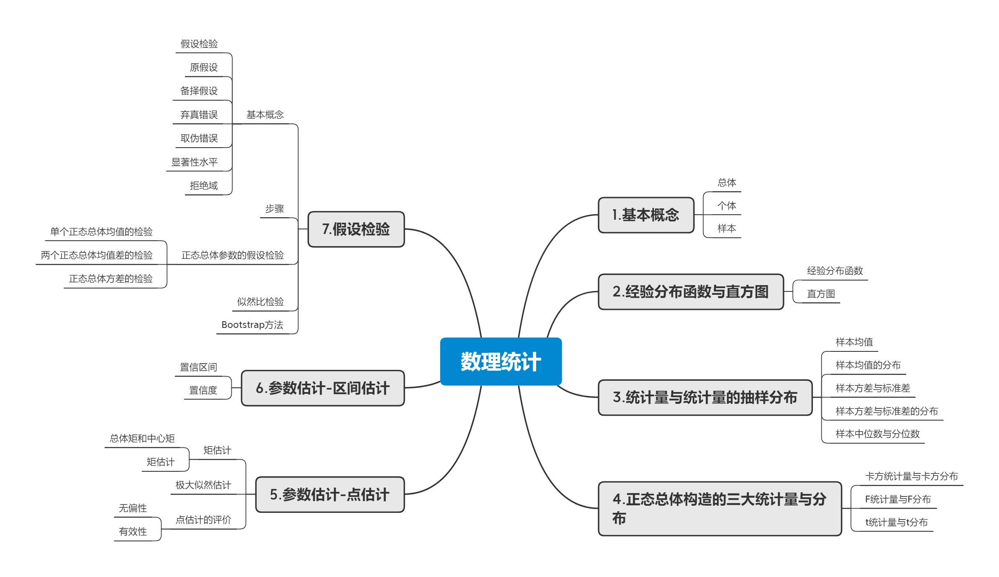

## 2.4_数理统计的基本概念

数理统计思维导图

[更多详细内容见notebook](https://github.com/datawhalechina/whale-quant/blob/master/notebook/ch02_%E9%87%91%E8%9E%8D%E5%B8%82%E5%9C%BA%E7%9A%84%E5%9F%BA%E7%A1%80%E6%A6%82%E5%BF%B5/ch02_2.4_%E6%95%B0%E7%90%86%E7%BB%9F%E8%AE%A1%E7%9A%84%E5%9F%BA%E6%9C%AC%E6%A6%82%E5%BF%B5.ipynb)

### 1.基本概念

**总体**：研究对象的全体，它是一个随机变量，用$X$表示。

**个体**：组成总体的每个基本元素。

**简单随机样本**：来自总体$X$的$n$个相互独立且与总体同分布的随机变量$X_{1},X_{2}\cdots,X_{n}$，称为容量为$n$的简单随机样本，简称样本。

**统计量**：设$X_{1},X_{2}\cdots,X_{n},$是来自总体$X$的一个样本，$g(X_{1},X_{2}\cdots,X_{n})$）是样本的连续函数，且$g()$中不含任何未知参数，则称$g(X_{1},X_{2}\cdots,X_{n})$为统计量。

**样本均值**：
$\overline{X} = \frac{1}{n}\sum_{i = 1}^{n}X_{i}$
**样本方差**：$S^{2} = \frac{1}{n - 1}\sum_{i = 1}^{n}{(X_{i} - \overline{X})}^{2}$

**样本矩**：样本$k$阶原点矩：$A_{k} = \frac{1}{n}\sum_{i = 1}^{n}X_{i}^{k},k = 1,2,\cdots$

**样本$k$阶中心矩**：$B_{k} = \frac{1}{n}\sum_{i = 1}^{n}{(X_{i} - \overline{X})}^{k},k = 1,2,\cdots$

### 2.分布

**$\chi^{2}$分布**：$\chi^{2} = X_{1}^{2} + X_{2}^{2} + \cdots + X_{n}^{2}\sim\chi^{2}(n)$，其中$X_{1},X_{2}\cdots,X_{n},$相互独立，且同服从$N(0,1)$

**$t$分布**：$T = \frac{X}{\sqrt{Y/n}}\sim t(n)$ ，其中$X\sim N\left( 0,1 \right),Y\sim\chi^{2}(n),$且$X$，$Y$ 相互独立。

**$F$分布**：$F = \frac{X/n_{1}}{Y/n_{2}}\sim F(n_{1},n_{2})$，其中$X\sim\chi^{2}\left( n_{1} \right),Y\sim\chi^{2}(n_{2}),$且$X$，$Y$相互独立。

**分位数**：若$P(X \leq x_{\alpha}) = \alpha,$则称$x_{\alpha}$为$X$的$\alpha$分位数

### 3.正态总体的常用样本分布

设$X_{1},X_{2}\cdots,X_{n}$为来自正态总体$N(\mu,\sigma^{2})$的样本，$\overline{X} = \frac{1}{n}\sum_{i = 1}^{n}X_{i},S^{2} = \frac{1}{n - 1}\sum_{i = 1}^{n}{{(X_{i} - \overline{X})}^{2},}$则：

(1) $\overline{X}\sim N\left( \mu,\frac{\sigma^{2}}{n} \right){\ \ }$或者$\frac{\overline{X} - \mu}{\frac{\sigma}{\sqrt{n}}}\sim N(0,1)$

(2) $\frac{(n - 1)S^{2}}{\sigma^{2}} = \frac{1}{\sigma^{2}}\sum_{i = 1}^{n}{{(X_{i} - \overline{X})}^{2}\sim\chi^{2}(n - 1)}$

(3) $\frac{1}{\sigma^{2}}\sum_{i = 1}^{n}{{(X_{i} - \mu)}^{2}\sim\chi^{2}(n)}$

(4) ${\ \ }\frac{\overline{X} - \mu}{S/\sqrt{n}}\sim t(n - 1)$

### 4.重要公式与结论

(1) 对于$\chi^{2}\sim\chi^{2}(n)$，有$E(\chi^{2}(n)) = n,D(\chi^{2}(n)) = 2n;$

(2) 对于$T\sim t(n)$，有$E(T) = 0,D(T) = \frac{n}{n - 2}(n > 2)$；

(3) 对于$F\tilde{\ }F(m,n)$，有 $\frac{1}{F}\sim F(n,m),F_{a/2}(m,n) = \frac{1}{F_{1 - a/2}(n,m)};$

(4) 对于任意总体$X$，有 $E(\overline{X}) = E(X),E(S^{2}) = D(X),D(\overline{X}) = \frac{D(X)}{n}$

