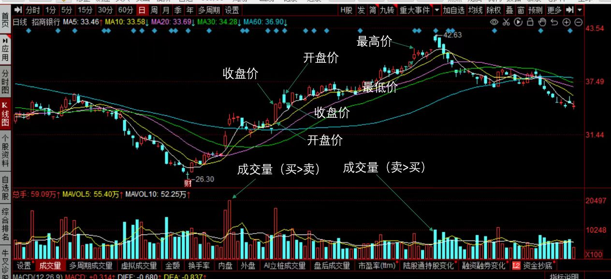
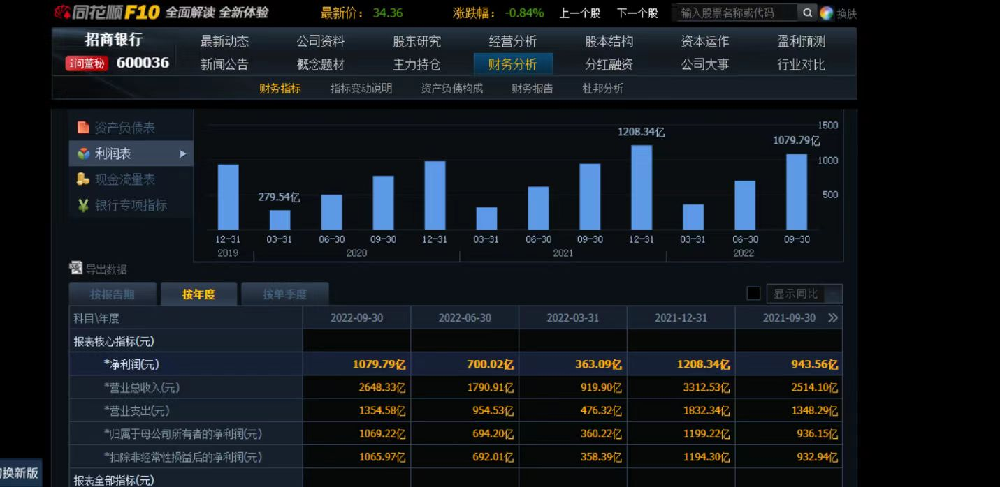

# 03_股票数据获取

目录

3.1 股票数据的基本分类

3.2 股票数据的常见指标介绍

3.3 Baostock的基础数据获取

3.4 pandas常见指标的数据清洗

3.5 其他数据获取平台的介绍

## 3.1 股票数据的基本分类

股票数据根据信息来源和分析方法的不同，可以分为技术面数据和基本面数据。

### 3.1.1 技术面数据

技术面数据是通过股票的历史价格和交易量等市场数据进行计算和分析得出的指标。它的核心观点是市场行为会在价格上留下痕迹，通过这些痕迹可以预测未来的价格走势。技术面数据主要关注股票价格的变动和市场趋势，常用的技术指标包括移动平均线、相对强弱指标、MACD指标等。技术面分析认为市场上已有的信息都会反映在股票价格中，因此通过分析股票价格图表和技术指标，可以尽可能准确地判断价格的走势和市场趋势。



### 3.1.2 基本面数据

基本面数据是通过分析公司的财务状况、业绩表现、竞争力等基本信息得出的评估。基本面分析认为股票的价格是与公司的基本面因素相关的，包括公司的营业收入、盈利能力、资产负债情况、市场份额、竞争优势等。基本面分析的目标是评估公司的内在价值，并基于这些评估来判断股票的投资潜力。常用的基本面指标包括市盈率、市净率、股息率等。基本面数据通常需要通过公司公开的财务报告和公告来获取。



技术面数据和基本面数据都是股票分析中重要的工具，它们提供了不同的视角和方法来评估股票的投资价值。投资者可以综合运用这两类数据，从技术面和基本面两个层面进行全面的分析和决策。

## 3.2 股票数据的常见指标介绍

如前所述，股票数据分为技术面数据和基本面，下面将分别介绍两种数据的常见指标。

### 3.2.1 技术面数据常见指标

**1. 移动平均线（Moving Average, MA）**

移动平均线是通过计算一段时间内的股票平均价格来平滑价格波动。常见的移动平均线有简单移动平均线（SMA）和指数移动平均线（EMA）。

- 简单移动平均线（Simple Moving Average, SMA）：简单移动平均线是最基本的移动平均线类型。它是通过将一段时间内的股票收盘价相加，然后除以时间段的天数来计算的。简单移动平均线可以平滑价格波动，显示出长期趋势。

- 指数移动平均线（Exponential Moving Average, EMA）：指数移动平均线对近期价格给予更高的权重，反映了市场更近期的变化。计算指数移动平均线时，当前价格会根据选定的时间段和权重系数，与之前的移动平均线值相结合。

移动平均线的应用主要包括以下几个方面：

- 确定趋势：投资者可以使用不同期限的移动平均线来确定趋势的强度和方向。较短期的移动平均线（如5日或10日）反映了近期的价格走势，较长期的移动平均线（如50日或200日）则更能反映长期趋势。

- 交叉信号：移动平均线的交叉可以提供买入或卖出的信号。例如，当短期移动平均线从下方穿过长期移动平均线时，被称为“黄金交叉”，可能暗示着价格上涨的趋势。相反，当短期移动平均线从上方穿过长期移动平均线时，被称为“死亡交叉”，可能暗示着价格下跌的趋势。

- 支撑与阻力线：移动平均线经常被用作支撑和阻力线的参考。当股票价格接近或穿过移动平均线时，可能会在此处遇到阻力或支撑，进而影响价格的反弹或下跌。

移动平均线是一种相对较简单的技术指标，可能受到市场噪音的影响。因此，在使用移动平均线时，投资者通常需要结合其他指标和技术工具，以加强分析和确认交易信号的准确性。

**2. 相对强弱指数（Relative Strength Index, RSI）**

RSI 是一种用于衡量股票价格变动强度和速度的技术指标。它可帮助投资者判断股票市场的超买和超卖情况，以及价格的反转和确认信号。

RSI 的计算基于一定时期内股票价格的平均涨幅和跌幅。通常情况下，RSI的取值范围在0到100之间。

RSI 指标的常用参数为14，计算步骤如下：

1. 首先，计算14个交易周期内涨幅和跌幅的平均值。

2. 计算涨幅平均值与跌幅平均值的相对强弱比率（RS，Relative Strength）。
   RS = (14个交易周期内涨幅平均值) / (14个交易周期内跌幅平均值)
3. 计算相对强弱指数（RSI）：
   RSI = 100 - (100 / (1 + RS))

RSI 的数值解读如下：
- RSI在0到30之间：表示股票市场被超卖，可能存在价格反弹的机会。
- RSI在70到100之间：表示股票市场被超买，可能存在价格下跌的机会。
- RSI在30到70之间：表示股票市场相对平稳，没有明显的超买或超卖信号。

投资者通常会关注RSI的超买和超卖区域，并结合其他技术指标和价格走势来辅助判断市场趋势和交易信号。例如，当RSI进入超买区域并且价格形成拐头下跌时，可能暗示进一步的价格下跌。相反，当RSI进入超卖区域并且价格形成拐头上涨时，可能暗示价格反弹或反转的机会。

RSI 是一种短期的指标，对价格的反应较为敏感。因此，投资者在使用RSI时应该结合其他技术指标和基本面分析，以获得更全面准确的市场判断和交易决策。

**3. 随机指标（Stochastic Oscillator）**

随机指标用于判断股票价格的超买和超卖情况，以及价格反转的可能性。它可以帮助投资者确定适合买入或卖出股票的时机。

随机指标的计算基于一段时间内的收盘价与最高价和最低价的关系。该指标通常使用 %K 线和 %D 线两条线，并结合超买区和超卖区进行解读。

随机指标的计算步骤如下：

1. 首先，计算一定时间段（常见为14个交易日）内的最高价和最低价。
2. 计算当前收盘价与该时间段内最低价的差值（收盘价-最低价），并除以最高价和最低价的差值（最高价-最低价）。
   %K = （收盘价 - 最低价）/ （最高价 - 最低价） * 100
3. 计算%K的移动平均值作为%D线的值，通常使用3日平均。
   %D = %K的3日简单移动平均线

随机指标的数值解读如下：
- 当 %K 线从下方穿越%D线时，被视为买入信号，可能预示着价格的反转和上涨。
- 当 %K 线从上方穿越%D线时，被视为卖出信号，可能预示着价格的反转和下跌。
- 当 %K 线位于高位（一般超过80）时，表示市场可能超买，价格的下跌风险增加。
- 当 %K 线位于低位（一般低于20）时，表示市场可能超卖，价格的上涨机会增加。

随机指标是一种短期的技术指标。它可以辅助投资者判断市场价格走势和买卖时机，但并不是绝对准确的，也需要结合其他指标和图表形态进行综合分析。此外，投资者应该注意风险管理，不仅仅依赖于单一指标作为决策依据。

**4. 成交量指标（Volume）**

成交量指标衡量了股票交易的活跃程度。当股票价格上涨时，成交量增加可以视为价格上涨的确认，而当股票价格下跌时，成交量增加可能表示价格下跌的确认。

成交量指标的计算非常简单，即某一时间周期内的总成交量。

成交量指标的应用主要包括以下几个方面：

1. 确认趋势：成交量指标可以用来确认价格趋势的有效性。在上涨趋势中，成交量增加可能意味着买盘增加，市场看涨情绪强烈。而在下跌趋势中，成交量增加可能意味着卖盘增加，市场看跌情绪强烈。如果价格和成交量出现背离，即价格上涨而成交量下降，或价格下跌而成交量增加，可能意味着趋势反转的可能性。

2. 确认突破：成交量指标也可用于确认价格突破的有效性。当价格突破重要的价格水平（如支撑或阻力线）时，如果成交量也大幅增加，可能预示着价格突破的力度和可持续性增加。

3. 观察分析：投资者可以通过观察成交量指标的变化，研究市场情绪和买卖压力。例如，当成交量急剧增加时，可能表示市场出现了重要的新闻、公告或市场情绪变化，这可能导致价格波动。

4. 交易量模型：有些交易者会使用成交量指标构建交易量模型，例如量价分析（Volume Price Analysis）或成交量波动指标（Volume Oscillator）。这些模型通过比较成交量与价格的关系，寻找特定的交易信号。

成交量指标相对于价格指标而言，属于非价格类指标。它可以与其他技术指标和图表形态结合使用，以提供更全面的市场分析和交易决策支持。同时，投资者也应该注意成交量的时期、粒度和数据来源，在使用成交量指标时避免盲目依赖，要结合其他信息进行综合分析。

**5. MACD 指标（Moving Average Convergence Divergence）**

MACD 指标是股票技术分析中常用的趋势追踪和买卖信号指标。它通过比较两条移动平均线的差异，来判断股票价格的趋势以及价格的买卖信号。

MACD 指标由以下几个元素组成：

1. DIF 线（Difference Line）：是短期指数移动平均线（如12日 EMA）减去长期指数移动平均线（如26日 EMA）得到的差值线。DIF 线可以较为敏感地反应价格的短期波动。

2. DEA 线（Signal Line）：是对 DIF 线进行平滑处理，一般使用DIF线的9日移动平均线得到。DEA 线可以平滑 DIF 线的波动，更好地体现价格的中期趋势。

3. MACD 柱（MACD Histogram）：是 DIF 线与 DEA 线的差值，可将价格的快速波动变化显示为柱状图。柱状图的红色柱代表 DIF 线在 DEA 线上方，表示价格可能上涨；绿色柱代表 DIF 线在 DEA 线下方，表示价格可能下跌。

MACD 指标的应用主要包括以下几个方面：

1. 趋势判断：当 DIF 线与 DEA 线发生金叉（DIF 线向上穿过 DEA 线）时，表示价格可能出现上涨趋势；当 DIF 线与 DEA 线发生死叉（DIF 线向下穿过 DEA线）时，表示价格可能出现下跌趋势。

2. 买卖信号：当 MACD 柱由负值转为正值时，被视为买入信号；当 MACD 柱由正值转为负值时，被视为卖出信号。这些转折点可能表示价格快速波动的转变。

3. 背离信号：观察价格和 MACD 指标的背离情况。例如，当价格创新高而 MACD 指标未能创新高时，可能表示价格上涨动能下降，可能出现价格回调。

MACD指标是一种相对较慢的指标，较长时间的移动平均线会导致滞后性。因此，投资者通常会结合其他技术指标和图表形态来进行综合分析和判断。同时，使用MACD指标时也要关注交易量以及价格走势的配合，以提高准确性和可靠性。

以上是一些常见的技术面指标，投资者可以根据自己的需求和策略选择合适的指标来进行股票分析和决策。重要的是要综合运用多个指标进行分析，以减少单一指标的局限性。

### 3.2.2 基本面数据常见指标

**1. 每股收益（Earnings Per Share, EPS）**

每股收益用于衡量公司每股可供股东分配的净利润，即每股盈利能力。每股收益是投资者评估公司盈利能力和估值的重要参考指标之一。

每股收益的计算公式为：EPS = 净利润 / 流通股本

其中，净利润是指公司在一定会计周期内所创造的净收益，即扣除各项费用和税后利润。流通股本是指公司已经发行并在市场上自由交易的股票数量。

每股收益指标的应用主要包括以下几个方面：

1. 估值比较：每股收益可以作为比较不同公司的盈利能力和估值水平的重要依据。通常情况下，具有更高每股收益的公司往往被认为具有更好的盈利能力，因此可能被投资者更高估值。

2. 成长趋势：观察每股收益的变化趋势可以了解公司盈利能力的增长速度和稳定性。持续增长的每股收益可能意味着公司业绩好于预期，具有良好的成长潜力。

3. 盈利稳定性：通过比较每股收益的波动程度，可以判断公司的盈利稳定性。较小的波动通常被认为是公司盈利稳定性较好的表现。

每股收益作为一个单一的指标，不能完全评估公司的业绩和潜力。投资者还需要结合其他指标和信息，如市盈率（PE ratio）、市净率（PB ratio）、行业对比等，进行全面分析和判断。此外，每股收益数据也需要结合公司的财务报表和公告信息核实，以确保数据的准确性和可靠性。

**2. 市净率（Price-to-Book Ratio, P/B Ratio）**

也称为股价净资产比，是一种用于衡量股票当前市场价格与公司每股净资产之间关系的指标。它是用来评估公司的市场估值是否低估或高估的重要指标。

市净率的计算公式为：市净率 = 公司总市值 / 公司净资产

其中，公司总市值是指公司所有已发行股票的市值之和，而公司净资产是指公司的总资产减去总负债。

市净率是一个相对指标，一般用来比较同行业或同一市场的公司。较低的市净率通常被认为是公司股票被低估的迹象，而较高的市净率可能意味着公司股票被高估。

根据市净率可以得出以下几个判断：

- 市净率低于1：通常表示公司的市场价值低于其净资产，股票可能被低估。

- 市净率约等于1：表示公司的市场价值大致等于其净资产，股票被市场公平估价。

- 市净率高于1：通常表示公司的市场价值高于其净资产，股票可能被高估。

市净率并不能独立决定一家公司的投资价值，因为它没有考虑到公司的盈利情况和未来的增长潜力。因此，在使用市净率作为投资决策工具时，投资者还应该结合其他因素进行综合分析。

**3. 股息收益率（Dividend Yield）**

股息收益率用于衡量股票派发的股息相对于股票的价格的比率。股息是公司利润的一部分，以现金或股票形式派发给股东。股息收益率可以帮助投资者评估持有一只股票所能获得的现金回报。

股息收益率的计算公式为：股息收益率 = 每股股息 / 股票价格

其中，每股股息是指公司每股派发的股息金额，股票价格是股票在市场上的交易价格。

股息收益率指标的应用主要包括以下几个方面：

1. 现金回报：股息收益率可以帮助投资者了解持有股票所能获得的现金回报，尤其对于偏好分红收入的投资者而言，具有重要意义。较高的股息收益率可能表示股东获得较高的分红回报。

2. 盈利比较：通过比较不同公司的股息收益率，投资者可以了解公司的盈利能力和分红政策。较高的股息收益率可能意味着公司分红政策较为慷慨，或者公司盈利水平相对较高。

3. 市场情绪：股息收益率也可以反映市场对公司的情绪和风险偏好。一般而言，较高的股息收益率可能意味着市场对公司前景持谨慎态度，或者公司面临一定的困境。

股息收益率是一个基于过去分红数据和当前股票价格的指标，不能保证未来股息收益率的持续性。投资者还需要综合考虑公司的财务状况、盈利稳定性、盈利增长预期等因素，以及对行业和整体市场的分析，进行全面的投资决策。此外，股息收益率也不适用于那些不派发股息或派发不稳定股息的公司。

**4. 净利润（Net Profit）**

净利润用于衡量一家公司在特定会计期间内实际获得的净收益，即扣除各项费用和税后利润。净利润是评估公司盈利能力和基本经营状况的重要指标。

净利润的计算公式为：净利润 = 总收入 - 总成本 - 税收 - 其他费用

其中：

- 总收入：是指公司在特定会计期间内所实现的总销售收入或营业收入。
- 总成本：包括直接成本和间接成本，指用于生产和销售产品或提供服务的成本。
- 税收：是指公司应缴纳的所得税或其他税收费用。
- 其他费用：包括财务费用、管理费用、营销费用等。

净利润是衡量公司盈利能力的重要指标，主要应用包括以下几个方面：

1. 盈利能力评估：净利润是评估公司盈利能力的核心指标之一。较高的净利润意味着公司创造了更多的利润，具有较好的盈利能力。投资者通常会对具有稳定和增长的净利润的公司更感兴趣。

2. 盈利趋势分析：观察净利润的变化趋势可以了解公司盈利的增长趋势和稳定性。持续增长的净利润可能意味着公司业绩良好，具有较好的发展潜力。

3. 盈利比较：通过比较不同公司的净利润，投资者可以了解公司的盈利水平和和业绩相对强弱。对于同行业的公司，较高的净利润可能意味着公司的竞争力较强。

净利润是一个单一的指标，不能完全评估公司的业绩和潜力。投资者还需要结合其他基本面指标、行业和市场的分析，以及财务报表中的其他信息，进行综合分析和判断。此外，净利润也可能受到会计政策、非经营性因素等的影响，因此在使用净利润数据时，需要谨慎解读。

**5. 负债与资产比率（Debt-to-Asset Ratio）**

负债与资产比率用于衡量公司的资本结构和债务风险水平。该比率反映了公司负债占总资产的比例（财务杠杆），可以帮助投资者了解公司负债情况以及对负债承受能力的评估。

负债与资产比率的计算公式为：负债与资产比率 = 总负债 / 总资产

其中，总负债是指公司在特定时点上的所有债务总额，包括长期负债和短期负债。总资产是指公司在特定时点上的全部资产，包括流动资产和固定资产。

负债与资产比率指标的应用主要包括以下几个方面：

1. 资本结构评估：通过负债与资产比率，投资者可以评估公司的资本结构，了解公司通过负债融资来支持业务运营和发展的程度。较高的负债与资产比率意味着公司债务较多，对外部融资的依赖程度较高。

2. 债务风险评估：负债与资产比率可以帮助投资者评估公司的债务风险水平。较高的负债与资产比率可能意味着公司具有较高的负债风险，可能面临偿债能力不足的风险。

3. 行业比较：通过比较同行业内不同公司的负债与资产比率，投资者可以了解公司在行业内的相对债务水平。较低的负债与资产比率可能意味着公司相对较少依赖债务融资，财务状况较为健康。

负债与资产比率只是一个衡量财务状况的指标之一，不能单独用于评估公司的投资价值。投资者还需要结合其他指标和财务报表信息，以及行业和市场的分析，进行全面的投资决策。此外，负债与资产比率还受到公司行业特性、资本结构策略和会计政策等因素的影响，可能存在正常的行业波动和季节性波动。

以上是一些常见的基本面指标，投资者应该根据自己的需求和投资策略选择合适的指标进行分析和决策。除了这些指标之外，还有许多其他的基本面数据可供参考，包括营收增长率、资产周转率、净利润率等。重要的是要对这些指标进行综合分析，以全面评估一家公司的财务状况和潜力。

## 3.3 Baostock的基础数据获取

### 3.3.1 BaoStock 技术面数据简介

证券宝（www.baostock.com） 是一个免费、开源的证券数据平台，无需注册即可获取大量准确、完整的证券历史行情数据和上市公司财务数据。通过`Python` `API`获取数据信息，满足量化交易投资者、数量金融爱好者、计量经济从业者的数据需求。该工具包返回的数据格式为`pandas` `DataFrame`类型，方便使用`pandas`/`NumPy`/`Matplotlib`进行数据分析和可视化。此外，还支持将数据保存到本地进行分析，提供了更多的灵活性和便利性。

在本章节中，我们主要介绍了如何利用`BaoStock`获取历史A股K线数据、指数数据以及上证50成分股。

#### 一、历史A股K线数据

历史A股K线数据是指中国A股市场中股票价格在一段时间内的开盘价、收盘价、最高价和最低价等信息，通常以图表的形式展示。这些数据对于投资者和分析师来说非常重要，因为它们可以通过分析股票价格的变化趋势和波动来预测未来的市场走势，并制定合适的投资策略。此外，历史K线数据还可以用于研究股票的历史表现、估值水平、市场风险等方面，为决策提供参考依据。

`query_history_k_data_plus`()：这个方法可以通过API接口获取A股的历史交易数据，你可以根据需要设置参数来获得日线、周线、月线以及5分钟、15分钟、30分钟和60分钟线的数据。这些数据可以结合均线数据进行选股和分析。返回的数据是`pandas`库中`DataFrame`类型的格式。数据范围从1990年12月19日至今，可以查询不复权、前复权或后复权数据。

1.1 **日线使用示例**

日线是股票、期货等市场中的一种技术分析图表，每个数据点代表一天的交易信息。它记录了该品种在一天内的开盘价、最高价、最低价和收盘价等数据，并通过连续的数据点形成一条曲线，以反映该品种价格的走势。

日线可以帮助投资者识别出股票或期货的价格趋势和支撑阻力位，判断未来价格走势的可能性，从而制定相应的投资策略。除此之外，日线还能够辅助投资者进行风险控制，识别出市场中的买卖信号，更好地把握交易机会。以下是通过调用`query_history_k_data_plus`()方法来对日线进行数据获取。


```python
import baostock as bs
import pandas as pd
from IPython.display import display

#### 登陆系统 ####
lg = bs.login()
# 显示登陆返回信息
print('login respond error_code:'+lg.error_code)
print('login respond  error_msg:'+lg.error_msg)

#### 获取沪深A股历史K线数据 ####
# 详细指标参数，参见“历史行情指标参数”章节；“分钟线”参数与“日线”参数不同。“分钟线”不包含指数。
# 分钟线指标：date,time,code,open,high,low,close,volume,amount,adjustflag
# 周月线指标：date,code,open,high,low,close,volume,amount,adjustflag,turn,pctChg
rs = bs.query_history_k_data_plus("sh.600000",
    "date,code,open,high,low,close,preclose,volume,amount,adjustflag,turn,tradestatus,pctChg,isST",
    start_date='2022-07-01', end_date='2022-12-31',
    frequency="d", adjustflag="3")
print('query_history_k_data_plus respond error_code:'+rs.error_code)
print('query_history_k_data_plus respond  error_msg:'+rs.error_msg)

#### 打印结果集 ####
data_list = []
while (rs.error_code == '0') & rs.next():
    # 获取一条记录，将记录合并在一起
    data_list.append(rs.get_row_data())
result = pd.DataFrame(data_list, columns=rs.fields)

#### 结果集输出到csv文件 ####   
result.to_csv("./history_A_stock_k_data.csv", index=False)
display(result)

#### 登出系统 ####
bs.logout()
```

    login success!
    login respond error_code:0
    login respond  error_msg:success
    query_history_k_data_plus respond error_code:0
    query_history_k_data_plus respond  error_msg:success
    


<div>
<style scoped>
    .dataframe tbody tr th:only-of-type {
        vertical-align: middle;
    }

    .dataframe tbody tr th {
        vertical-align: top;
    }

    .dataframe thead th {
        text-align: right;
    }
</style>
<table border="1" class="dataframe">
  <thead>
    <tr style="text-align: right;">
      <th></th>
      <th>date</th>
      <th>code</th>
      <th>open</th>
      <th>high</th>
      <th>low</th>
      <th>close</th>
      <th>preclose</th>
      <th>volume</th>
      <th>amount</th>
      <th>adjustflag</th>
      <th>turn</th>
      <th>tradestatus</th>
      <th>pctChg</th>
      <th>isST</th>
    </tr>
  </thead>
  <tbody>
    <tr>
      <th>0</th>
      <td>2022-07-01</td>
      <td>sh.600000</td>
      <td>8.0100</td>
      <td>8.0400</td>
      <td>7.9800</td>
      <td>7.9900</td>
      <td>8.0100</td>
      <td>17846787</td>
      <td>142651655.1700</td>
      <td>3</td>
      <td>0.060800</td>
      <td>1</td>
      <td>-0.249700</td>
      <td>0</td>
    </tr>
    <tr>
      <th>1</th>
      <td>2022-07-04</td>
      <td>sh.600000</td>
      <td>7.9900</td>
      <td>8.0000</td>
      <td>7.9400</td>
      <td>7.9600</td>
      <td>7.9900</td>
      <td>18222009</td>
      <td>145047089.1700</td>
      <td>3</td>
      <td>0.062100</td>
      <td>1</td>
      <td>-0.375500</td>
      <td>0</td>
    </tr>
    <tr>
      <th>2</th>
      <td>2022-07-05</td>
      <td>sh.600000</td>
      <td>7.9600</td>
      <td>8.0000</td>
      <td>7.9400</td>
      <td>7.9800</td>
      <td>7.9600</td>
      <td>21322243</td>
      <td>169924262.9100</td>
      <td>3</td>
      <td>0.072600</td>
      <td>1</td>
      <td>0.251300</td>
      <td>0</td>
    </tr>
    <tr>
      <th>3</th>
      <td>2022-07-06</td>
      <td>sh.600000</td>
      <td>7.9700</td>
      <td>7.9800</td>
      <td>7.8700</td>
      <td>7.9000</td>
      <td>7.9800</td>
      <td>28829658</td>
      <td>227963132.4700</td>
      <td>3</td>
      <td>0.098200</td>
      <td>1</td>
      <td>-1.002500</td>
      <td>0</td>
    </tr>
    <tr>
      <th>4</th>
      <td>2022-07-07</td>
      <td>sh.600000</td>
      <td>7.8800</td>
      <td>7.9200</td>
      <td>7.8600</td>
      <td>7.8700</td>
      <td>7.9000</td>
      <td>18636395</td>
      <td>147034169.9300</td>
      <td>3</td>
      <td>0.063500</td>
      <td>1</td>
      <td>-0.379700</td>
      <td>0</td>
    </tr>
    <tr>
      <th>...</th>
      <td>...</td>
      <td>...</td>
      <td>...</td>
      <td>...</td>
      <td>...</td>
      <td>...</td>
      <td>...</td>
      <td>...</td>
      <td>...</td>
      <td>...</td>
      <td>...</td>
      <td>...</td>
      <td>...</td>
      <td>...</td>
    </tr>
    <tr>
      <th>120</th>
      <td>2022-12-26</td>
      <td>sh.600000</td>
      <td>7.1900</td>
      <td>7.2100</td>
      <td>7.0800</td>
      <td>7.1000</td>
      <td>7.1900</td>
      <td>20138533</td>
      <td>143606823.7100</td>
      <td>3</td>
      <td>0.068600</td>
      <td>1</td>
      <td>-1.251700</td>
      <td>0</td>
    </tr>
    <tr>
      <th>121</th>
      <td>2022-12-27</td>
      <td>sh.600000</td>
      <td>7.1300</td>
      <td>7.2900</td>
      <td>7.1200</td>
      <td>7.2200</td>
      <td>7.1000</td>
      <td>24065192</td>
      <td>173516852.3700</td>
      <td>3</td>
      <td>0.082000</td>
      <td>1</td>
      <td>1.690100</td>
      <td>0</td>
    </tr>
    <tr>
      <th>122</th>
      <td>2022-12-28</td>
      <td>sh.600000</td>
      <td>7.2200</td>
      <td>7.3000</td>
      <td>7.2000</td>
      <td>7.3000</td>
      <td>7.2200</td>
      <td>20901364</td>
      <td>152167733.8100</td>
      <td>3</td>
      <td>0.071200</td>
      <td>1</td>
      <td>1.108000</td>
      <td>0</td>
    </tr>
    <tr>
      <th>123</th>
      <td>2022-12-29</td>
      <td>sh.600000</td>
      <td>7.2700</td>
      <td>7.2900</td>
      <td>7.1800</td>
      <td>7.2400</td>
      <td>7.3000</td>
      <td>18367088</td>
      <td>132652083.0000</td>
      <td>3</td>
      <td>0.062600</td>
      <td>1</td>
      <td>-0.821900</td>
      <td>0</td>
    </tr>
    <tr>
      <th>124</th>
      <td>2022-12-30</td>
      <td>sh.600000</td>
      <td>7.2300</td>
      <td>7.3000</td>
      <td>7.2200</td>
      <td>7.2800</td>
      <td>7.2400</td>
      <td>20352397</td>
      <td>147932730.7100</td>
      <td>3</td>
      <td>0.069300</td>
      <td>1</td>
      <td>0.552500</td>
      <td>0</td>
    </tr>
  </tbody>
</table>
<p>125 rows × 14 columns</p>
</div>


    logout success!
    


    <baostock.data.resultset.ResultData at 0x1a21fbfcca0>


具体步骤如下：

1. 首先导入需要用到的 `baostock` 和 `pandas` 库。
2. 使用 `bs.login()` 函数登录 Baostock 系统，并输出登录返回信息。该函数返回一个对象 `lg`，其中包含了登录返回的错误代码和错误信息。
3. 使用 `bs.query_history_k_data_plus()` 函数查询指定股票在指定时间范围内的 K 线数据，其中第一个参数为要查询的股票代码，第二个参数为要查询的 K 线数据字段列表，第三个参数为开始日期，第四个参数为结束日期，第五个参数为查询频率，第六个参数为复权类型。该函数返回一个对象 `rs`，其中包含了查询返回的错误代码和错误信息以及查询结果集。
4. 将查询结果集转换成 Pandas DataFrame 格式，并输出到 CSV 文件中。首先创建一个空列表 `data_list`，然后使用 `rs.next()` 循环获取查询结果集里的每一行数据，将每一行数据存入 `data_list` 列表中。最后使用 Pandas 的 `DataFrame` 函数将 `data_list` 转换成 `DataFrame` 格式并输出到 CSV 文件中。
5. 最后使用 `bs.logout()` 函数退出 `Baostock` 系统。


1.2 **分钟线使用示例**

分钟线指的是股票或其他交易品种的价格走势图，每根蜡烛图表示一定时间间隔内的开盘价、收盘价、最高价和最低价。例如，1分钟线表示每根蜡烛图代表1分钟的价格走势。分钟线对于交易者来说具有重要意义，可以帮助他们快速分析市场趋势和价格波动，做出更明智的交易决策。以下是通过调用`query_history_k_data_plus`()方法来对分钟线进行数据获取。


```python
import baostock as bs
import pandas as pd
from IPython.display import display

#### 登陆系统 ####
lg = bs.login()
# 显示登陆返回信息
print('login respond error_code:'+lg.error_code)
print('login respond  error_msg:'+lg.error_msg)

#### 获取沪深A股历史K线数据 ####
# 详细指标参数，参见“历史行情指标参数”章节；“分钟线”参数与“日线”参数不同。“分钟线”不包含指数。
# 分钟线指标：date,time,code,open,high,low,close,volume,amount,adjustflag
# 周月线指标：date,code,open,high,low,close,volume,amount,adjustflag,turn,pctChg
rs = bs.query_history_k_data_plus("sh.600000",
    "date,time,code,open,high,low,close,volume,amount,adjustflag",
    start_date='2022-07-01', end_date='2022-07-31',
    frequency="5", adjustflag="3")
print('query_history_k_data_plus respond error_code:'+rs.error_code)
print('query_history_k_data_plus respond  error_msg:'+rs.error_msg)

#### 打印结果集 ####
data_list = []
while (rs.error_code == '0') & rs.next():
    # 获取一条记录，将记录合并在一起
    data_list.append(rs.get_row_data())
result = pd.DataFrame(data_list, columns=rs.fields)

#### 结果集输出到csv文件 ####   
result.to_csv("./history_A_stock_k_data.csv", index=False)
display(result)

#### 登出系统 ####
bs.logout()
```

    login success!
    login respond error_code:0
    login respond  error_msg:success
    query_history_k_data_plus respond error_code:0
    query_history_k_data_plus respond  error_msg:success
    


<div>
<style scoped>
    .dataframe tbody tr th:only-of-type {
        vertical-align: middle;
    }

    .dataframe tbody tr th {
        vertical-align: top;
    }

    .dataframe thead th {
        text-align: right;
    }
</style>
<table border="1" class="dataframe">
  <thead>
    <tr style="text-align: right;">
      <th></th>
      <th>date</th>
      <th>time</th>
      <th>code</th>
      <th>open</th>
      <th>high</th>
      <th>low</th>
      <th>close</th>
      <th>volume</th>
      <th>amount</th>
      <th>adjustflag</th>
    </tr>
  </thead>
  <tbody>
    <tr>
      <th>0</th>
      <td>2022-07-01</td>
      <td>20220701093500000</td>
      <td>sh.600000</td>
      <td>8.0100</td>
      <td>8.0400</td>
      <td>8.0100</td>
      <td>8.0200</td>
      <td>814989</td>
      <td>6540084.0000</td>
      <td>3</td>
    </tr>
    <tr>
      <th>1</th>
      <td>2022-07-01</td>
      <td>20220701094000000</td>
      <td>sh.600000</td>
      <td>8.0100</td>
      <td>8.0300</td>
      <td>8.0100</td>
      <td>8.0200</td>
      <td>561500</td>
      <td>4500107.0000</td>
      <td>3</td>
    </tr>
    <tr>
      <th>2</th>
      <td>2022-07-01</td>
      <td>20220701094500000</td>
      <td>sh.600000</td>
      <td>8.0200</td>
      <td>8.0200</td>
      <td>8.0100</td>
      <td>8.0100</td>
      <td>567996</td>
      <td>4550430.0000</td>
      <td>3</td>
    </tr>
    <tr>
      <th>3</th>
      <td>2022-07-01</td>
      <td>20220701095000000</td>
      <td>sh.600000</td>
      <td>8.0200</td>
      <td>8.0200</td>
      <td>8.0000</td>
      <td>8.0100</td>
      <td>958804</td>
      <td>7673820.0000</td>
      <td>3</td>
    </tr>
    <tr>
      <th>4</th>
      <td>2022-07-01</td>
      <td>20220701095500000</td>
      <td>sh.600000</td>
      <td>8.0000</td>
      <td>8.0100</td>
      <td>7.9800</td>
      <td>7.9800</td>
      <td>1141000</td>
      <td>9122703.0000</td>
      <td>3</td>
    </tr>
    <tr>
      <th>...</th>
      <td>...</td>
      <td>...</td>
      <td>...</td>
      <td>...</td>
      <td>...</td>
      <td>...</td>
      <td>...</td>
      <td>...</td>
      <td>...</td>
      <td>...</td>
    </tr>
    <tr>
      <th>1003</th>
      <td>2022-07-29</td>
      <td>20220729144000000</td>
      <td>sh.600000</td>
      <td>7.2500</td>
      <td>7.2600</td>
      <td>7.2400</td>
      <td>7.2500</td>
      <td>2280958</td>
      <td>16538355.0000</td>
      <td>3</td>
    </tr>
    <tr>
      <th>1004</th>
      <td>2022-07-29</td>
      <td>20220729144500000</td>
      <td>sh.600000</td>
      <td>7.2500</td>
      <td>7.2500</td>
      <td>7.2300</td>
      <td>7.2400</td>
      <td>2477400</td>
      <td>17932752.0000</td>
      <td>3</td>
    </tr>
    <tr>
      <th>1005</th>
      <td>2022-07-29</td>
      <td>20220729145000000</td>
      <td>sh.600000</td>
      <td>7.2300</td>
      <td>7.2500</td>
      <td>7.2300</td>
      <td>7.2400</td>
      <td>1461621</td>
      <td>10581344.0000</td>
      <td>3</td>
    </tr>
    <tr>
      <th>1006</th>
      <td>2022-07-29</td>
      <td>20220729145500000</td>
      <td>sh.600000</td>
      <td>7.2500</td>
      <td>7.2600</td>
      <td>7.2400</td>
      <td>7.2400</td>
      <td>1121914</td>
      <td>8130368.0000</td>
      <td>3</td>
    </tr>
    <tr>
      <th>1007</th>
      <td>2022-07-29</td>
      <td>20220729150000000</td>
      <td>sh.600000</td>
      <td>7.2500</td>
      <td>7.2600</td>
      <td>7.2500</td>
      <td>7.2600</td>
      <td>1165284</td>
      <td>8457152.0000</td>
      <td>3</td>
    </tr>
  </tbody>
</table>
<p>1008 rows × 10 columns</p>
</div>


    logout success!
    


    <baostock.data.resultset.ResultData at 0x1a221f376d0>


**技术面参数解释** 

`code`：股票代码，这个参数用于指定查询的股票或指数代码，以及所在交易所。输入格式为 "交易所代码.股票代码" 或 "交易所代码.指数代码"。其中，交易所代码"sh"代表上海证券交易所，"sz"代表深圳证券交易所。如：sh.601398，此参数不可为空。

`fields`：这个参数用于指定返回数据中包含哪些指标，支持多指标输入，以半角逗号分隔，填写内容作为返回类型的列。详细指标列表见历史行情指标参数章节，日线与分钟线参数不同。此参数不可为空；

`start`：这个参数用于指定查询的起始日期，格式“`YYYY`-`MM`-`DD`”，如果不指定，则默认从2015-01-01开始查询。

`end`：这个参数用于指定查询的结束日期，格式为“`YYYY`-`MM`-`DD`”。如果不指定，则默认查询最近一个交易日的数据。

`frequency`：这个参数用于指定查询的数据类型。可以选择返回日线、周线、月线或分钟线的K线数据。其中，大写字母表示周期，如"D"代表日线，"W"代表周线，"M"代表月线，数字表示分钟线的周期，如"5"代表5分钟线，"15"代表15分钟线等。指数只支持日线数据。周线数据只能选择每周最后一个交易日查询，月线数据只能选择每月最后一个交易日查询。

`adjustflag`：这个参数用于指定查询数据是否需要进行复权处理。如果需要进行复权处理，则可以选择前复权或后复权。复权类型，默认不复权：3；1：后复权；2：前复权。已支持分钟线、日线、周线、月线前后复权。

**注意** 

对于日线数据的处理方法。因为在停牌期间没有交易，因此开盘价、最高价、最低价和收盘价都与前一个交易日的收盘价相同，成交量和成交额为0，换手率为空。

如果想将换手率转换为浮点数类型，则可以使用列表推导式，并将空字符串转换为0，最终将结果存储在"`dataframe`"（名为`result`）中的"`turn`"列中：
result["turn"] = [0 if x == "" else float(x) for x in result["turn"]]

**返回数据说明**

| 参数名称    | 参数描述                                    | 算法说明                                                     |
| :----------- | :------------------------------------------- | :------------------------------------------------------------ |
| date        | 交易所行情日期                              |                                                              |
| code        | 证券代码                                    |                                                              |
| open        | 开盘价                                      |                                                              |
| high        | 最高价                                      |                                                              |
| low         | 最低价                                      |                                                              |
| close       | 收盘价                                      |                                                              |
| preclose    | 前收盘价                                    | 见表格下方详细说明                                           |
| volume      | 成交量（累计 单位：股）                     |                                                              |
| amount      | 成交额（单位：人民币元）                    |                                                              |
| adjustflag  | 复权状态(1：后复权， 2：前复权，3：不复权） |                                                              |
| turn        | 换手率                                      | [指定交易日的成交量(股)/指定交易日的股票的流通股总股数(股)]*100% |
| tradestatus | 交易状态(1：正常交易 0：停牌）              |                                                              |
| pctChg      | 涨跌幅（百分比）                            | 日涨跌幅=[(指定交易日的收盘价-指定交易日前收盘价)/指定交易日前收盘价]*100% |
| peTTM       | 滚动市盈率                                  | (指定交易日的股票收盘价/指定交易日的每股盈余TTM)=(指定交易日的股票收盘价*截至当日公司总股本)/归属母公司股东净利润TTM |
| pbMRQ       | 市净率                                      | (指定交易日的股票收盘价/指定交易日的每股净资产)=总市值/(最近披露的归属母公司股东的权益-其他权益工具) |
| psTTM       | 滚动市销率                                  | (指定交易日的股票收盘价/指定交易日的每股销售额)=(指定交易日的股票收盘价*截至当日公司总股本)/营业总收入TTM |
| pcfNcfTTM   | 滚动市现率                                  | (指定交易日的股票收盘价/指定交易日的每股现金流TTM)=(指定交易日的股票收盘价*截至当日公司总股本)/现金以及现金等价物净增加额TTM |
| isST        | 是否ST股                          |  1是，0否                                          |

**注意“前收盘价”说明：** 

当股票在指定交易日发生除权除息时，其前收盘价的计算方法有所不同。一般而言，前收盘价是指前一个交易日的实际收盘价，但当股权登记日与分红现金数量、配送股数和配股价等因素相结合时，前收盘价需要根据一定的计算方法得出。具体来说，需要先计算除息价，然后再计算送红股后的除权价和配股后的除权价，最后得出除权除息价。这个除权除息价就是指定交易日的前收盘价。该价格由交易所计算并公布，而在首发日，则将首发价格作为前收盘价。

具体计算方法如下: 

1、***计算除息价***: 除息价=股息登记日的收盘价-每股所分红利现金额 

2、***计算除权价***: 送红股后的除权价=股权登记日的收盘价/(1+每股送红股数) 配股后的除权价=(股权登记日的收盘价+配股价*每股配股数)/(1+每股配股数) 

3、***计算除权除息价*** ：除权除息价=(股权登记日的收盘价-每股所分红利现金额+配股价*每股配股数)/(1+每股送红股数+每股配股数)

**关于复权数据说明** 

复权数据是在股票交易中调整历史价格和成交量的数据，以考虑除权、除息等事件对价格和成交量的影响。复权数据的意义在于能够更准确地反映股票的实际表现，避免因为除权、除息等事件造成的误导性信息。通过使用复权数据，投资者可以更好地了解股票的历史价格走势和成交量变化，以做出更明智的投资决策。

`BaoStock`使用“涨跌幅复权法”对历史股价数据进行复权处理，以便更准确地计算资金收益率。该方法的优点是可以保证初始投入的资金运用率为100%，从而避免分红或配股对投资额的影响。

然而，不同的系统可能采用不同的复权方式，因此在比较不同系统提供的股票数据时，可能会发现存在差异。例如，同花顺、通达信等软件可能采用其他的复权方式，导致与`BaoStock`提供的数据不一致。

1.3 **历史行情指标参数**

**日线指标参数（包含停牌证券）**

日线指标参数是用来计算股票或其他证券在每个交易日结束时的技术指标。这些指标可以包括移动平均线、相对强弱指数（RSI）、随机指标（Stochastic Oscillator）等等。日线指标参数对于股票交易者和投资者来说非常重要，因为它们提供了有关证券价格变化、波动率和市场趋势的信息。这些指标可以帮助决策者制定买卖策略，并评估特定证券的风险和收益潜力。

| 参数名称    | 参数描述         | 说明                                |
| :----------- | :---------------- | :----------------------------------- |
| date        | 交易所行情日期   | 格式：YYYY-MM-DD                    |
| code        | 证券代码         | 格式：sh.600000。sh：上海，sz：深圳 |
| open        | 今开盘价格       | 精度：小数点后4位；单位：人民币元   |
| high        | 最高价           | 精度：小数点后4位；单位：人民币元   |
| low         | 最低价           | 精度：小数点后4位；单位：人民币元   |
| close       | 今收盘价         | 精度：小数点后4位；单位：人民币元   |
| preclose    | 昨日收盘价       | 精度：小数点后4位；单位：人民币元   |
| volume      | 成交数量         | 单位：股                            |
| amount      | 成交金额         | 精度：小数点后4位；单位：人民币元   |
| adjustflag  | 复权状态         | 不复权、前复权、后复权              |
| turn        | 换手率           | 精度：小数点后6位；单位：%          |
| tradestatus | 交易状态         | 1：正常交易 0：停牌                 |
| pctChg      | 涨跌幅（百分比） | 精度：小数点后6位                   |
| peTTM       | 滚动市盈率       | 精度：小数点后6位                   |
| psTTM       | 滚动市销率       | 精度：小数点后6位                   |
| pcfNcfTTM   | 滚动市现率       | 精度：小数点后6位                   |
| pbMRQ       | 市净率           | 精度：小数点后6位                   |
| isST        | 是否ST           | 1是，0否                            |

**周、月线指标参数**

周线和月线指标参数是用于技术分析的指标参数，通常用于股票、期货等市场的长期趋势分析。周线指标参数以每周为单位计算，而月线指标参数以每月为单位计算。这些指标通常包括均线、相对强弱指标和移动平均收敛/发散指标等。他能够在于帮助分析市场的长期趋势，辅助投资者做出投资决策。例如，当股票价格在周线或月线上出现明显的向上趋势时，可能会提示投资者买入该股票。反之，如果价格在这些时间段内呈现下跌趋势，则可能提示投资者卖出或避免购买该股票。

| 参数名称   | 参数描述         | 说明                                | 算法说明                                                     |
| :---------- | :---------------- | :----------------------------------- | :------------------------------------------------------------ |
| date       | 交易所行情日期   | 格式：YYYY-MM-DD                    |                                                              |
| code       | 证券代码         | 格式：sh.600000。sh：上海，sz：深圳 |                                                              |
| open       | 开盘价格         | 精度：小数点后4位；单位：人民币元   |                                                              |
| high       | 最高价           | 精度：小数点后4位；单位：人民币元   |                                                              |
| low        | 最低价           | 精度：小数点后4位；单位：人民币元   |                                                              |
| close      | 收盘价           | 精度：小数点后4位；单位：人民币元   |                                                              |
| volume     | 成交数量         | 单位：股                            |                                                              |
| amount     | 成交金额         | 精度：小数点后4位；单位：人民币元   |                                                              |
| adjustflag | 复权状态         | 不复权、前复权、后复权              |                                                              |
| turn       | 换手率           | 精度：小数点后6位；单位：%          |                                                              |
| pctChg     | 涨跌幅（百分比） | 精度：小数点后6位                   | 涨跌幅=[(区间最后交易日收盘价-区间首个交易日前收盘价)/区间首个交易日前收盘价]*100% |

**5、15、30、60分钟线指标参数(不包含指数)**

15、30、60分钟线指标参数是应用于股票或其他金融资产的技术分析中的时间周期参数，它们表示了图表上每根蜡烛的时间间隔。例如，15分钟线表示在图表上每个蜡烛代表了15分钟的价格走势。

这些时间周期参数对于短期交易者很有意义，因为它们可以帮助他们追踪较小的价格波动和市场变化，从而更好地制定买卖决策。同时，不同的时间周期参数也可以在一张图表上同时显示，以帮助交易者更全面地分析市场走势。

| 参数名称   | 参数描述       | 说明                                |
| :---------- | :-------------- | :----------------------------------- |
| date       | 交易所行情日期 | 格式：YYYY-MM-DD                    |
| time       | 交易所行情时间 | 格式：YYYYMMDDHHMMSSsss             |
| code       | 证券代码       | 格式：sh.600000。sh：上海，sz：深圳 |
| open       | 开盘价格       | 精度：小数点后4位；单位：人民币元   |
| high       | 最高价         | 精度：小数点后4位；单位：人民币元   |
| low        | 最低价         | 精度：小数点后4位；单位：人民币元   |
| close      | 收盘价         | 精度：小数点后4位；单位：人民币元   |
| volume     | 成交数量       | 单位：股                            |
| amount     | 成交金额       | 精度：小数点后4位；单位：人民币元   |
| adjustflag | 复权状态       | 不复权、前复权、后复权              |

#### 二、指数数据

指数数据是用来表示某个经济或金融市场的整体表现的数字指标，通常由一组代表该市场重要公司股票价格的股票指数构成。指数数据的意义在于让人们更好地了解市场的走势和趋势。它可以显示出市场整体的涨跌情况，帮助投资者评估其投资组合的表现，并作为制定投资决策的参考。此外，指数数据还可以被用来创建各种金融衍生品产品，例如期货和期权等。

我们可以通过API接口获取不同类型的指数K线数据，包括综合指数（如上证指数、深证综指）、规模指数（如上证50、沪深300）、行业指数（一级行业、二级行业等）、策略指数、成长指数、价值指数、主题指数、基金指数和债券指数。每种指数都有其对应的代码，例如上证指数的代码为sh.000001。下面将结合代码的形式，以沪深指数K线数据为例，进行讲解。

2.1 **沪深指数K线数据**

沪深指数K线数据是描述中国上海证券交易所和深圳证券交易所股市行情的一种图表表示方法。它通过显示每个交易周期（如日、周或月）的四个价格点：开盘价、最高价、最低价和收盘价，来展示股市的波动情况。

沪深指数K线数据对于投资者来说具有重要意义，因为它可以帮助他们更好地了解股市趋势和价格变动。通过分析K线数据，投资者可以制定更明智的投资决策，例如根据涨跌幅度和支撑位阻力位等技术指标进行买卖操作。


```python
import baostock as bs
import pandas as pd
from IPython.display import display

# 登陆系统
lg = bs.login()
# 显示登陆返回信息
print('login respond error_code:'+lg.error_code)
print('login respond  error_msg:'+lg.error_msg)

# 获取指数(综合指数、规模指数、一级行业指数、二级行业指数、策略指数、成长指数、价值指数、主题指数)K线数据
# 综合指数，例如：sh.000001 上证指数，sz.399106 深证综指 等；
# 规模指数，例如：sh.000016 上证50，sh.000300 沪深300，sh.000905 中证500，sz.399001 深证成指等；
# 一级行业指数，例如：sh.000037 上证医药，sz.399433 国证交运 等；
# 二级行业指数，例如：sh.000952 300地产，sz.399951 300银行 等；
# 策略指数，例如：sh.000050 50等权，sh.000982 500等权 等；
# 成长指数，例如：sz.399376 小盘成长 等；
# 价值指数，例如：sh.000029 180价值 等；
# 主题指数，例如：sh.000015 红利指数，sh.000063 上证周期 等；

# 详细指标参数，参见“历史行情指标参数”章节；“周月线”参数与“日线”参数不同。
# 周月线指标：date,code,open,high,low,close,volume,amount,adjustflag,turn,pctChg
rs = bs.query_history_k_data_plus("sh.000001",
    "date,code,open,high,low,close,preclose,volume,amount,pctChg",
    start_date='2022-01-01', end_date='2022-06-30', frequency="d")
print('query_history_k_data_plus respond error_code:'+rs.error_code)
print('query_history_k_data_plus respond  error_msg:'+rs.error_msg)

# 打印结果集
data_list = []
while (rs.error_code == '0') & rs.next():
    # 获取一条记录，将记录合并在一起
    data_list.append(rs.get_row_data())
result = pd.DataFrame(data_list, columns=rs.fields)
# 结果集输出到csv文件
result.to_csv("./history_Index_k_data.csv", index=False)
display(result)

# 登出系统
bs.logout()
```

    login success!
    login respond error_code:0
    login respond  error_msg:success
    query_history_k_data_plus respond error_code:0
    query_history_k_data_plus respond  error_msg:success
    


<div>
<style scoped>
    .dataframe tbody tr th:only-of-type {
        vertical-align: middle;
    }

    .dataframe tbody tr th {
        vertical-align: top;
    }

    .dataframe thead th {
        text-align: right;
    }
</style>
<table border="1" class="dataframe">
  <thead>
    <tr style="text-align: right;">
      <th></th>
      <th>date</th>
      <th>code</th>
      <th>open</th>
      <th>high</th>
      <th>low</th>
      <th>close</th>
      <th>preclose</th>
      <th>volume</th>
      <th>amount</th>
      <th>pctChg</th>
    </tr>
  </thead>
  <tbody>
    <tr>
      <th>0</th>
      <td>2022-01-04</td>
      <td>sh.000001</td>
      <td>3649.1510</td>
      <td>3651.8924</td>
      <td>3610.0922</td>
      <td>3632.3289</td>
      <td>3639.7754</td>
      <td>40502776900</td>
      <td>510251060624.8000</td>
      <td>-0.204587</td>
    </tr>
    <tr>
      <th>1</th>
      <td>2022-01-05</td>
      <td>sh.000001</td>
      <td>3628.2634</td>
      <td>3628.2634</td>
      <td>3583.4668</td>
      <td>3595.1761</td>
      <td>3632.3289</td>
      <td>42390202800</td>
      <td>538963631684.2000</td>
      <td>-1.022837</td>
    </tr>
    <tr>
      <th>2</th>
      <td>2022-01-06</td>
      <td>sh.000001</td>
      <td>3581.2184</td>
      <td>3594.4890</td>
      <td>3559.8803</td>
      <td>3586.0792</td>
      <td>3595.1761</td>
      <td>37154054300</td>
      <td>474284290005.4000</td>
      <td>-0.253031</td>
    </tr>
    <tr>
      <th>3</th>
      <td>2022-01-07</td>
      <td>sh.000001</td>
      <td>3588.9851</td>
      <td>3607.2316</td>
      <td>3577.0976</td>
      <td>3579.5427</td>
      <td>3586.0792</td>
      <td>43630696100</td>
      <td>502891435426.0000</td>
      <td>-0.182274</td>
    </tr>
    <tr>
      <th>4</th>
      <td>2022-01-10</td>
      <td>sh.000001</td>
      <td>3572.7434</td>
      <td>3593.5187</td>
      <td>3555.1255</td>
      <td>3593.5187</td>
      <td>3579.5427</td>
      <td>35622261000</td>
      <td>443400848592.4000</td>
      <td>0.390441</td>
    </tr>
    <tr>
      <th>...</th>
      <td>...</td>
      <td>...</td>
      <td>...</td>
      <td>...</td>
      <td>...</td>
      <td>...</td>
      <td>...</td>
      <td>...</td>
      <td>...</td>
      <td>...</td>
    </tr>
    <tr>
      <th>112</th>
      <td>2022-06-24</td>
      <td>sh.000001</td>
      <td>3324.7360</td>
      <td>3356.7145</td>
      <td>3322.9496</td>
      <td>3349.7470</td>
      <td>3320.1487</td>
      <td>39081973400</td>
      <td>509615998469.1000</td>
      <td>0.891475</td>
    </tr>
    <tr>
      <th>113</th>
      <td>2022-06-27</td>
      <td>sh.000001</td>
      <td>3364.0030</td>
      <td>3393.3091</td>
      <td>3364.0030</td>
      <td>3379.1852</td>
      <td>3349.7470</td>
      <td>41411773800</td>
      <td>541573846134.1000</td>
      <td>0.878819</td>
    </tr>
    <tr>
      <th>114</th>
      <td>2022-06-28</td>
      <td>sh.000001</td>
      <td>3377.6793</td>
      <td>3412.1017</td>
      <td>3358.8666</td>
      <td>3409.2103</td>
      <td>3379.1852</td>
      <td>41205651600</td>
      <td>525512509334.6000</td>
      <td>0.888531</td>
    </tr>
    <tr>
      <th>115</th>
      <td>2022-06-29</td>
      <td>sh.000001</td>
      <td>3399.6779</td>
      <td>3414.6467</td>
      <td>3358.4676</td>
      <td>3361.5177</td>
      <td>3409.2103</td>
      <td>44057355900</td>
      <td>561306976812.3000</td>
      <td>-1.398934</td>
    </tr>
    <tr>
      <th>116</th>
      <td>2022-06-30</td>
      <td>sh.000001</td>
      <td>3358.9338</td>
      <td>3417.0085</td>
      <td>3358.9338</td>
      <td>3398.6161</td>
      <td>3361.5177</td>
      <td>38124317800</td>
      <td>510307202947.5000</td>
      <td>1.103621</td>
    </tr>
  </tbody>
</table>
<p>117 rows × 10 columns</p>
</div>


    logout success!
    


    <baostock.data.resultset.ResultData at 0x1a21fbf3ac0>


**返回数据说明**

| 参数名称 | 参数描述       | 说明                                |
| :-------- | :-------------- | :----------------------------------- |
| date     | 交易所行情日期 | 格式：YYYY-MM-DD                    |
| code     | 证券代码       | 格式：sh.600000。sh：上海，sz：深圳 |
| open     | 今开盘价格     | 精度：小数点后4位；单位：人民币元   |
| high     | 最高价         | 精度：小数点后4位；单位：人民币元   |
| low      | 最低价         | 精度：小数点后4位；单位：人民币元   |
| close    | 今收盘价       | 精度：小数点后4位；单位：人民币元   |
| preclose | 昨日收盘价     | 精度：小数点后4位；单位：人民币元   |
| volume   | 成交数量       | 单位：股                            |
| amount   | 成交金额       | 精度：小数点后4位；单位：人民币元   |
| pctChg   | 涨跌幅         | 精度：小数点后6位                   |

该代码使用`baostock`包获取中国A股股票市场上证指数（sh.000001）从2022年1月1日到2022年6月30日的历史日线K线数据。其中，`baostock`是一个提供金融数据的`Python`库。该代码中使用了`baostock`库中的`login()`函数、`query_history_k_data_plus()`函数和`logout()`函数，分别用于登录`baostock`系统、获取历史K线数据和退出`baostock`系统。具体参数含义可以参考函数注释或官方文档。

查询指数历史K线数据时，指定了上证指数（sh.000001）作为股票代码，以及起始日期和结束日期，并指定频率为日线。同时，指定了所需查询字段，包括日期（`date`）、股票代码（`code`）、开盘价（`open`）、最高价（`high`）、最低价（`low`）、收盘价（`close`）、昨收价（`preclose`）、成交量（`volume`）、成交金额（`amount`）和当日涨跌幅（`pctChg`）。

查询结果保存在一个`DataFrame`中，其中每一行代表一天的数据记录。最后将结果输出至.csv文件，并退出`baostock`系统。

#### 三、上证50成分股

上证50成分股指的是上海证券交易所（Shanghai Stock Exchange）挑选出来的50家规模最大、流动性最好的公司，这些公司在中国A股市场中具有较高的影响力和代表性。上证50指数是由这些50家公司的股票组成的指数。这个指数通常被视为中国股市的核心指标之一，因为它覆盖了50家规模大、具有代表性的公司，在市场风险和涨跌幅方面具有重要的参考意义。此外，由于该指数的成分股通常由市值较大、经营稳定的公司组成，因此被认为是一种相对较为稳健的投资方式。

`query_sz50_stocks`()：这个方法通过API接口获取上证50成分股的信息，更新频率为每周一更新。这个方法返回一个`pandas`的`DataFrame`类型，即一个二维表格数据结构，其中包含了上证50成分股的详细信息。下面将结合代码对该方法进行讲解：


```python
import baostock as bs # 导入 baostock 库
import pandas as pd   # 导入 pandas 库
from IPython.display import display

# 登陆系统
lg = bs.login()  # 调用 login 方法进行登陆
# 显示登陆返回信息
print('login respond error_code:'+lg.error_code) # 打印登陆返回错误码
print('login respond  error_msg:'+lg.error_msg)  # 打印登陆返回错误信息

# 获取上证50成分股
rs = bs.query_sz50_stocks()  # 调用 query_sz50_stocks 方法获取上证50成分股信息
print('query_sz50 error_code:'+rs.error_code)  # 打印方法返回错误码
print('query_sz50  error_msg:'+rs.error_msg)   # 打印方法返回错误信息

# 打印结果集
sz50_stocks = []   # 创建一个空列表，用于存储查询结果
while (rs.error_code == '0') & rs.next():
    # 如果查询没有出错且还有数据
    sz50_stocks.append(rs.get_row_data())   # 将获取到的数据添加到列表中
result = pd.DataFrame(sz50_stocks, columns=rs.fields)  # 使用 pandas 将数据转换为 DataFrame 格式
# 结果集输出到csv文件
result.to_csv("D:/sz50_stocks.csv", encoding="gbk", index=False)  # 将结果保存为 csv 文件
display(result)   # 打印结果

# 登出系统
bs.logout()  # 调用 logout 方法进行登出
```

    login success!
    login respond error_code:0
    login respond  error_msg:success
    query_sz50 error_code:0
    query_sz50  error_msg:success
    


<div>
<style scoped>
    .dataframe tbody tr th:only-of-type {
        vertical-align: middle;
    }

    .dataframe tbody tr th {
        vertical-align: top;
    }

    .dataframe thead th {
        text-align: right;
    }
</style>
<table border="1" class="dataframe">
  <thead>
    <tr style="text-align: right;">
      <th></th>
      <th>updateDate</th>
      <th>code</th>
      <th>code_name</th>
    </tr>
  </thead>
  <tbody>
    <tr>
      <th>0</th>
      <td>2023-03-20</td>
      <td>sh.600010</td>
      <td>包钢股份</td>
    </tr>
    <tr>
      <th>1</th>
      <td>2023-03-20</td>
      <td>sh.600028</td>
      <td>中国石化</td>
    </tr>
    <tr>
      <th>2</th>
      <td>2023-03-20</td>
      <td>sh.600030</td>
      <td>中信证券</td>
    </tr>
    <tr>
      <th>3</th>
      <td>2023-03-20</td>
      <td>sh.600031</td>
      <td>三一重工</td>
    </tr>
    <tr>
      <th>4</th>
      <td>2023-03-20</td>
      <td>sh.600036</td>
      <td>招商银行</td>
    </tr>
    <tr>
      <th>5</th>
      <td>2023-03-20</td>
      <td>sh.600048</td>
      <td>保利发展</td>
    </tr>
    <tr>
      <th>6</th>
      <td>2023-03-20</td>
      <td>sh.600104</td>
      <td>上汽集团</td>
    </tr>
    <tr>
      <th>7</th>
      <td>2023-03-20</td>
      <td>sh.600111</td>
      <td>北方稀土</td>
    </tr>
    <tr>
      <th>8</th>
      <td>2023-03-20</td>
      <td>sh.600196</td>
      <td>复星医药</td>
    </tr>
    <tr>
      <th>9</th>
      <td>2023-03-20</td>
      <td>sh.600276</td>
      <td>恒瑞医药</td>
    </tr>
    <tr>
      <th>10</th>
      <td>2023-03-20</td>
      <td>sh.600309</td>
      <td>万华化学</td>
    </tr>
    <tr>
      <th>11</th>
      <td>2023-03-20</td>
      <td>sh.600346</td>
      <td>恒力石化</td>
    </tr>
    <tr>
      <th>12</th>
      <td>2023-03-20</td>
      <td>sh.600406</td>
      <td>国电南瑞</td>
    </tr>
    <tr>
      <th>13</th>
      <td>2023-03-20</td>
      <td>sh.600436</td>
      <td>片仔癀</td>
    </tr>
    <tr>
      <th>14</th>
      <td>2023-03-20</td>
      <td>sh.600438</td>
      <td>通威股份</td>
    </tr>
    <tr>
      <th>15</th>
      <td>2023-03-20</td>
      <td>sh.600519</td>
      <td>贵州茅台</td>
    </tr>
    <tr>
      <th>16</th>
      <td>2023-03-20</td>
      <td>sh.600585</td>
      <td>海螺水泥</td>
    </tr>
    <tr>
      <th>17</th>
      <td>2023-03-20</td>
      <td>sh.600690</td>
      <td>海尔智家</td>
    </tr>
    <tr>
      <th>18</th>
      <td>2023-03-20</td>
      <td>sh.600745</td>
      <td>闻泰科技</td>
    </tr>
    <tr>
      <th>19</th>
      <td>2023-03-20</td>
      <td>sh.600809</td>
      <td>山西汾酒</td>
    </tr>
    <tr>
      <th>20</th>
      <td>2023-03-20</td>
      <td>sh.600887</td>
      <td>伊利股份</td>
    </tr>
    <tr>
      <th>21</th>
      <td>2023-03-20</td>
      <td>sh.600893</td>
      <td>航发动力</td>
    </tr>
    <tr>
      <th>22</th>
      <td>2023-03-20</td>
      <td>sh.600900</td>
      <td>长江电力</td>
    </tr>
    <tr>
      <th>23</th>
      <td>2023-03-20</td>
      <td>sh.600905</td>
      <td>三峡能源</td>
    </tr>
    <tr>
      <th>24</th>
      <td>2023-03-20</td>
      <td>sh.601012</td>
      <td>隆基绿能</td>
    </tr>
    <tr>
      <th>25</th>
      <td>2023-03-20</td>
      <td>sh.601066</td>
      <td>中信建投</td>
    </tr>
    <tr>
      <th>26</th>
      <td>2023-03-20</td>
      <td>sh.601088</td>
      <td>中国神华</td>
    </tr>
    <tr>
      <th>27</th>
      <td>2023-03-20</td>
      <td>sh.601166</td>
      <td>兴业银行</td>
    </tr>
    <tr>
      <th>28</th>
      <td>2023-03-20</td>
      <td>sh.601225</td>
      <td>陕西煤业</td>
    </tr>
    <tr>
      <th>29</th>
      <td>2023-03-20</td>
      <td>sh.601288</td>
      <td>农业银行</td>
    </tr>
    <tr>
      <th>30</th>
      <td>2023-03-20</td>
      <td>sh.601318</td>
      <td>中国平安</td>
    </tr>
    <tr>
      <th>31</th>
      <td>2023-03-20</td>
      <td>sh.601398</td>
      <td>工商银行</td>
    </tr>
    <tr>
      <th>32</th>
      <td>2023-03-20</td>
      <td>sh.601601</td>
      <td>中国太保</td>
    </tr>
    <tr>
      <th>33</th>
      <td>2023-03-20</td>
      <td>sh.601628</td>
      <td>中国人寿</td>
    </tr>
    <tr>
      <th>34</th>
      <td>2023-03-20</td>
      <td>sh.601633</td>
      <td>长城汽车</td>
    </tr>
    <tr>
      <th>35</th>
      <td>2023-03-20</td>
      <td>sh.601668</td>
      <td>中国建筑</td>
    </tr>
    <tr>
      <th>36</th>
      <td>2023-03-20</td>
      <td>sh.601669</td>
      <td>中国电建</td>
    </tr>
    <tr>
      <th>37</th>
      <td>2023-03-20</td>
      <td>sh.601688</td>
      <td>华泰证券</td>
    </tr>
    <tr>
      <th>38</th>
      <td>2023-03-20</td>
      <td>sh.601857</td>
      <td>中国石油</td>
    </tr>
    <tr>
      <th>39</th>
      <td>2023-03-20</td>
      <td>sh.601888</td>
      <td>中国中免</td>
    </tr>
    <tr>
      <th>40</th>
      <td>2023-03-20</td>
      <td>sh.601899</td>
      <td>紫金矿业</td>
    </tr>
    <tr>
      <th>41</th>
      <td>2023-03-20</td>
      <td>sh.601919</td>
      <td>中远海控</td>
    </tr>
    <tr>
      <th>42</th>
      <td>2023-03-20</td>
      <td>sh.601995</td>
      <td>中金公司</td>
    </tr>
    <tr>
      <th>43</th>
      <td>2023-03-20</td>
      <td>sh.603259</td>
      <td>药明康德</td>
    </tr>
    <tr>
      <th>44</th>
      <td>2023-03-20</td>
      <td>sh.603260</td>
      <td>合盛硅业</td>
    </tr>
    <tr>
      <th>45</th>
      <td>2023-03-20</td>
      <td>sh.603288</td>
      <td>海天味业</td>
    </tr>
    <tr>
      <th>46</th>
      <td>2023-03-20</td>
      <td>sh.603501</td>
      <td>韦尔股份</td>
    </tr>
    <tr>
      <th>47</th>
      <td>2023-03-20</td>
      <td>sh.603799</td>
      <td>华友钴业</td>
    </tr>
    <tr>
      <th>48</th>
      <td>2023-03-20</td>
      <td>sh.603986</td>
      <td>兆易创新</td>
    </tr>
    <tr>
      <th>49</th>
      <td>2023-03-20</td>
      <td>sh.688599</td>
      <td>天合光能</td>
    </tr>
  </tbody>
</table>
</div>


    logout success!
    


    <baostock.data.resultset.ResultData at 0x1a221f6f490>


**参数含义** 

- `date`：查询日期，格式XXXX-XX-XX，为空时默认最新日期。

**返回数据说明**

| 参数名称   | 参数描述 |
| :---------- | :-------- |
| updateDate | 更新日期 |
| code       | 证券代码 |
| code_name  | 证券名称 |

### 3.3.2 BaoStock 基本面数据简介
BaoStock 除了可以获取技术面数据，还可以获取基本面数据。BaoStock 可以获取的基本面数据主要有季频盈利能力、季频营运能力、季频成长能力、季频偿债能力等。

和技术面类似，BaoStock 通过 API 获取基本面数据。指定入参后，不同的 `BaoStock API` 会根据入参返回相应的数据。返回的数据类型是 `pandas` 的 `DataFrame` 。

**基本面数据入参说明如下：**

- code：股票代码，**sz.+6位数字代码**（0.8.8版本仅支持这一种格式），如：sh.601398。sh：上海；sz：深圳。此参数不可为空；
- year：统计年份，为空时默认当前年；
- quarter：统计季度，可为空，为空时默认取当前季度。不为空时只有4个取值：1，2，3，4。

**基本面数据出参汇总说明如下：**


 **参数分类**   | **参数名称**    | **参数描述**                                 | **算法说明**                                              
:----------------|:------------------|:------------------------------------------|:-------------------------------------------------------
 公共参数       | code             | 证券代码                                     |                                                       
 公共参数       | pubDate          | 公司发布财报的日期                                |                                                       
 公共参数       | statDate         | "财报统计的季度的最后一天, 比如2017-03-31, 2017-06-30" |                                                       
 季频盈利能力   | roeAvg           | 净资产收益率(平均)(%)                            | 归属母公司股东净利润/[(期初归属母公司股东的权益+期末归属母公司股东的权益)/2]*100%       
 季频盈利能力   | npMargin         | 销售净利率(%)                                 | 净利润/营业收入*100%                                         
 季频盈利能力   | gpMargin         | 销售毛利率(%)                                 | 毛利/营业收入\*100%=(营业收入-营业成本)/营业收入*100%                    
 季频盈利能力   | netProfit        | 净利润(元)                                   |                                                       
 季频盈利能力   | epsTTM           | 每股收益                                     | 归属母公司股东的净利润TTM/最新总股本                                  
 季频盈利能力   | MBRevenue        | 主营营业收入(元)                                |                                                       
 季频盈利能力   | totalShare       | 总股本                                      |                                                       
 季频盈利能力   | liqaShare        | 流通股本                                     |                                                       
 季频营运能力   | NRTurnRatio      | 应收账款周转率(次)                               | 营业收入/[(期初应收票据及应收账款净额+期末应收票据及应收账款净额)/2]                
 季频营运能力   | NRTurnDays       | 应收账款周转天数(天)                              | 季报天数/应收账款周转率(一季报：90天，中报：180天，三季报：270天，年报：360天)        
 季频营运能力   | INVTurnRatio     | 存货周转率(次)                                 | 营业成本/[(期初存货净额+期末存货净额)/2]                              
 季频营运能力   | INVTurnDays      | 存货周转天数(天)                                | 季报天数/存货周转率(一季报：90天，中报：180天，三季报：270天，年报：360天)          
 季频营运能力   | CATurnRatio      | 流动资产周转率(次)                               | 营业总收入/[(期初流动资产+期末流动资产)/2]                             
 季频营运能力   | AssetTurnRatio   | 总资产周转率                                   | 营业总收入/[(期初资产总额+期末资产总额)/2]                             
 季频成长能力   | YOYEquity        | 净资产同比增长率                                 | (本期净资产-上年同期净资产)/上年同期净资产的绝对值*100%                      
 季频成长能力   | YOYAsset         | 总资产同比增长率                                 | (本期总资产-上年同期总资产)/上年同期总资产的绝对值*100%                      
 季频成长能力   | YOYNI            | 净利润同比增长率                                 | (本期净利润-上年同期净利润)/上年同期净利润的绝对值*100%                      
 季频成长能力   | YOYEPSBasic      | 基本每股收益同比增长率                              | (本期基本每股收益-上年同期基本每股收益)/上年同期基本每股收益的绝对值*100%             
 季频成长能力   | YOYPNI           | 归属母公司股东净利润同比增长率                          | (本期归属母公司股东净利润-上年同期归属母公司股东净利润)/上年同期归属母公司股东净利润的绝对值*100% 
 季频偿债能力   | currentRatio     | 流动比率                                     | 流动资产/流动负债                                             
 季频偿债能力   | quickRatio       | 速动比率                                     | (流动资产-存货净额)/流动负债                                      
 季频偿债能力   | cashRatio        | 现金比率                                     | (货币资金+交易性金融资产)/流动负债                                   
 季频偿债能力   | YOYLiability     | 总负债同比增长率                                 | (本期总负债-上年同期总负债)/上年同期中负债的绝对值*100%                      
 季频偿债能力   | liabilityToAsset | 资产负债率                                    | 负债总额/资产总额                                             
 季频偿债能力   | assetToEquity    | 权益乘数                                     | 资产总额/股东权益总额=1/(1-资产负债率) 
 
**季频盈利能力**

是指公司在每个季度内所实现的盈利水平和能力。这通常涉及到一些财务指标和比率，例如每股收益（EPS）、净利润率、毛利润率等等。这些指标可以用来评估公司的经营状况和盈利能力，对投资者来说是非常重要的参考数据之一。通过了解公司的季度盈利能力，投资者可以更好地了解公司的财务状况，从而做出更明智的投资决策。

代码示例如下：


```python
import baostock as bs
import pandas as pd
from IPython.display import display

# 登录 BaoStock 系统
lg = bs.login()

# 显示登陆返回信息
print('login respond error_code:'+lg.error_code)
print('login respond  error_msg:'+lg.error_msg)

# 获取600036招商银行季频盈利能力数据
profit_list = []
rs_profit = bs.query_profit_data(code="sh.600036", year=2022, quarter=4)
while (rs_profit.error_code == '0') & rs_profit.next():
    profit_list.append(rs_profit.get_row_data())

# 转换为DataFrame格式
df_profit = pd.DataFrame(profit_list, columns=rs_profit.fields)

# 打印结果
display(df_profit)

# 将结果集输出到csv文件
df_profit.to_csv("D:\\profit_data.csv", encoding="gbk", index=False)

# 退出 BaoStock 系统
bs.logout()
```

    login success!
    login respond error_code:0
    login respond  error_msg:success
    


<div>
<style scoped>
    .dataframe tbody tr th:only-of-type {
        vertical-align: middle;
    }

    .dataframe tbody tr th {
        vertical-align: top;
    }

    .dataframe thead th {
        text-align: right;
    }
</style>
<table border="1" class="dataframe">
  <thead>
    <tr style="text-align: right;">
      <th></th>
      <th>code</th>
      <th>pubDate</th>
      <th>statDate</th>
      <th>roeAvg</th>
      <th>npMargin</th>
      <th>gpMargin</th>
      <th>netProfit</th>
      <th>epsTTM</th>
      <th>MBRevenue</th>
      <th>totalShare</th>
      <th>liqaShare</th>
    </tr>
  </thead>
  <tbody>
    <tr>
      <th>0</th>
      <td>sh.600036</td>
      <td>2023-03-25</td>
      <td>2022-12-31</td>
      <td>0.152986</td>
      <td>0.404005</td>
      <td></td>
      <td>139294000000.000000</td>
      <td>5.472357</td>
      <td>344783000000.000000</td>
      <td>25219845601.00</td>
      <td>20628944429.00</td>
    </tr>
  </tbody>
</table>
</div>


    logout success!
    


    <baostock.data.resultset.ResultData at 0x1a21fb46b50>


**季频营运能力**

是指公司在每个季度内所实现的营运能力和效率。这通常涉及到一些财务指标和比率，例如存货周转率、应收账款周转率、总资产周转率等等。这些指标可以用来评估公司的经营状况和营运效率，对投资者来说也是非常重要的参考数据之一。通过了解公司的季度营运能力，投资者可以更好地了解公司的经营状况和盈利潜力，从而做出更明智的投资决策。

代码示例如下：


```python
import baostock as bs
import pandas as pd
from IPython.display import display

# 登录 BaoStock 系统
lg = bs.login()

# 显示登陆返回信息
print('login respond error_code:'+lg.error_code)
print('login respond  error_msg:'+lg.error_msg)

# 获取600036招商银行季频营运能力数据
operation_list = []
rs_operation = bs.query_operation_data(code="sh.600036", year=2022, quarter=4)
while (rs_operation.error_code == '0') & rs_operation.next():
    operation_list.append(rs_operation.get_row_data())

# 转换为DataFrame格式
df_operation = pd.DataFrame(operation_list, columns=rs_operation.fields)

# 打印输出
display(df_operation)

# 将结果集输出到csv文件
df_operation.to_csv("D:\\operation_data.csv", encoding="gbk", index=False)

# 退出 BaoStock 系统
bs.logout()
```

    login success!
    login respond error_code:0
    login respond  error_msg:success
    


<div>
<style scoped>
    .dataframe tbody tr th:only-of-type {
        vertical-align: middle;
    }

    .dataframe tbody tr th {
        vertical-align: top;
    }

    .dataframe thead th {
        text-align: right;
    }
</style>
<table border="1" class="dataframe">
  <thead>
    <tr style="text-align: right;">
      <th></th>
      <th>code</th>
      <th>pubDate</th>
      <th>statDate</th>
      <th>NRTurnRatio</th>
      <th>NRTurnDays</th>
      <th>INVTurnRatio</th>
      <th>INVTurnDays</th>
      <th>CATurnRatio</th>
      <th>AssetTurnRatio</th>
    </tr>
  </thead>
  <tbody>
    <tr>
      <th>0</th>
      <td>sh.600036</td>
      <td>2023-03-25</td>
      <td>2022-12-31</td>
      <td></td>
      <td></td>
      <td></td>
      <td></td>
      <td></td>
      <td>0.035567</td>
    </tr>
  </tbody>
</table>
</div>


    logout success!
    


    <baostock.data.resultset.ResultData at 0x1a221f46190>


**季频成长能力**

是指公司在每个季度内所实现的成长水平和能力。这通常涉及到一些财务指标和比率，例如营收增长率、净利润增长率、每股收益增长率等等。这些指标可以用来评估公司的成长潜力和未来发展趋势，对投资者来说也是非常重要的参考数据之一。通过了解公司的季度成长能力，投资者可以更好地了解公司的未来发展潜力，从而做出更明智的投资决策。

代码示例如下：


```python
import baostock as bs
import pandas as pd
from IPython.display import display

# 登录 BaoStock 系统
lg = bs.login()

# 显示登陆返回信息
print('login respond error_code:'+lg.error_code)
print('login respond  error_msg:'+lg.error_msg)

# 获取600036招商银行季频成长能力数据
growth_list = []
rs_growth = bs.query_growth_data(code="sh.600036", year=2022, quarter=4)
while (rs_growth.error_code == '0') & rs_growth.next():
    growth_list.append(rs_growth.get_row_data())

# 转换为DataFrame格式
df_growth = pd.DataFrame(growth_list, columns=rs_growth.fields)

# 打印输出
display(df_growth)

# 将结果集输出到csv文件
df_growth.to_csv("D:\\growth_data.csv", encoding="gbk", index=False)

# 退出 BaoStock 系统
bs.logout()
```

    login success!
    login respond error_code:0
    login respond  error_msg:success
    


<div>
<style scoped>
    .dataframe tbody tr th:only-of-type {
        vertical-align: middle;
    }

    .dataframe tbody tr th {
        vertical-align: top;
    }

    .dataframe thead th {
        text-align: right;
    }
</style>
<table border="1" class="dataframe">
  <thead>
    <tr style="text-align: right;">
      <th></th>
      <th>code</th>
      <th>pubDate</th>
      <th>statDate</th>
      <th>YOYEquity</th>
      <th>YOYAsset</th>
      <th>YOYNI</th>
      <th>YOYEPSBasic</th>
      <th>YOYPNI</th>
    </tr>
  </thead>
  <tbody>
    <tr>
      <th>0</th>
      <td>sh.600036</td>
      <td>2023-03-25</td>
      <td>2022-12-31</td>
      <td>0.101029</td>
      <td>0.096215</td>
      <td>0.152772</td>
      <td>0.140998</td>
      <td>0.150848</td>
    </tr>
  </tbody>
</table>
</div>


    logout success!
    


    <baostock.data.resultset.ResultData at 0x1a21fb46fd0>


**季频偿债能力**

是指公司在每个季度内所实现的偿债能力和风险。这通常涉及到一些财务指标和比率，例如资产负债比率、流动比率、速动比率、利息保障倍数等等。这些指标可以用来评估公司的偿债能力和财务风险，对投资者来说也是非常重要的参考数据之一。通过了解公司的季度偿债能力，投资者可以更好地了解公司的财务状况和风险情况，从而做出更明智的投资决策。

代码示例如下：


```python
import baostock as bs
import pandas as pd
from IPython.display import display

# 登录 BaoStock 系统
lg = bs.login()

# 显示登陆返回信息
print('login respond error_code:'+lg.error_code)
print('login respond  error_msg:'+lg.error_msg)

# 获取600036招商银行季频偿债能力数据
balance_list = []
rs_balance = bs.query_balance_data(code="sh.600036", year=2022, quarter=4)
while (rs_balance.error_code == '0') & rs_balance.next():
    balance_list.append(rs_balance.get_row_data())

# 转换为DataFrame格式
df_balance = pd.DataFrame(balance_list, columns=rs_balance.fields)

# 打印输出
display(df_balance)

# 将结果集输出到csv文件
df_balance.to_csv("D:\\balance_data.csv", encoding="gbk", index=False)

# 退出 BaoStock 系统
bs.logout()
```

    login success!
    login respond error_code:0
    login respond  error_msg:success
    


<div>
<style scoped>
    .dataframe tbody tr th:only-of-type {
        vertical-align: middle;
    }

    .dataframe tbody tr th {
        vertical-align: top;
    }

    .dataframe thead th {
        text-align: right;
    }
</style>
<table border="1" class="dataframe">
  <thead>
    <tr style="text-align: right;">
      <th></th>
      <th>code</th>
      <th>pubDate</th>
      <th>statDate</th>
      <th>currentRatio</th>
      <th>quickRatio</th>
      <th>cashRatio</th>
      <th>YOYLiability</th>
      <th>liabilityToAsset</th>
      <th>assetToEquity</th>
    </tr>
  </thead>
  <tbody>
    <tr>
      <th>0</th>
      <td>sh.600036</td>
      <td>2023-03-25</td>
      <td>2022-12-31</td>
      <td></td>
      <td></td>
      <td></td>
      <td>0.095586</td>
      <td>0.905884</td>
      <td>10.625140</td>
    </tr>
  </tbody>
</table>
</div>


    logout success!
    


    <baostock.data.resultset.ResultData at 0x1a21fbf3250>


## 3.4 pandas常见指标的数据清洗

### 3.4.1 用 Pandas 组织财务数据

Pandas是一款主要用于组织、操作和分析数据的Python库。虽然它功能丰富，但需要一定的基础。为了帮助您适应这种学习曲线，我们将在本课程中花些时间介绍Pandas，并讲解它在财务分析中的作用。在本课程中，您将学习如何使用Pandas存储和访问数据，并介绍基本的Pandas对象作为构建块。Pandas以表格形式组织数据，类似于电子表格的方式，但由于Pandas非常强大，您可以比在电子表格中更轻松地执行复杂的分析。鉴于Pandas和电子表格之间的相似之处，我们将从在电子表格中收集数据并对其进行分析开始，而这个例子恰好可以证明为什么要Pandas。

#### 表格形式的数据

当我们在 Excel 中打开 qan_prc_2020.csv 文件时，我们会看到一个包含以下数据的电子表格：

|      | a          | b      | C      | d      | e      | f         | g        |
| ---- | ---------- | ------ | ------ | ------ | ------ | --------- | -------- |
| `1`  | 日期       | open   | high   | low    | close  | adj close | volume   |
| `2`  | 2020-01-02 | 7.1400 | 7.2100 | 7.1200 | 7.1600 | 6.9852    | 4980666  |
| `3`  | 2020-01-03 | 7.2800 | 7.3100 | 7.1600 | 7.1900 | 7.0145    | 2763615  |
| `4`  | 2020-01-06 | 7.0100 | 7.0300 | 6.9100 | 7.0000 | 6.8291    | 7859151  |
| `5`  | 2020-01-07 | 7.2300 | 7.2550 | 7.0800 | 7.1000 | 6.9267    | 7589056  |
| `6`  | 2020-01-08 | 7.0500 | 7.0800 | 6.7600 | 6.8600 | 6.6925    | 13449760 |
| `7`  | 2020-01-09 | 6.9700 | 7.0000 | 6.9000 | 6.9500 | 6.7803    | 6173211  |
| `8`  | 2020-01-10 | 6.9900 | 7.0600 | 6.9600 | 7.0000 | 6.8291    | 4450193  |
| `9`  | 2020-01-13 | 6.9800 | 7.0600 | 6.9800 | 7.0200 | 6.8486    | 3842992  |
| `10` | 2020-01-14 | 7.0900 | 7.1500 | 7.0800 | 7.1100 | 6.9364    | 4958613  |
| `11` | 2020-01-15 | 7.1700 | 7.2000 | 7.0200 | 7.0400 | 6.8681    | 10472071 |
| `12` | 2020-01-16 | 7.0400 | 7.0700 | 7.0200 | 7.0700 | 6.8974    | 10728336 |
| `13` | 2020-01-17 | 7.1200 | 7.1500 | 7.1000 | 7.1500 | 6.9755    | 9619822  |

上述描述了表格形式的数据，通常以行和列的形式呈现，形成一个二维矩阵。不同的列通常包含不同的数据类型。在这个例子中，我们有日期数据（A列）、开盘股价（B列）、当天股票最高价（C列）和最低价（D列）、股票在市场收盘时的价格（E列），根据股票拆分、股息和其他事件调整的收盘价（F列），以及当天的总交易量（G列）。

表格中的每一行都会跨越多个列链接单元格。在这个例子中，A列提供了日期信息。我们可以根据A列中提供的日期，确定每一行中的数据所代表的日期。例如，在第7行中，B、C、D和E分别对应于A列中的日期，即2020年1月9日。

#### 如果 excel 能处理数据，那为什么要用 pandas 呢？

Pandas库的优点在于提供了灵活性和强大功能的结合。然而，这些优点的获得是有代价的，至少在最初阶段，需要面对复杂性的挑战。因此，需要通过练习来适应Pandas。

但是，即使是在最基本的层面上，比如在表格中查找数据，Pandas比Excel具有显着的优势。我们已经习惯了电子表格程序，我们从来没有质疑它们的工作原理或者它们是否可以改进。

Excel中的电子表格迫使我们在所有情况下都按字母和数字访问数据，这不是特别直观或用户友好。与之相比，“D列第5行的单元格”这样的描述并不如“2020年1月15日的开盘价”直观。在Pandas中，我们可以使用命名索引来查找值。例如，如果我们想要特定日期的开盘价数据，则使用元组(open_price, 2020-01-15)来查询比使用(column D, row 5)更直观。

我们将采用以下策略从电子表格过渡到Pandas。我们将从一个非常简单的任务开始，计算一个时间窗口内股票的平均收盘价。我们将通过三种不同的方式解决这个问题：

首先，我们将使用Excel来计算这个平均值。这是一个基线，因为Excel和Pandas都依赖相似的元素来组织和操作表格数据。

接下来，我们将使用Python的标准库来执行相同的任务。这将展示一些相对于Excel的优势，但仍有改进的余地。

最后，我们将讨论Pandas及其相对于Excel和Python标准库的优势。

#### 计算 2020 年第二周 Qantas 平均价格：Excel

要计算Qantas在2020年第二周的平均价格，我们需要执行以下步骤：

1.确定带有日期的列：A列。

2.确定A列中与日期从“2020-01-06”到“2020-01-10”相对应的相关行：第4到第8行。

3.确定具有收盘价的列（上面称为“收盘价”）：E列。

4.定义相关数据项的切片（或范围）为E4:E8

5.通过在Excel中输入=average(E4:E8)将函数AVERAGE应用于切片E4:E8。

这种方法可以实现，但在Excel中进行这样的计算有一些缺点。例如，如果基础源数据中列的顺序发生变化，会发生什么情况？如果我们添加数据并将行向上或向下移动怎么办？如果我们想要不同的日期范围怎么办？如果我们想计算每周的平均值怎么办？我们不能简单地将平均单元格向下复制一行，因为这会给我们周二到周一的平均值，而不是周一到周五的平均值。另外，如何处理节假日和其他非交易日？如果我们有数十万个观察结果会怎么样？

我们可以使用不同的标签（例如，“收盘价”等）而不是A、B等来引用列，使用直接的日期引用行。最终，我们希望通过包含的信息来引用列和行，例如计算['收盘价']（'2020-01-06':'2020-01-10'”的平均值。

#### 计算 2020 年第二周 Qantas 平均价格：Python 标准库

现在，让我们看看如何使用 Python 的标准库来计算这个平均值。

~~~
# ---------------------------------------------------------------------------- 
#   The dates and prices lists
# ---------------------------------------------------------------------------- 
dates = [
  '2020-01-02', 
  '2020-01-03',
  '2020-01-06',
  '2020-01-07',
  '2020-01-08',
  '2020-01-09',
  '2020-01-10',
  '2020-01-13',
  '2020-01-14',
  '2020-01-15',
  ]

# Close price
prices = [
  7.1600, 
  7.1900,
  7.0000,
  7.1000,
  6.8600,
  6.9500,
  7.0000,
  7.0200,
  7.1100,
  7.0400,
  ]

# ---------------------------------------------------------------------------- 
#   Indexing using lists
# ---------------------------------------------------------------------------- 

# The `start` variable will hold the first index in the slice and the `end`
# variable will hold the last index in the slice. Remember that the `index`
# list method will return the position of the element in the list, starting at
# 0. In this case, `start` will be set to 2 and `end` will be set to 6.

# Remember to uncomment the statements below and complete the part with '?' 
start  = '?'
end  = '?'
#print(start, end)                   

# Now, slice the `prices` list. 
# Remember that slices do not include endpoints
prcs_w1  = '?'

# Finally, calculate the average of the prices in the slice
avgprc  = '?'
#print(avgprc)                       


# ---------------------------------------------------------------------------- 
#   Indexing using dictionaries
# ---------------------------------------------------------------------------- 
prc_dic = {
  '2020-01-02': 7.1600, 
  '2020-01-03': 7.1900,
  '2020-01-06': 7.0000,
  '2020-01-07': 7.1000,
  '2020-01-08': 6.8600,
  '2020-01-09': 6.9500,
  '2020-01-10': 7.0000,
  '2020-01-13': 7.0200,
  '2020-01-14': 7.1100,
  '2020-01-15': 7.0400,
  }

# Get the price on '2020-01-13', in this case, 7.02
x  = '?'
#print(f'The price on 2020-01-13 is {x}')    


# Try the following... it will not work because we cannot slice dictionaries
#prc_dic['2020-01-02':'2020-01-13']          # Raises Exception

~~~

#### 如果使用 list

为了更好地说明，我们将不使用所有的数据，而是只使用 Date 和 Close 列的前十个观察值。lec_avgs_example.py模块定义了两个列表，分别是日期和价格。

~~~
# ---------------------------------------------------------------------------- 
#   The dates and prices lists
# ---------------------------------------------------------------------------- 
dates = [
  '2020-01-02', 
  '2020-01-03',
  '2020-01-06',
  '2020-01-07',
  '2020-01-08',
  '2020-01-09',
  '2020-01-10',
  '2020-01-13',
  '2020-01-14',
  '2020-01-15',
  ]

# Close prices
prices = [
  7.1600, 
  7.1900,
  7.0000,
  7.1000,
  6.8600,
  6.9500,
  7.0000,
  7.0200,
  7.1100,
  7.0400,
  ]
~~~

为了计算从“2020-01-06”到“2020-01-10”的平均价格：

1. 我们可以使用日期列表找到第一个和最后一个日期的索引。列表方法index(item)接受一个参数item，Python将搜索列表以找到第一个元素等于item的值，并返回其从零开始的索引位置。
2. 我们可以使用切片将价格子集化以对这些日期的价格进行计算。
3. 我们可以通过将所有元素的总和除以元素数量来计算平均值。Python的sum(iterable)函数可以用于将浮点数列表中的值相加。

为了实现上述步骤，可以将以下内容添加到lec_avgs_example.py中，然后运行该模块。要避免复制和粘贴，而是自己键入每个语句。

~~~
# Remember to uncomment the statements below and complete the part with '?' 
start = dates.index('2020-01-06')   
end = dates.index('2020-01-10')     
print(start, end)                   

# Now, slice the `prices` list. 
# Remember that slices do not include endpoints
prcs_w1 = prices[start:end+1]       

# Finally, calculate the average of the prices in the slice
avgprc = sum(prcs_w1)/len(prcs_w1)  
print(avgprc) 
~~~

这段文字表达的是，在Python中使用列表对象进行数据分析类似于我们在Excel中所做的。对于简单的任务，列表对象可以胜任。然而，在进行严肃的数据分析（特别是财务数据分析）时，列表对象并不是理想的选择。这有很多原因，包括可读性、同步性和性能方面的考虑。

#### 可读性

我们提到直接使用日期来选择价格会更方便。在上面的示例中，我们首先定义了起始值和结束值，但我们也可以直接执行以下操作：

~~~
# Select the price on '2020-01-06'
prices[dates.index('2020-01-06')]

# Select the prices for the first week of 2020
prices[dates.index('2020-01-06'):dates.index('2020-01-10')+1]
~~~

可以看见，可读性成为了一个问题。 prices[dates.index('2020-01-06'):dates.index('2020-01-10')+1] 不仅难以阅读，而且很容易忘记包含“+1”，以确保捕获最后一天！

#### 同步问题

对于列表，日期列表中每个日期的索引必须与价格中该日期的价格索引相匹配。但是，日期列表和价格列表之间没有内在的联系。例如，日期列表可以按时间顺序排序，而价格列表可以按值升序排序。因此，作为程序员，确保每个列表中元素的顺序保持同步的责任落在您身上。您可能会意外地从日期列表中删除了一个观察值，但没有在价格列表中这样做。如果发生这种情况，索引将不正确。

#### 性能问题

Python 的列表对象旨在处理各种类型的对象，而没有专为处理数字数据而优化。因此，它们在处理大量数字数据时可能不太有效率。为了解决这个问题，Python 的 NumPy 库提供了对数字计算的优化支持，这对于金融等领域的数值计算非常有用。Pandas 将 NumPy 库集成进来，这意味着使用 Pandas 处理大量数据时，可以获得比使用纯 Python 列表更高的性能和效率。

#### 开放问题

**如果使用字典进行读取数据会怎么样？**

### 3.4.2 Pandas 的 Series, Indexes和DataFrames

上一节介绍了使用 Excel 和 Python 标准库进行简单任务的问题，这些工具可能会强制我们以不太直观的方式处理数据。Pandas解决了这些问题。Pandas允许我们使用标签进行自然的查找，使我们的“列”保持同步，并且允许对复杂的计算进行简单的切片，使得处理数据更加轻松、灵活和高效。本节将介绍Pandas中的主要对象：DataFrames、Series和Indexes。理解这些对象之间的关系以及它们的用途是很重要的，因为了解Pandas中信息的逻辑和层次结构是从中获得最大收益的关键。同时，我们还将形式化表格数据的规范化透视图，这为Pandas对象提供了一个良好的基础。

#### 从规范的角度

本文提出了一种不同于 Excel 中列和行互换的数据组织方式，即以列为数据集的主要构建块。每列包含特定类型的数据，列不混合数据，列索引是唯一标识每一列的标签。行链接跨列的数据，行索引也是一组与列索引分开的标签，行索引使我们能够识别任何列中的元素。在这种数据组织方式中，列名和行号可以作为引用数据的标签，而不是 Excel 中的列字母和行数字。Pandas 可以更方便、更直观地访问数据。

在电子表格中，数据以列为单位进行组织。每一列包含特定类型的数据，不会混合不同类型的数据。列的索引是唯一标识每一列的标签，通常是字母。虽然第一行通常包含列中包含的数据的描述性名称，但通常不能通过此名称引用单元格。Excel中的行索引标签只是数字，通常用于识别行中的元素，例如股票价格的观察日期。然而，Excel很难通过此信息引用观察结果。相反，我们必须使用行索引：行号。与Excel不同，Pandas让我们使用列名访问数据，更加直观方便。行索引也是一组与列索引分开的标签，使我们能够识别任何列中的元素。

让我们使用我们的 Qantas 股票价格数据示例表，看看 Excel 如何符合上述规范的观点：

|      | A          | B      | C      | D      | E      | F         | G        |
| ---- | ---------- | ------ | ------ | ------ | ------ | --------- | -------- |
| `1`  | Date       | Open   | High   | Low    | Close  | Adj Close | Volume   |
| `2`  | 2020-01-02 | 7.1400 | 7.2100 | 7.1200 | 7.1600 | 6.9852    | 4980666  |
| `3`  | 2020-01-03 | 7.2800 | 7.3100 | 7.1600 | 7.1900 | 7.0145    | 2763615  |
| `4`  | 2020-01-06 | 7.0100 | 7.0300 | 6.9100 | 7.0000 | 6.8291    | 7859151  |
| `5`  | 2020-01-07 | 7.2300 | 7.2550 | 7.0800 | 7.1000 | 6.9267    | 7589056  |
| `6`  | 2020-01-08 | 7.0500 | 7.0800 | 6.7600 | 6.8600 | 6.6925    | 13449760 |
| `7`  | 2020-01-09 | 6.9700 | 7.0000 | 6.9000 | 6.9500 | 6.7803    | 6173211  |
| `8`  | 2020-01-10 | 6.9900 | 7.0600 | 6.9600 | 7.0000 | 6.8291    | 4450193  |
| `9`  | 2020-01-13 | 6.9800 | 7.0600 | 6.9800 | 7.0200 | 6.8486    | 3842992  |
| `10` | 2020-01-14 | 7.0900 | 7.1500 | 7.0800 | 7.1100 | 6.9364    | 4958613  |
| `11` | 2020-01-15 | 7.1700 | 7.2000 | 7.0200 | 7.0400 | 6.8681    | 10472071 |
| `12` | 2020-01-16 | 7.0400 | 7.0700 | 7.0200 | 7.0700 | 6.8974    | 10728336 |
| `13` | 2020-01-17 | 7.1200 | 7.1500 | 7.1000 | 7.1500 | 6.9755    | 9619822  |

Excel 训练我们以特定方式查找数据。  我们首先输入列索引，然后输入行索引。  让我们把它分解成几个步骤：

 我们首先选择一个列索引（字母）。  这对应于包含该列的所有观察值的列表（系列）。  Excel与规范框架一致；  电子表格作为按字母索引的列的集合。

 然后，我们选择一个行索引（数字）来获得特定的观察结果。  重要的是，所有列共享相同的索引方法。  如果第 5 行的日期为 2020 年 1 月 15 日，则所有列的第 5 行都有 2020 年 1 月 15 日的数据。Excel 行索引也与规范框架一致。

#### Pandas: Series 和 Indices

Pandas，除其他外，允许您有效地处理表格格式的数据。  在 Pandas 中，表格数据符合我们的规范表示：

熊猫数据框是系列的集合。  列索引将每个列标签映射到其对应的系列。

每个系列代表一个一维数据元素数组。  行索引（在 Pandas 中简称为索引）将行标签映射到它们对应的数据元素

要将 Pandas 引入我们的项目，我们需要确保已安装包。  然后，我们需要将 Pandas 包导入到我们的 Python 源代码中。  pandas 普遍接受的快捷方式是 pd：

~~~
import pandas as pd 
~~~

- **构建 Series 对象**

为了更好地理解 Pandas 中的 Series 对象，让我们回到之前的示例，即使用列表计算 Qantas 每周平均股票价格。 我们使用两个单独的列表来维护日期和价格数据，并通过索引日期列表来访问对应的价格数据。使用 Series，我们可以将这两个列表组合成一个对象，从而消除了需要不断检查两个列表是否同步的麻烦。

具体而言，我们使用 Pandas 中的 Series 构造函数来创建一个 Series 对象。这个构造函数是 Pandas 模块的一部分，我们通常将其导入为 pd。构造函数的参数有很多，但在本文中，我们只需要关注数据和索引这两个参数即可。如果需要，可以在 Pandas 的官方文档中查看构造函数的完整参数列表。

在 lec_pd_series.py 模块中，我们有：

~~~
# ---------------------------------------------------------------------------- 
#   Create a Series instance
# ---------------------------------------------------------------------------- 
# Create a series object
ser = pd.Series(data=prices, index=dates)
print(ser)
~~~

输出为：

~~~# Output:
# Output:
#  2020-01-02    7.16
#  2020-01-03    7.19
#  2020-01-06    7.00
#  2020-01-07    7.10
#  2020-01-08    6.86
#  2020-01-09    6.95
#  2020-01-10    7.00
#  2020-01-13    7.02
#  2020-01-14    7.11
#  2020-01-15    7.04
#  dtype: float64
~~~

在前面的文本中，我们提到了 Series 是一个一维数组对象，其中包含了索引和对应的数据。当使用print输出Series对象时，输出结果显示了两列。第一列是索引，第二列是数据数组。这是因为Pandas Series对象保证索引和数据始终同步，但是我们仍然可以单独查看它们。与Excel电子表格中的列类似，Series是可索引的。因此，在Series构造函数中必须指定数据和索引这两个参数。数据参数是一个对象，通常是一个列表，包含我们感兴趣的主要数据。索引参数是一个列表或类似列表的对象，包含数据的行索引标签。如果使用字典作为数据，则有两种选择：要将字典键用作索引并将值用作数据，只需将字典提供给数据参数并指定index=None；如果您希望用不同的索引方法替换键，请提供一个新的索引列表作为索引参数。通过将数据和索引组合成一个对象，我们可以直接通过索引标签选择单个数据元素。

~~~~
# This is the series we created above
ser = pd.Series(data=prices, index=dates)

# Select Qantas price on '2020-01-02' ($7.16) using ...

# ... the `prices` list
prc0 = prices[dates.index('2020-01-02')]    
print(prc0)                                 

# ... the `ser` series
prc1 = ser['2020-01-02']            
print(prc1)           
~~~~

#### 选择元素：简介

Pandas 提供了多种从 Series 中选择元素的方法，其中包括使用中括号 [] 进行索引。可以使用 [] 来选择切片，类似于我们在之前的列表中所做的操作。例如，要选择 2020 年 1 月第二周的收盘价：

~~~
# ---------------------------------------------------------------------------- 
#   Slicing series
# ---------------------------------------------------------------------------- 
# Unlike dictionaries, you can slice a series
prcs = ser['2020-01-06':'2020-01-10']

print(prcs)

# Output:
#  2020-01-06    7.00
#  2020-01-07    7.10
#  2020-01-08    6.86
#  2020-01-09    6.95
#  2020-01-10    7.00
#  dtype: float64    
~~~

与list做对比：

~~~
# Using the lists:
prices[dates.index('2020-01-06'):dates.index('2020-01-10')+1]
~~~

该比较强调了 Series 相对于列表的三个优势：

首先，使用 Pandas Series 对象的索引标签进行切片操作比使用列表和日期索引进行切片操作更简洁。例如，ser['2020-01-06':'2020-01-10'] 相对于 prices[dates.index('2020-01-06'):dates.index('2020-01 -10')+1] 更加简洁。

其次，Series 切片操作包含端点，而 List 切片操作不包含端点。因此，对于 Series 切片，我们只需要指定开始和结束的索引标签，不需要在最后一个观察值后添加 1 作为结束索引。而对于列表切片，我们需要记住不包含端点的规则，并将一个添加到我们的结束索引。

第三，尽管这并不明显，但是 Series 对象的内部操作使得它们在处理大量数据时更加高效。

#### Series 的属性

Series 是一种强大而灵活的数据结构，因为它们不是简单地将数据和索引存储到 Python 列表中，而是使用值列表和索引列表来创建专门的索引容器。 Series 可以被视为一维数组对象，其中包含一组值和将数据标签与每个值相关联的索引。我们可以使用属性来访问这些组件，例如 `array` 属性可以提供系列中的数据。

~~~
# This is the series we created above
ser = pd.Series(data=prices, index=dates)

# Use `.array` to get the underlying data array
ary = ser.array
print(ary)

# Output:
#  <PandasArray>
#  [7.16, 7.19, 7.0, 7.1, 6.86, 6.95, 7.0, 7.02, 7.11, 7.04]
#  Length: 10, dtype: float64
#  

# Like any instance, you can get its type (i.e., the class used to create the
# instance)
type(ser.array)

# Output:
#  <class 'pandas.core.arrays.numpy_.PandasArray'>
~~~

与之前的描述相同，Series不是将值存储在Python列表或元组中，而是使用特定的方式存储索引和值，因此调用Series对象的`.array`属性不能返回列表对象。相反，它返回一个PandasArray对象，这些数组将在后面的学习中进一步讨论。可以将其视为具有特定顺序和固定大小的元组的特殊版本。我们可以通过`index`属性访问索引，使用点语法调用属性即可，与之前访问`.array`相同。

~~~
# Create a series object
ser = pd.Series(data=prices, index=dates)

# Use the `index` attribute to get the index from a series
the_index = ser.index
print(the_index)

# Output:
# Index(['2020-01-02', '2020-01-03', '2020-01-06', '2020-01-07', '2020-01-08',
#    '2020-01-09', '2020-01-10', '2020-01-13', '2020-01-14', '2020-01-15'],
#   dtype='object')


# Like any instance, you can get its type (i.e., the class used to create the
# instance).
print('The type of `the_index` is', type(the_index)) 

# Output:
# The type of `the_index` is <class 'pandas.core.indexes.base.Index'>
~~~


### 3.4.3 Pandas DataFrames

Pandas的DataFrame是一个类似于电子表格的对象，其中包含了列和索引的集合。和电子表格一样，DataFrame对象也有三种类型的信息：数据（即列的集合）、列索引（即列标签）和行索引（即行标签）。我们可以将DataFrame看作是一组Series，其中每个Series都具有相同的行标签（即相同的索引）。DataFrame中的列索引将每个Series与其列标签相关联，而行索引则标识了DataFrame中任何Series中的元素。可以通过属性索引来访问这个公共的行索引。

#### 构建 DataFrames

让我们从创建 Pandas DataFrame 的基本方法开始。我们可以通过创建单独的 Pandas Series，然后将它们组合成一个数据框来创建 DataFrame。在 lec_pd_dataframes.py 模块中，我们可以看到我们首先创建了两个 Pandas Series。第一个叫做 prc_ser，包含 Qantas 公司在 2020 年前十个交易日的收盘价格。第二个 Pandas Series 叫做 bday_ser，仅是同期每个交易日的计数器。换句话说，在 1 月 2 日它的值为 1，在 1 月 3 日它的值为 2，以此类推。

~~~
# Series with prices
prc_ser = pd.Series(data=prices, index=dates)

# Series with trading day
bday_ser = pd.Series(data=bday, index=dates)

~~~

请注意，数据框中每个系列都有完全相同的索引，由日期组成。

数据框可以视为一系列对象的标记集合，每个对象都是一个系列（列）。可以通过列标签访问数据框中的每个系列，就像在字典中访问键值一样。实际上，可以通过将系列字典传递给 pd.DataFrame 构造函数来创建数据框，其中字典的键成为数据框中列的索引标签。将以下内容添加到 lec_pd_dataframes.py：

~~~
# Using the series we created above...

# Data Frame with close and Bday columns
df = pd.DataFrame({'Close': prc_ser, 'Bday': bday_ser})

print(df)
# Output:
#             Close  Bday
# 2020-01-02   7.16     1
# 2020-01-03   7.19     2
# 2020-01-06   7.00     3
# 2020-01-07   7.10     4
# 2020-01-08   6.86     5
# 2020-01-09   6.95     6
# 2020-01-10   7.00     7
# 2020-01-13   7.02     8
# 2020-01-14   7.11     9
# 2020-01-15   7.04    10
~~~

DataFrame 就像一个电子表格，可以通过列和行的标签来访问其中的数据元素。与 Excel 中的电子表格不同，DataFrame 中的列标签可以是任意的字符串，而行标签则使用相同的索引来标识每个系列中的位置。需要注意的是，列和行标签不是数据的一部分，而是用来标识数据的位置。可以使用 DataFrame 构造函数创建数据框，可以将系列以字典的形式作为参数传递给构造函数。

~~~
other_dates = [
  '2020-01-06',
  '2020-01-07',
  '2020-01-08',
  '2020-01-09',
  '2020-01-10',
  '2020-01-13',
  '2020-01-14',
  '2020-01-15',
  '2020-01-16',
  '2020-01-17',
  ]
other_bday = [
        3,
        4,
        5,
        6,
        7,
        8,
        9,
        10,
        11,
        12,
        ]
new_bday_ser = pd.Series(data=other_bday, index=other_dates)
new_df = pd.DataFrame({'Close': prc_ser, 'Bday': new_bday_ser})
print(new_df)
# Returns:
#             Close  Bday
# 2020-01-02   7.16   NaN
# 2020-01-03   7.19   NaN
# 2020-01-06   7.00   3.0
# 2020-01-07   7.10   4.0
# 2020-01-08   6.86   5.0
# 2020-01-09   6.95   6.0
# 2020-01-10   7.00   7.0
# 2020-01-13   7.02   8.0
# 2020-01-14   7.11   9.0
# 2020-01-15   7.04  10.0
# 2020-01-16    NaN  11.0
# 2020-01-17    NaN  12.0
~~~

### 3.4.4 整理排序 Series 和 Dataframes

确保 Series 和 DataFrame 按照索引排序是一种良好的做法。 对于 DataFrame，这意味着行索引已排序，而不是列已排序。 如果数据基于日期，则行索引应按时间顺序排序。 如果您使用整数标识符对行进行标记，则应按升序对整数进行排序。

排序对于正确选择数据非常重要，而选择数据是所有分析的基础。 因此，每次选择数据时，我们需要确保选择的是正确的数据。 在后面学习“在 Pandas 中访问数据：索引”课程时，我们将更加深入地讨论排序的重要性。

尽管排序很重要，但 Pandas 不会自动对所有索引进行排序，因为不断对数据进行排序可能非常耗时。 因此，Pandas 默认将数据添加到序列或数据框的末尾，以便更快地工作。 因此，建议您首先组装您的系列和/或数据框，然后再对它们进行排序，例如添加或删除行、重新标记行或列。 完成这些操作后，在进行实际分析之前对系列和数据框进行排序。

现在，让我们看看如何检查我们的数据是否已排序......

~~~
# Create a series with an unsorted index 
new_ser = pd.Series(data=[1,3,2], index=['a', 'c', 'b']) 

# This will return 'False'
print(new_ser.is_monotonic_increasing) 
~~~

**对 Series 或 DataFrame 进行排序**

~~~
# Sort the series
sorted_ser = new_ser.sort_index()
print(sorted_ser)

# This will return only the first rows (not the entire series as before)
x = sorted_ser['a':'b'] # --> only first two rows
print(x)
# Out:
# a    1
# b    2
# dtype: int64

# `sorted_ser` is sorted so the following will return the intersection between
# the slice and the row labels
x = sorted_ser['b':'z']
print(x)
# Out:
# b    2
# c    3
# dtype: int64
~~~

### 3.4.5 Pandas 索引

在进入细节之前，让我们介绍一下这三种索引方法的一些基础知识：

- .loc：仅通过标签进行索引（基于标签的索引）      

- .iloc：仅通过整数位置进行索引（位置索引）      

- [ ]：结合了基于标签和位置的索引。

将以下代码复制并粘贴到 lec_pd_indexing.py 文件中：

~~~
import pandas as pd

# ---------------------------------------------------------------------------- 
#   The dates and prices lists
# ---------------------------------------------------------------------------- 
dates = [
  '2020-01-02', 
  '2020-01-03',
  '2020-01-06',
  '2020-01-07',
  '2020-01-08',
  '2020-01-09',
  '2020-01-10',
  '2020-01-13',
  '2020-01-14',
  '2020-01-15',
  ]

prices = [
  7.1600, 
  7.1900,
  7.0000,
  7.1000,
  6.8600,
  6.9500,
  7.0000,
  7.0200,
  7.1100,
  7.0400,
  ]

# Trading day counter
bday = [
  1,
  2,
  3,
  4,
  5,
  6,
  7,
  8,
  9,
  10]
~~~

该模块创建了我们在上一节中使用的相同的Series和dataframe:

~~~
# ---------------------------------------------------------------------------- 
#   Create instances
# ---------------------------------------------------------------------------- 

# Create a series object
ser = pd.Series(data=prices, index=dates)
print(ser)

# Output:
#   2020-01-02    7.16
#   2020-01-03    7.19
#   2020-01-06    7.00
#   2020-01-07    7.10
#   2020-01-08    6.86
#   2020-01-09    6.95
#   2020-01-10    7.00
#   2020-01-13    7.02
#   2020-01-14    7.11
#   2020-01-15    7.04
#   dtype: float64


# Data Frame with close and Bday columns
df = pd.DataFrame(data={'Close': ser, 'Bday': bday}, index=dates)
print(df)

# Output:
#             Close  Bday
# 2020-01-02   7.16     1
# 2020-01-03   7.19     2
# 2020-01-06   7.00     3
# 2020-01-07   7.10     4
# 2020-01-08   6.86     5
# 2020-01-09   6.95     6
# 2020-01-10   7.00     7
# 2020-01-13   7.02     8
# 2020-01-14   7.11     9
# 2020-01-15   7.04    10
~~~

#### Pandas：使用 .loc 建立索引

- **使用 .loc 建立Series索引**

| Selection                         | Result       | Notes                               |
| --------------------------------- | ------------ | ----------------------------------- |
| Series.loc[label]                 | scalar value | Label 必须存在，否则 KeyError       |
| Series.loc[list of labels]        | Series       | 所有Label 必须存在，否则为 KeyError |
| Series.loc[start_label:end_label] | Series       | 结果各不相同                        |

- **Series.loc：使用单个标签进行选择**

~~~
# 1.1 Series
# -------------

# 1.1.1 Series.loc: Selection using a single label
# ser.loc[label] --> scalar if label in index, error otherwise

# Set `x` below to be the price on 2020-01-10
x = ser.loc['2020-01-10'] # --> 7.0

# The following will raise a KeyError
ser.loc['3000-01-10'] # --> KeyError
~~~

您还可以使用 .loc 设置元素的值。  例如，我们可以将“2020-01-02”的价格设置为 0：

~~~
# Set the price for 2020-01-02 to zero
ser2 = ser.copy() 
ser2.loc['2020-01-02'] = 0  
print(ser2)                 

# Output: 
#    2020-01-02    0.00   <-- Note the difference
#    2020-01-03    7.19
#    2020-01-06    7.00
#    2020-01-07    7.10
#    2020-01-08    6.86
#    2020-01-09    6.95
#    2020-01-10    7.00
#    2020-01-13    7.02
#    2020-01-14    7.11
#    2020-01-15    7.04
#    dtype: float64
~~~

- **Series.loc：选择标签序列**

~~~
# 1.1.2 Series.loc: Selection using sequence of labels
# will return a series

x = ser.loc[['2020-01-03', '2020-01-10']]
print(x)

# Output:
#  2020-01-03    7.19
#  2020-01-10    7.00
#  dtype: float64

print(type(x)) # --> <class 'pandas.core.series.Series'>
~~~

- **Series.loc：使用标记的切片进行选择**

为 Series.loc 指定一个切片会返回一个Series。  重要的是，使用切片选择时将包括端点！

~~~
x = ser.loc['2020-01-03':'2020-01-10']
print(x)

# Output:
# 2020-01-03    7.19
# 2020-01-06    7.00
# 2020-01-07    7.10
# 2020-01-08    6.86
# 2020-01-09    6.95
# 2020-01-10    7.00
# dtype: float64
~~~

#### 使用 .loc 索引 dataframe

- **DataFrame.loc：使用单个标签进行选择**

这里我们必须区分两种情况：      

- 单个行和列标签返回单个值（标量）。      
- 单行或单列标签返回一个Series。

~~~
# For instance, selecting the close price on January 3, 2020
x = df.loc['2020-01-03', 'Close'] 
print(x) # --> 7.19 

# A single row **or** a single column label will return a series:
# The following will return a series corresponding to the column "Close"
x = df.loc[:,'Close'] 
print(x)

# Output :
# 2020-01-02    7.16
# 2020-01-03    7.19
# 2020-01-06    7.00
# 2020-01-07    7.10
# 2020-01-08    6.86
# 2020-01-09    6.95
# 2020-01-10    7.00
# 2020-01-13    7.02
# 2020-01-14    7.11
# 2020-01-15    7.04
# Name: Close, dtype: float64

type(df.loc[:,'Close']) # --> <class 'pandas.core.series.Series'>

y = df.loc['2020-01-03', :]
print(y)

# Output:
# Close    7.19
# Bday     2.00
# Name: 2020-01-03, dtype: float64

print(type(df.loc['2020-01-03', :])) # --> <class 'pandas.core.series.Series'>
~~~

上面的示例使用 : 表示我们想要所有行 ([:, 'Close']) 或所有列 (['2020-01-03', :])。  但是，当您想要一个包含数据框中一行的所有列值的系列时，您可以简单地这样写 :

~~~
# This is equivalent to df.loc['2020-01-03',:]
x = df.loc['2020-01-03']
print(x)

# Out:
# Close    7.19
# Bday     2.00
# Name: 2020-01-03, dtype: float64


print(type(df.loc['2020-01-03'])) # --> <class 'pandas.core.series.Series'>

# This will raise an exception because the label does not exist
df.loc['2020-01-01']
~~~

- **DataFrame.loc：使用多个标签进行选择**

就像Series一样，您可以使用一段连续的标签（作为行或列索引器）。  例如：

~~~
# Set x so it contains the closing prices for '2020-01-02' and '2020-01-03'
x = df.loc[['2020-01-02', '2020-01-03'], 'Close']
print(x)

# Output:
#  2020-01-02    7.16
#  2020-01-03    7.19
#  Name: Close, dtype: float64
~~~

- **DataFrame.loc：使用切片进行选择**

我们为所有列选择一部分行（日期），产生一个dataframe：

~~~
# the next statement is equivalent to x = df.loc['2020-01-01':'2020-01-10']
x = df.loc['2020-01-01':'2020-01-10', :]
print(x)

# Output:
#             Close  Bday
# 2020-01-02   7.16     1
# 2020-01-03   7.19     2
# 2020-01-06   7.00     3
# 2020-01-07   7.10     4
# 2020-01-08   6.86     5
# 2020-01-09   6.95     6
# 2020-01-10   7.00     7

print(type(x)) # --> <class 'pandas.core.frame.DataFrame'>
~~~

重要的是要记住，在使用切片时，Pandas 会返回dataframe中位于请求的开始和结束之间的所有标签。  换句话说，如果切片的一部分没有包含在索引中，Pandas 不会抛出异常。  这类似于切片如何处理列表：

~~~
some_list = [1, 2, 3, 4]

# Slices do not include endpoints
# x -> [1]
x = some_list[0:1]

# This will not raise an exception
# x -> []
x = some_list[100:101]
~~~

对于Series或dataframe来说，这将返回一个空系列或数据框：

~~~
x = df.loc['2999-01-01':'2999-01-10', :]
print(x)

# Output:
# Empty DataFrame
# Columns: [Close, Bday]
# Index: []

print(type(x)) # --> <class 'pandas.core.frame.DataFrame'>
~~~

与列表一样，切片可以是开放式的。  如果我们指定一个起点并省略终点 (start:)，那么 Pandas 会为我们提供以起点开头的所有元素。   如果我们省略开头并指定结尾 (:end)，Pandas 会给出从开头到结尾的所有元素。  下面是一个带有开放式切片的示例：

~~~
# Slices can be open ended
# However, single row labels and open column slices will NOT return a
# data frame, they will return a series!!!

x = df.loc['2020-01-06':, :]
print(x)

# Out:
#             Close  Bday
# 2020-01-06   7.00     3
# 2020-01-07   7.10     4
# 2020-01-08   6.86     5
# 2020-01-09   6.95     6
# 2020-01-10   7.00     7
# 2020-01-13   7.02     8
# 2020-01-14   7.11     9
# 2020-01-15   7.04    10

# print(type(x)) # --> <class 'pandas.core.frame.DataFrame'>

x = df.loc['2020-01-06', 'Close':]
print(x)

# Out:
# Close    7.0
# Bday     3.0
# Name: 2020-01-06, dtype: float64

# print(type(x)) # --> <class 'pandas.core.series.Series'>
~~~

重要的是，如果索引未排序，带有 .loc 的切片可能无法按预期工作。  让我们重点重复一遍！  如果索引未排序，带有 .loc 的切片可能无法按预期工作。  例如：

~~~
df2 = df.copy()

df2.rename(index={'2020-01-08':'1900-01-01'}, inplace=True)

print(df2)

# Out:
#             Close  Bday
# 2020-01-02   7.16     1
# 2020-01-03   7.19     2
# 2020-01-06   7.00     3
# 2020-01-07   7.10     4
# 1900-01-01   6.86     5
# 2020-01-09   6.95     6
# 2020-01-10   7.00     7
# 2020-01-13   7.02     8
# 2020-01-14   7.11     9
# 2020-01-15   7.04    10

# print(type(df2)) # --> <class 'pandas.core.frame.DataFrame'>

x = df2.loc['2020-01-03':'2020-01-10', :]
print(x)

# Out:
#             Close  Bday
# 2020-01-03   7.19     2
# 2020-01-06   7.00     3
# 2020-01-07   7.10     4
# 1900-01-01   6.86     5
# 2020-01-09   6.95     6
# 2020-01-10   7.00     7
~~~

这可以通过先对索引进行排序来避免。

~~~
# You can avoid these issues by sorting the dataframe first
df2.sort_index(inplace=True)
x = df2.loc['2020-01-03':'2020-01-10', :]
print(x) 

# Out:
#             Close  Bday
# 2020-01-03   7.19     2
# 2020-01-06   7.00     3
# 2020-01-07   7.10     4
# 2020-01-09   6.95     6
# 2020-01-10   7.00     7
~~~

最后，请注意，如果我们在切片中指定相同的起点和终点，Pandas 将返回一个dataframe。

~~~
# This will return a DataFrame
x = df.loc['2020-01-03':'2020-01-03']
print(x)

# Output:
#             Close  Bday
# 2020-01-03   7.19     2

# print(type(x)) # --> <class 'pandas.core.frame.DataFrame'>


# This will return a series
x = df.loc['2020-01-03']
print(x)

# Output:
# Close    7.19
# Bday     2.00
# Name: 2020-01-03, dtype: float64

print(type(x)) # -->  <class 'pandas.core.series.Series'>
~~~

#### Pandas：使用 .iloc 建立索引

- **Series.iloc：使用单个位置索引进行选择**

Series包含一系列数据元素，如列表。  使用单个位置索引从系列中选择返回单个（标量）值：

~~~
# ser.iloc[pos] --> scalar if abs(pos) < len(ser), otherwise error
x = ser.iloc[0]  # --> 7.16 
x = ser.iloc[-1] # --> 7.04 

x = ser.iloc[100] # raises IndexError
~~~

与基于标签的索引一样，我们可以使用位置 .iloc 索引来分配值：

~~~
# Using .loc for assignment
# Copy the series
s2 = ser.copy()

# assign 
s2.iloc[0] = 0
print(s2)

# Output:
# 2020-01-02    0.00
# 2020-01-03    7.19
# 2020-01-06    7.00
# 2020-01-07    7.10
# 2020-01-08    6.86
# 2020-01-09    6.95
# 2020-01-10    7.00
# 2020-01-13    7.02
# 2020-01-14    7.11
# 2020-01-15    7.04
# dtype: float64
~~~

- **Series.iloc：使用一系列位置索引进行选择**

如果我们指定一个索引序列，.iloc 返回一个包含位置索引处的数据项的Series：

~~~
# 2.1.2 Series.iloc: Selection using sequence of labels

x = ser.iloc[[0, 2]]
print(x)

# Output:
# 2020-01-02    7.16
# 2020-01-06    7.00
# dtype: float64
~~~

- **Series.iloc：使用位置索引切片进行选择**

如开头所述，.iloc，切片将不包括端点，使 .iloc 的行为与 Python 中的其他位置索引方法一致：

~~~~
x = ser.iloc[0:1] # x --> series with one row
print(x)
# Output:
# 2020-01-02    7.16
# dtype: float64


x = ser.iloc[0:2]
print(x)
# Output:
# 2020-01-02    7.16
# 2020-01-03    7.19
# dtype: float64
~~~~

#### 使用 .iloc 索引 DataFrame

- **DataFrame.iloc：使用单一位置索引进行选择**

如果我们指定单个行和列索引，.iloc 返回单个值（标量）。  单行或单列位置索引返回一个系列。  行索引器始终是必需的。  与系列一样，我们也可以使用列表作为索引器。

~~~
x = df.iloc[0]
print(x)

# Output:
#   Close    7.16
#   Bday     1.00

# Equivalent to
x = df.iloc[0,:]
print(x)

# Output:
#   Close    7.16
#   Bday     1.00


x = df.iloc[10] # --> raises IndexError because the DF contains 10 rows
~~~

我们可以对列使用单个索引器，但我们需要包括行索引器：

~~~
# First column (and all rows):
x = df.iloc[:,0]
print(x)

# Output:
# 2020-01-02    7.16
# 2020-01-03    7.19
# 2020-01-06    7.00
# 2020-01-07    7.10
# 2020-01-08    6.86
# 2020-01-09    6.95
# 2020-01-10    7.00
# 2020-01-13    7.02
# 2020-01-14    7.11
# 2020-01-15    7.04
# Name: Close, dtype: float64
~~~

- **DataFrame.iloc：使用索引序列进行选择**

这与标签序列和 .loc 的工作方式相同，只是我们使用位置索引代替标签索引。  请记住，如果我们在行索引器中使用单个索引，则输出是一个系列。

~~~
# This will return a series with the first two columns as labels:
x = df.iloc[0,[0,1]]
print(x)

# Output :
#   Close    7.16
#   Bday     1.00
#   Name: 2020-01-02, dtype: float64

# This will return a *dataframe* with the first row of df
x = df.iloc[0:1,:]
print(x)

# Output:
#             Close  Bday
# 2020-01-02   7.16     1

# print(type(x)) # --> <class 'pandas.core.frame.DataFrame'>

# If the column indexer is omitted, all columns will be returned.

# df.iloc[list of row pos] --> dataframe with rows in the list
# Note: will raise IndexError if pos is out of bounds
x = df.iloc[[0, 1]] # --> DF with first two rows of df
print(x)

# Output:
#             Close  Bday
# 2020-01-02   7.16     1
# 2020-01-03   7.19     2
~~~

但是，如果任何索引超出范围，Pandas 会引发异常：

~~~
# The following will raise an exception
x = df.iloc[[0, 10]] # --> raises IndexError

# The following will raise an exception
x = df.iloc[[0,100], :] 
~~~

- **DataFrame.iloc：使用切片进行选择**

~~~
x = df.iloc[1:1000, :]
print(x)

# Output:
#             Close  Bday
# 2020-01-03   7.19     2
# 2020-01-06   7.00     3
# 2020-01-07   7.10     4
# 2020-01-08   6.86     5
# 2020-01-09   6.95     6
# 2020-01-10   7.00     7
# 2020-01-13   7.02     8
# 2020-01-14   7.11     9
# 2020-01-15   7.04    10

# print(type(x)) # --> <class 'pandas.core.frame.DataFrame'>

x = df.iloc[999:1000, :]
print(x)

# Output:
# Empty DataFrame
# Columns: [Close, Bday]
# Index: []
~~~

切片也可以是开放式的。  省略端点会产生指定起始位置的所有数据。  当省略起始位置时，我们获取从开始到指定结束位置的所有数据。

~~~
# Slices can be open ended
x = df.iloc[2:, :]
print(x)

# Output :
#             Close  Bday
# 2020-01-06   7.00     3
# 2020-01-07   7.10     4
# 2020-01-08   6.86     5
# 2020-01-09   6.95     6
# 2020-01-10   7.00     7
# 2020-01-13   7.02     8
# 2020-01-14   7.11     9
# 2020-01-15   7.04    10

x = df.iloc[0, 0:]
print(x)

# Output:
# Close    7.16
# Bday     1.00
# Name: 2020-01-02, dtype: float64
# print(type(x)) # --> <class 'pandas.core.series.Series'>

# This will return an empty series
x = df.iloc[0, 10:]
print(x)

# Output:
# Series([], Name: 2020-01-02, dtype: float64)

# print(type(x)) # -->  <class 'pandas.core.series.Series'>
~~~

#### 用[ ]索引pandas

- **eries 和 [ ]**

| Selection                     | Result       | Notes                           |
| ----------------------------- | ------------ | ------------------------------- |
| Series[label]                 | scalar value | Label必须存在，否则KeyError     |
| Series[list of labels]        | Series       | 所有Label必须存在，否则KeyError |
| Series[start_label:end_label] | Series       | 结果会有所不同                  |
| Series[pos]                   | scalar       | 类似于列表                      |
| Series[list of pos]           | Series       | 类似于列表                      |
| Series[start_pos:end_pos]     | Series       | 不包括端点                      |

为了说明每种方法，让我们使用之前创建的 ser 系列：

~~~
print(ser)

# Out:
#    2020-01-02    7.16
#    2020-01-03    7.19
#    2020-01-06    7.00
#    2020-01-07    7.10
#    2020-01-08    6.86
#    2020-01-09    6.95
#    2020-01-10    7.00
#    2020-01-13    7.02
#    2020-01-14    7.11
#    2020-01-15    7.04
#    dtype: float64
~~~

- **Series：使用单个标签的基于 [ ] 的选择**

使用单个标签的选择在语法上等同于使用键访问字典中的元素。  重要的是要记住标签必须存在，否则 Python 会生成 KeyError：

~~~
# 3.1.1 label, list of labels, label slices

# Set `x` to be the price for '2020-01-13'
x = ser['2020-01-13'] 
print(x) # --> 7.02

# The following raises KeyError because label not part of ser.index
x = ser['3000-01-10'] 
~~~

通过在方括号之间指定标签列表，我们可以从一系列中选择多个元素。  如果一步完成，最外面的括号定义索引运算符，内部括号定义标签列表。  这将返回一个系列，其中包含与标签对应的行。  所有标签都必须是索引的一部分，否则 Pandas 会产生错误。

~~~
# Set `x` to be a series with the first two rows of `ser`
x = ser[['2020-01-02', '2020-01-03']] # --> first two rows

# All labels must exist
x = ser[['2020-01-02', '3000-01-10']] # raises KeyError because a label is not part of ser.index
~~~

- **Series：使用标记切片的基于 [ ] 的选择**

(1) 如果索引中包含start_label和end_label，则返回start_label和end_label之间的所有元素（包括端点）。

~~~
# Set `x` to include all obs between  '2020-01-13' and '2020-01-14'
x = ser['2020-01-13':'2020-01-14']
print(x)

# Output:
# 2020-01-13    7.02
# 2020-01-14    7.11
#  dtype: float64
~~~

(2) 如果 start_label 或 end_label 不包含在索引中：      

- 如果索引已排序，则切片使用在 start_label 和 end_label 之间找到的所有标签。      
- 如果索引未排序，Pandas 会产生错误。  首先考虑索引排序时的情况：

~~~
# The `ser` above is sorted by index. 
# Set `x` to include all obs between '2020-01-13' and '3000-01-01'. The
# end data (obviously) is not part of the series
x = ser['2020-01-13':'3000-01-01'] 
print(x) 
~~~

请注意，x 包含从“2020-01-13”开始的所有元素。要查看索引未排序时会发生什么，让我们修改标签。  我们将使用字母标签“a”、“c”和“b”。  这些没有排序，因为它们不是按字母顺序排列的；  因此，索引未按系列排序。  我们将为此示例创建一个新系列：

~~~
# Create a series with an unsorted index 
new_ser = pd.Series(data=[1,3,2], index=['a', 'c', 'b']) 

# First, select a slice from 'a' to 'b'. Because both labels are included in
# the index, the slice will contain all obs between the indexes 'a' and 'b'
x = new_ser['a':'b'] 
print(x) 

# Next, select a slice from 'b' to 'z'. Note that 'z' is not part of the
# index. Since the index is not sorted, the following will result in an error
x = new_ser['b':'z'] 

# Series also have a method called `sort_index`, which will return a copy of the
# series with sorted indexes:

# Sort the series
sorted_ser = new_ser.sort_index() 
print(sorted_ser) 

# Output:
#  a    1
#  b    2
#  c    3
#  dtype: int64

# This will return only the first rows (not the entire series as before)
x = sorted_ser['a':'b'] 
print(x) 

# Output:
#  a    1
#  b    2
#  dtype: int64

# `sorted_ser` is sorted so the following will return the intersection between
# the slice and the row labels
x = sorted_ser['b':'z'] 
print(x) 

# Output:
#  b    2
#  c    3
#  dtype: int64
~~~

- **Series: [ ]-基于按数值位置选择**

此代码示例通过使用数字位置演示了每种选择方法：

~~~
# Using the ser created above
print(ser)
# Out:
#    2020-01-02    7.16
#    2020-01-03    7.19
#    2020-01-06    7.00
#    2020-01-07    7.10
#    2020-01-08    6.86
#    2020-01-09    6.95
#    2020-01-10    7.00
#    2020-01-13    7.02
#    2020-01-14    7.11
#    2020-01-15    7.04
#    dtype: float64

# Get the first element of the series
x = ser[0] 

# Get the first and fourth element (series)
x = ser[[0,3]] 

# NOTE: When using slices, the endpoints are NOT included
# This will return a series with the first element only
x = ser[0:1] 
print(x)

# Output:
#  2020-01-02    7.16
#  dtype: float64

# This will return the first five elements of the series
x = ser[:5]
print(x)
# Returns:
# 2020-01-02    7.16
# 2020-01-03    7.19
# 2020-01-06    7.00
# 2020-01-07    7.10
# 2020-01-08    6.86
# dtype: float64

# This will return every other element, starting at position 0
x = ser[::2]
# Out:
# 2020-01-02    7.16
# 2020-01-06    7.00
# 2020-01-08    6.86
# 2020-01-10    7.00
# 2020-01-14    7.11
# dtype: float64

# This returns the series in reverse order
x = ser[::-1]
# Out:
# 2020-01-15    7.04
# 2020-01-14    7.11
# 2020-01-13    7.02
# 2020-01-10    7.00
# 2020-01-09    6.95
# 2020-01-08    6.86
# 2020-01-07    7.10
# 2020-01-06    7.00
# 2020-01-03    7.19
# 2020-01-02    7.16
# dtype: float64
~~~

如前所述，当索引包含整数时，我们强烈建议不要使用这种方法来选择数据。  我们提供了一个示例，说明当索引中有整数时会发生什么，这样我们就可以识别潜在的问题并知道为什么不建议再自己的项目中这样做：

~~~
new_ser = pd.Series(data=['a','b', 'c'], index=[1, -4, 10])
# This will produce an empty series (because pandas thinks these are positions, not labels)
x = new_ser[1:-4] 
print(x)
~~~

#### Dataframe 和 [ ]

- **DataFrames：使用单个标签的基于 [ ] 的选择**

~~~
print(df)

# Output:
#             Close  Bday
# 2020-01-02   7.16     1
# 2020-01-03   7.19     2
# 2020-01-06   7.00     3
# 2020-01-07   7.10     4
# 2020-01-08   6.86     5
# 2020-01-09   6.95     6
# 2020-01-10   7.00     7
# 2020-01-13   7.02     8
# 2020-01-14   7.11     9
# 2020-01-15   7.04    10


# df[column label] --> series if column exists, error otherwise
# `x` will be a series with values in Close
x = df['Close'] 
print(x)
# Returns a series:
# Out:
# 2020-01-02    7.16
# 2020-01-03    7.19
# 2020-01-06    7.00
# 2020-01-07    7.10
# 2020-01-08    6.86
# 2020-01-09    6.95
# 2020-01-10    7.00
# 2020-01-13    7.02
# 2020-01-14    7.11
# 2020-01-15    7.04
# Name: Close, dtype: float64

print(type(df["Close"]))
# <class 'pandas.core.series.Series'>

# Note that the label is case sensitive. For instance the following 
# raises KeyError 
#df['CLOSE'] 
~~~

- **DataFrames：使用标签序列的基于[ ]的选择**

使用标签序列的选择将返回dataframe

~~~
# Sequences of labels
# df[list of column labels] --> dataframe with columns in the same order
# as the column labels
# Note: All column labels must exist, otherwise error
cols = ['Close', 'Bday']
print(df[cols])

# Output:
#             Close  Bday
# 2020-01-02   7.16     1
# 2020-01-03   7.19     2
# 2020-01-06   7.00     3
# 2020-01-07   7.10     4
# 2020-01-08   6.86     5
# 2020-01-09   6.95     6
# 2020-01-10   7.00     7
# 2020-01-13   7.02     8
# 2020-01-14   7.11     9
# 2020-01-15   7.04    10


# We can pass the list of columns directly to the DataFrame:

print(df[["Close", "Bday"]])
# Output:
#             Close  Bday
# 2020-01-02   7.16     1
# 2020-01-03   7.19     2
# 2020-01-06   7.00     3
# 2020-01-07   7.10     4
# 2020-01-08   6.86     5
# 2020-01-09   6.95     6
# 2020-01-10   7.00     7
# 2020-01-13   7.02     8
# 2020-01-14   7.11     9
# 2020-01-15   7.04    10

print(type(df[["Close", "Bday"]]))
# <class 'pandas.core.frame.DataFrame'>
~~~

- **DataFrame：使用切片的基于 [ ] 的选择：**

使用 [] 对数据帧进行切片时，Pandas 查看与切片匹配的行标签，而不是列。  此外，当切片不匹配任何行标签时，它会返回一个空数据框。

~~~
# Slices work similar to ser[slice], i.e., they operate on row indexes
# `x` will be an empty datafame because the slice is not part of the row
# labels
x = df['Close': 'Bday']  
print(x) 

# Output:
# Empty DataFrame
# Columns: [Close, Bday]
# Index: []

# Slicing DFs with [] works very differently than one would expect:
# x --> dataframe with first two rows
x = df['2020-01-02':'2020-01-03']  
print(x) 
# Returns:
#             Close  Bday
# 2020-01-02   7.16     1
# 2020-01-03   7.19     2
~~~

在对数据框的行进行切片时，我们还可以使用位置而不是标签。  但是，端点不包括在内。

~~~
# You can use position instead of row labels, but endpoints are NOT included
# x --> all rows but the last one
x = df[:-1] 
print(x)

# Will NOT raise error if out of bounds
# x -> returns empty DF
x = df[100:1001] 
print(x)
# Returns:
# Empty DataFrame
# Columns: [Close, Bday]
# Index: []
~~~

您还可以选择 DataFrame 的列作为属性。  例如：

~~~
df.Close 
~~~

### 3.4.6 使用 Pandas 存储和检索数据

#### 从 CSV 文件中检索数据

将以下代码复制并粘贴到 lec_pd_csv.py 文件中：

~~~
import os
import pandas as pd
import toolkit_config as cfg

QAN_PRC_CSV = os.path.join(cfg.DATADIR, 'qan_prc_2020.csv')
QAN_NOHEAD_CSV = os.path.join(cfg.DATADIR, 'qan_prc_no_header.csv')
QAN_CLOSE_CSV = os.path.join(cfg.DATADIR, 'qan_close_ser.csv')
~~~

Pandas 让我们通过 read_csv 从 CSV 文件中检索数据。  此方法是整个 Pandas 包的一部分。  因此，我们通过 pandas 的 pd 别名使用此方法：pd.read_csv。  pd.read_csv 总是返回一个dataframe，即使 CSV 只有一个有意义的列。

~~~
# Load the data contained in qan_prc_2020.csv to a DF
qan_naive_read = pd.read_csv(QAN_PRC_CSV)
print(qan_naive_read)

# Output:
#             Date  Open   High   Low  Close  Adj Close    Volume
#  0    2020-01-02  7.14  7.210  7.12   7.16   6.985208   4980666
#  1    2020-01-03  7.28  7.310  7.16   7.19   7.014476   2763615
#  2    2020-01-06  7.01  7.030  6.91   7.00   6.829114   7859151
#  3    2020-01-07  7.23  7.255  7.08   7.10   6.926673   7589056
#  4    2020-01-08  7.05  7.080  6.76   6.86   6.692532  13449760
#  ..          ...   ...    ...   ...    ...        ...       ...
#  249  2020-12-22  4.83  4.860  4.78   4.80   4.800000  12150719
#  250  2020-12-23  4.80  4.950  4.80   4.91   4.910000   6895232
#  251  2020-12-24  5.03  5.030  4.89   4.89   4.890000   3588668
#  252  2020-12-29  4.95  5.010  4.94   4.96   4.960000   4330876
#  253  2020-12-30  4.95  4.980  4.91   4.96   4.960000   4010174
#  
#  [254 rows x 7 columns]
           
qan_naive_read.info()

# Output:
#   <class 'pandas.core.frame.DataFrame'>
#   RangeIndex: 223 entries, 0 to 222
#   Data columns (total 7 columns):
#     #   Column     Non-Null Count  Dtype  
#    ---  ------     --------------  -----  
#     0   Date       223 non-null    object 
#     1   Open       223 non-null    float64
#     2   High       223 non-null    float64
#     3   Low        223 non-null    float64
#     4   Close      223 non-null    float64
#     5   Adj Close  223 non-null    float64
#     6   Volume     223 non-null    int64  
#   dtypes: float64(5), int64(1), object(1)
#   memory usage: 12.3+ KB
~~~

我们已经知道我们可以使用列来设置数据框的索引：

~~~
# Using the `set_index` method
qan_naive_read.set_index('Date', inplace=True)
print(qan_naive_read)

# Output:
#              Open   High   Low  Close  Adj Close    Volume
#  Date                                                     
#  2020-01-02  7.14  7.210  7.12   7.16   6.985208   4980666
#  2020-01-03  7.28  7.310  7.16   7.19   7.014476   2763615
#  2020-01-06  7.01  7.030  6.91   7.00   6.829114   7859151
#  2020-01-07  7.23  7.255  7.08   7.10   6.926673   7589056
#  2020-01-08  7.05  7.080  6.76   6.86   6.692532  13449760
#  ...          ...    ...   ...    ...        ...       ...
#  2020-12-22  4.83  4.860  4.78   4.80   4.800000  12150719
#  2020-12-23  4.80  4.950  4.80   4.91   4.910000   6895232
#  2020-12-24  5.03  5.030  4.89   4.89   4.890000   3588668
#  2020-12-29  4.95  5.010  4.94   4.96   4.960000   4330876
#  2020-12-30  4.95  4.980  4.91   4.96   4.960000   4010174
#  
#  [254 rows x 6 columns]

qan_naive_read.info()

# <class 'pandas.core.frame.DataFrame'>
# Index: 254 entries, 2020-01-02 to 2020-12-30
# Data columns (total 6 columns):
#  #   Column     Non-Null Count  Dtype  
# ---  ------     --------------  -----  
#  0   Open       254 non-null    float64
#  1   High       254 non-null    float64
#  2   Low        254 non-null    float64
#  3   Close      254 non-null    float64
#  4   Adj Close  254 non-null    float64
#  5   Volume     254 non-null    int64  
# dtypes: float64(5), int64(1)
# memory usage: 13.9+ KB
~~~

在下面的示例代码中，我们使用列标签来指定索引列。

~~~
# Using the `index_col` parameter:
qan_better_read = pd.read_csv(QAN_PRC_CSV, index_col='Date')
print(qan_better_read)

# Output:
#              Open   High   Low  Close  Adj Close    Volume
#  Date                                                     
#  2020-01-02  7.14  7.210  7.12   7.16   6.985208   4980666
#  2020-01-03  7.28  7.310  7.16   7.19   7.014476   2763615
#  2020-01-06  7.01  7.030  6.91   7.00   6.829114   7859151
#  2020-01-07  7.23  7.255  7.08   7.10   6.926673   7589056
#  2020-01-08  7.05  7.080  6.76   6.86   6.692532  13449760
#  ...          ...    ...   ...    ...        ...       ...
#  2020-12-22  4.83  4.860  4.78   4.80   4.800000  12150719
#  2020-12-23  4.80  4.950  4.80   4.91   4.910000   6895232
#  2020-12-24  5.03  5.030  4.89   4.89   4.890000   3588668
#  2020-12-29  4.95  5.010  4.94   4.96   4.960000   4330876
#  2020-12-30  4.95  4.980  4.91   4.96   4.960000   4010174
#  
#  [254 rows x 6 columns]

          
qan_better_read.info()

# Output:
# <class 'pandas.core.frame.DataFrame'>
# Index: 254 entries, 2020-01-02 to 2020-12-30
# Data columns (total 6 columns):
#  #   Column     Non-Null Count  Dtype  
# ---  ------     --------------  -----  
#  0   Open       254 non-null    float64
#  1   High       254 non-null    float64
#  2   Low        254 non-null    float64
#  3   Close      254 non-null    float64
#  4   Adj Close  254 non-null    float64
#  5   Volume     254 non-null    int64  
# dtypes: float64(5), int64(1)
~~~

#### 将数据存储在 CSV 文件中

例如，假设我们要将创建的 qan_better_read 数据框中包含的数据保存到另一个 CSV 文件中。  但是，我们希望此文件仅包含数据，而不包含列标题。  在lec_pd_csv.py模块中，我们会发现如下语句：

~~~
# First, we read the data into a dataframe
qan_better_read = pd.read_csv(QAN_PRC_CSV, index_col='Date')

# We then save the data into the file located at QAN_NOHEAD_CSV above.
# The column headers will not be saved
qan_better_read.to_csv(QAN_NOHEAD_CSV, header=False)
~~~

- **从 CSV 文件读取/写入系列**

但是如果我们想将一个系列的内容保存到一个 CSV 文件中呢？  为了了解它是如何工作的，我们将创建一个名为 ser 的系列，其中包含来自 qan_better_read 数据框的“Close”列的数据。  然后我们将把这个系列保存到 QAN_CLOSE_CSV 代表的文件中：

~~~
# ----------------------------------------------------------------------------
#  Saving the contents of a series to a CSV file
# ----------------------------------------------------------------------------
# Create a series
qan_better_read = pd.read_csv(QAN_PRC_CSV, index_col='Date')
ser = qan_better_read.loc[:, 'Close']
print(ser)

# Output:
#  Date
#  2020-01-02    7.16
#  2020-01-03    7.19
#  2020-01-06    7.00
#  2020-01-07    7.10
#  2020-01-08    6.86
#                ... 
#  2020-12-22    4.80
#  2020-12-23    4.91
#  2020-12-24    4.89
#  2020-12-29    4.96
#  2020-12-30    4.96
#  Name: Close, Length: 254, dtype: float64

# Save the series to a CSV file
ser.to_csv(QAN_CLOSE_CSV)
~~~

这是我们所期望的。  但是 Pandas 是如何知道该系列包含“Close”列中的数据的呢？  默认情况下，每当我们从数据框列创建一个系列时，Pandas 都会为该系列命名，这将是该列的名称。  您可以通过尝试以下操作来了解这一点：

~~~
# Note that the name of the series will be the same as the column label
print(ser.name)

# Output:
#  'Close'
~~~

但是，我们经常创建没有名称的系列。  将系列保存到 CSV 文件时，这可能会出现一些问题。  要查看其工作原理，请按如下方式修改上面的代码：

~~~
# Create a series without a name
dates = list(qan_better_read.index) # --> list with the index labels
data = list(qan_better_read.Close)  # --> list with closing prices
ser_no_name = pd.Series(data, index=dates)
print(ser_no_name)

# Output:
#  2020-01-02    7.16
#  2020-01-03    7.19
#  2020-01-06    7.00
#  2020-01-07    7.10
#  2020-01-08    6.86
#                ... 
#  2020-12-22    4.80
#  2020-12-23    4.91
#  2020-12-24    4.89
#  2020-12-29    4.96
#  2020-12-30    4.96
#  Length: 254, dtype: float64

print(f'The name of the series is {ser_no_name.name}')

# Output:
#  'The name of the series is None'
~~~

如您所见，这个系列没有名字。  接下来，我们将其保存为 CSV 文件：

~~~
# Now save it to the same CSV file as above
ser_no_name.to_csv(QAN_CLOSE_CSV)
~~~

当我们尝试将这个新的 CSV 文件中的数据加载到一个系列中时会发生什么？  如果没有 index_col 参数，数据将作为数据框加载：

~~~
# Read the data back
as_df = pd.read_csv(QAN_CLOSE_CSV)
print(as_df)

# Output:
#      Unnamed: 0     0
# 0    2020-01-02  7.16
# 1    2020-01-03  7.19
# 2    2020-01-06  7.00
# 3    2020-01-07  7.10
# 4    2020-01-08  6.86
# ..          ...   ...
# 249  2020-12-22  4.80
# 250  2020-12-23  4.91
# 251  2020-12-24  4.89
# 252  2020-12-29  4.96
# 253  2020-12-30  4.96
# 
# [254 rows x 2 columns]
~~~

解决上述问题的一种方法是保存不带列标题的系列内容，然后使用参数 index_col=0 加载回数据。  这将告诉 Pandas 第一列包含索引。  请注意，它仍将返回一个dataframe。  此外，Pandas 将分别使用标签“0”和“1”自动命名索引和第一列。

~~~
# Using the ser_no_name created above
# Save the contents without column headers
ser_no_name.to_csv(QAN_CLOSE_CSV, header=False)
# Read it back 
as_df = pd.read_csv(QAN_CLOSE_CSV, header=None, index_col=0)
print(as_df)

# Output:
#                1
# 0               
# 2020-01-02  7.16
# 2020-01-03  7.19
# 2020-01-06  7.00
# 2020-01-07  7.10
# 2020-01-08  6.86
# ...          ...
# 2020-12-22  4.80
# 2020-12-23  4.91
# 2020-12-24  4.89
# 2020-12-29  4.96
# 2020-12-30  4.96
# 
# [254 rows x 1 columns]
~~~

我们可以使用 read_csv 函数的参数名称来告诉 Pandas 在创建数据框之前命名 CSV 文件的列。  例如，我们可以设置 names=["Date", "Close"] 如下例所示：

~~~
# Using the ser_no_name created above
# Save the contents without column headers
ser_no_name.to_csv(QAN_CLOSE_CSV, header=False)
# Read it back 
as_df = pd.read_csv(QAN_CLOSE_CSV, header=None, names=["Date", "Close"], index_col=0)
print(as_df)

# Output:
#             Close
# Date             
# 2020-01-02   7.16
# 2020-01-03   7.19
# 2020-01-06   7.00
# 2020-01-07   7.10
# 2020-01-08   6.86
# ...           ...
# 2020-12-22   4.80
# 2020-12-23   4.91
# 2020-12-24   4.89
# 2020-12-29   4.96
# 2020-12-30   4.96
# 
# [254 rows x 1 columns]
~~~

尽管如此，要在保存Series时明确指定列，我们需要指定一个 index_label 选项和一个 header 选项。  index_label 只是一个带有索引名称的字符串。  标题选项应该是列名列表。  在Series的情况下，这应该是一个包含单个元素的列表，即列的名称。

~~~
# ----------------------------------------------------------------------------
#   Saving the contents of an unnamed series (best version) 
# ----------------------------------------------------------------------------
# Using the ser_no_name created above
# Save the contents without column headers
ser_no_name.to_csv(QAN_CLOSE_CSV, 
        index_label="Date", 
        header=['Close'],
        )
# Read it back 
as_df = pd.read_csv(QAN_CLOSE_CSV, index_col=0)
print(as_df)

# Output:
#             Close
# Date             
# 2020-01-02   7.16
# 2020-01-03   7.19
# 2020-01-06   7.00
# 2020-01-07   7.10
# 2020-01-08   6.86
# ...           ...
# 2020-12-22   4.80
# 2020-12-23   4.91
# 2020-12-24   4.89
# 2020-12-29   4.96
# 2020-12-30   4.96
# 
# [254 rows x 1 columns]
~~~

### 3.4.7 Python 和 Pandas 中的日期

我们希望具有类似excel的能力来处理 Pandas 中的日期。  到目前为止，我们已经看到许多在其索引中包含日期的Series和Data frame，例如以下示例：

~~~
import pandas as pd

dates = [
  '2020-01-02', 
  '2020-01-03',
  '2020-01-06',
  '2020-01-07',
  '2020-01-08',
  '2020-01-09',
  '2020-01-10',
  '2020-01-13',
  '2020-01-14',
  '2020-01-15',
  ]

# Close price
prices = [
  7.1600, 
  7.1900,
  7.0000,
  7.1000,
  6.8600,
  6.9500,
  7.0000,
  7.0200,
  7.1100,
  7.0400,
  ]

ser = pd.Series(data=prices, index=dates)
print(ser)

# Output:
#   2020-01-02    7.16
#   2020-01-03    7.19
#   2020-01-06    7.00
#   2020-01-07    7.10
#   2020-01-08    6.86
#   2020-01-09    6.95
#   2020-01-10    7.00
#   2020-01-13    7.02
#   2020-01-14    7.11
#   2020-01-15    7.04
#   dtype: float64
~~~

乍一看，这些索引似乎实际上包含日期。  然而，情况并非如此。  到目前为止，在本课程中，诸如上述的索引由日期的字符串表示组成。  但是，用字符串表示日期不允许我们执行日历类型的操作，例如计算两个日期之间的天数、获取日期部分（日、月或年），或将日期按特定时间段移动。  我们可以通过将日期更改为无效日期来证明这一点。  例如，将上面其中一个日期更改为第十三年的第十三个月的第十三天：'2013-13-13'。  这不是有效日期，但 Pandas 允许您将其用作索引。  就 Pandas 而言，索引标签是字符串，而不是日期。

### 日期时间模块

我们强调表示日期和时间的类，因为日期和时间戳在财务分析中通常都很重要。  这些类是：

- datetime 类，它实现结合了日期和时间功能的对象。

- timedelta 类，用于表示持续时间，或两个日期时间实例之间的差异。

~~~
import datetime as dt 
~~~

#### 日期时间类

将下面的代码复制并粘贴到 lec_pd_datetime.py 文件中：

~~~
import os
import datetime as dt
import pandas as pd
import toolkit_config as cfg

CSVLOC = os.path.join(cfg.DATADIR, 'tsla_prc.csv')
~~~

让我们从 datetime.datetime 类开始（将使用 dt.datetime 访问）。  此类的实例表示日期和时间。  此类有许多方法旨在生成表示特定日期的实例。  这些方法之一是 now，它返回 dt.datetime 的一个实例，该实例表示调用该方法时的日期/时间的快照。

 在lec_pd_datetime.py模块中写入如下语句并运行代码：

~~~
# Instance of `dt.datetime` with the current date/time
dt_now = dt.datetime.now()
# This will produce a string representing the date/time in `dt_now`
print(dt_now)
# This will confirm that `dt_now` is an instance of the `datetime` class
print(type(dt_now)) # --> <class 'datetime.datetime'>
~~~

当我们在 datetime.datetime 的实例上调用 print 函数时，该函数返回实例中包含的数据的表示形式。  例如，假设 dt_now 变量是在 2021 年 8 月 21 日 13:24:27:283311 创建的（即下午 1.24 后 27 秒和 283,311 微秒）。  print(dt_now) 的输出然后变为“2021-08-21 13:24:27.283311”。  从这个表示中，我们可以看到 datetime 的实例存储日期（年、月、日）和时间（小时、分钟、秒、微秒）。

~~~
dt_now.day            # --> 21
dt_now.month          # --> 8
dt_now.year           # --> 2021
dt_now.hour           # --> 13
dt_now.minute         # --> 24
dt_now.second         # --> 27
dt_now.microsecond    # --> 283311
~~~

请注意，这些属性不是函数调用（没有括号）。  我们可以直接从实例访问这些属性。  以下代码使用属性 dt_now.day、dt_now.month 和 dt_now.year。

~~~
s = 'Date in day/month/year format is: {}/{}/{} '.format(dt_now.day, dt_now.month, dt_now.year)
print(s) 

# Output (assuming the Aug 21, 2021 date above):
#   Date in day/month/year format is: 21/8/2021 
~~~

Python 有另一个内置函数 repr，它通常与 print 结合使用。  repr 函数返回实例创建方式的表示（尽管这种行为也可以由类自定义）。  如果没有自定义，此函数将返回一个字符串，其中包含用于生成实例的语句（如果可能）。  这意味着 repr 帮助我们学习如何重构实例。  对于基本类型和其他简单情况，repr 返回创建具有相同数据的实例的命令。

~~~
# String representing the data included in the object
print(dt_now)

# Output:
# 2021-08-21 13:24:27.283311

# This will give you a string representing how the instance could be
# constructed
print(repr(dt_now))

# Output:
#   datetime.datetime(2021, 8, 21, 13, 24, 27, 283311)
~~~

下面的语句创建一个日期/时间为“2021-08-21 13:24:27.283311”的日期时间实例：

~~~
a_little_ago = dt.datetime(
    year=2021, 
    month=8, 
    day=21, 
    hour=13, 
    minute=27, 
    second=1, microsecond=283311)
print(a_little_ago) 

# Output:
# 2021-08-21 13:24:27.283311
~~~

这表明构造函数 dt.datetime（datetime.datetime 的快捷方式）在给定日期和时间参数的情况下生成 datetime.datetime 的实例。我们不需要将所有参数传递给此构造函数，只需传递年、月和日：

~~~
dt_other = dt.datetime(
    year=2021, 
    month=8, 
    day=21, 
    )
print(dt_other) 

# Output:
# 2021-08-21 00:00:00
~~~


#### timedelta类

dt.timedelta 的实例表示持续时间或经过的时间。  例如，让我们检查一下如果我们减去两个 datetime 实例会发生什么：

~~~
# Lets create two other datetime instances
dt0 = dt.datetime(year=2019, month=12, day=31) 
dt1 = dt.datetime(year=2020, month=1, day=1) 

# Operations between datetime objects will return timedelta objects
delta = dt1 - dt0

print(delta)
# Output:
# 1 day, 0:00:00

print(repr(delta))
# Output:
# datetime.timedelta(days=1)
~~~

另外一个例子：

~~~
t1 = dt.datetime(year=2020, month=12, day=31, hour=12)
t2 = dt.datetime(year=2020, month=12, day=31, hour=0)

new_delta = t1 - t2
  
print(new_delta) 
# Output:
# 12:00:00
~~~

由于 timedelta 对象表示持续时间，我们可以使用它们来移动 datetime 实例中表示的日期：

~~~
start = dt.datetime(year=2020, month=12, day=31, hour=0)
delta = dt.timedelta(hours=12) 

# This is the new date
end = start + delta 

print(start) 
# Output:
#   2020-12-31 00:00:00

print(end) 
# Output:
#   2020-12-31 12:00:00
~~~

#### 格式化日期时间对象

Datetime 对象有一个非常方便的方法，称为 strftime，它允许我们以不同的格式表示日期时间。  在下表中，指令指示我们用来获得所需输出的符号。

~~~
| Directive | Meaning                                                        | Example                  |
|-----------|----------------------------------------------------------------|--------------------------|
| %a        | Weekday as locale's abbreviated name.                          | Sun, Mon, ...            |
| %A        | Weekday as locale's full name.                                 | Sunday, Monday, ...      |
| %w        | Weekday as a decimal number (Sunday=0,Saturday=6)              | 0, 1, .., 6              |
| %d        | Day of the month as a zero-padded decimal number.              | 01, 02, ..., 31          |
| %b        | Month as locale's abbreviated name.                            | Jan, Feb, .., Dec        |
| %B        | Month as locale's full name.                                   | January, February, ...   |
| %m        | Month as a zero-padded decimal number.                         | 01, 02, ..., 12          |
| %y        | Year without century as a zero-padded decimal number.          | 00, 01, ..., 99          |
| %Y        | Year with a century as a decimal number.                       | 0001, 1999, 2013, 2014   |
| %H        | Hour (24-hour clock) as a zero-padded decimal number.          | 00, 01, ..., 23          |
| %I        | Hour (12-hour clock) as a zero-padded decimal number.          | 01, 02, ..., 12          |
| %p        | Locale's equivalent of either am or pm.                        | AM, PM                   |
| %M        | Minute as a zero-padded decimal number.                        | 00, 01, ..., 59          |
| %S        | Second as a zero-padded decimal number.                        | 00, 01, ..., 59          |
| %j        | Day of the year as a zero-padded decimal number.               | 001, 002, ..., 366       |
| %U        | Week number of the year (Sunday as the first day of the week). | 00, 01, ..., 53          |
| %W        | Week number of the year (Monday as the first day of the week). | 00, 01, ..., 53          |
| %c        | Locale's appropriate date and time representation.             | Tue Aug 16 21:30:00 1988 |
~~~

例如

~~~
# Create a datatime object
date = dt.datetime(year=2020, month=12, day=31, hour=0)

# Create a string with the representation we want:
s = date.strftime('%Y-%m-%d')
print(s)

# Output: 
#  '2020-12-31' 
~~~

### 3.4.8 Pandas 中的时间序列功能

我们已经讨论了如何使用 Pandas read_csv 方法将 CSV 加载到data frame中。  在 lec_pd_datetime.py 文件的以下部分中，我们将此文件的内容加载到data frame中（不设置索引）：

~~~
prc = pd.read_csv(CSVLOC) 
print(prc) 

# Output:
#             Date        Open        High  ...       Close   Adj Close    Volume
# 0     2010-06-29    3.800000    5.000000  ...    4.778000    4.778000  93831500
# 1     2010-06-30    5.158000    6.084000  ...    4.766000    4.766000  85935500
# 2     2010-07-01    5.000000    5.184000  ...    4.392000    4.392000  41094000
# 3     2010-07-02    4.600000    4.620000  ...    3.840000    3.840000  25699000
# 4     2010-07-06    4.000000    4.000000  ...    3.222000    3.222000  34334500
# ...          ...         ...         ...  ...         ...         ...       ...
# 2640  2020-12-22  648.000000  649.880005  ...  640.340027  640.340027  51716000
# 2641  2020-12-23  632.200012  651.500000  ...  645.979980  645.979980  33173000
# 2642  2020-12-24  642.989990  666.090027  ...  661.770020  661.770020  22865600
# 2643  2020-12-28  674.510010  681.400024  ...  663.690002  663.690002  32278600
# 2644  2020-12-29  661.000000  669.900024  ...  665.989990  665.989990  22910800
# 
# [2645 rows x 7 columns]

prc.info() 

# <class 'pandas.core.frame.DataFrame'>
# RangeIndex: 2645 entries, 0 to 2644
# Data columns (total 7 columns):
#  #   Column     Non-Null Count  Dtype  
# ---  ------     --------------  -----  
#  0   Date       2645 non-null   object 
#  1   Open       2645 non-null   float64
#  2   High       2645 non-null   float64
#  3   Low        2645 non-null   float64
#  4   Close      2645 non-null   float64
#  5   Adj Close  2645 non-null   float64
#  6   Volume     2645 non-null   int64  
# dtypes: float64(5), int64(1), object(1)
~~~

检查数据显示，包含日期 (Date) 的列的数据类型是object，这是 Pandas 用于字符串的数据类型。

~~~
# 'Date' is a column of strings with dates.
print(prc.loc[:, 'Date'])

# Output:
# 0       2010-06-29
# 1       2010-06-30
# 2       2010-07-01
# 3       2010-07-02
# 4       2010-07-06
#            ...    
# 2640    2020-12-22
# 2641    2020-12-23
# 2642    2020-12-24
# 2643    2020-12-28
# 2644    2020-12-29
# Name: Date, Length: 2645, dtype: object

# The index is just a counter
print(prc.index) 

# Output:
# RangeIndex(start=0, stop=2645, step=1)
~~~

当我们使用 read_csv 方法时，Pandas 会自动创建一种特殊类型的索引，称为 RangeIndex。  出于我们的目的，它的行为与将位置作为行标签的普通索引完全一样。

我们的下一步是为 prc 数据框设置一个新索引。  我们希望此索引包含“日期”列中的日期。  但是我们不希望这个索引中的标签是代表日期的字符串。  相反，我们想创建另一种更适合时间序列分析的索引：DatetimeIndex。

#### 将字符串转换为日期时间

我们使用 Pandas 方法 to_datetime，该方法用于将参数转换为日期时间值的系列或索引。  to_datetime 方法返回的对象取决于输入的类型：

- 列表或类似的返回 DatetimeIndex

- 系列返回具有日期时间数据类型的系列

- 标量返回时间戳

~~~
# prc['Date'] is a series
dser = pd.to_datetime(prc['Date'], format='%Y-%m-%d')
print(dser)

# Output:
# 0      2010-06-29
# 1      2010-06-30
# 2      2010-07-01
# 3      2010-07-02
# 4      2010-07-06
#           ...    
# 2640   2020-12-22
# 2641   2020-12-23
# 2642   2020-12-24
# 2643   2020-12-28
# 2644   2020-12-29
# Name: Date, Length: 2645, dtype: datetime64[ns]


# prc['Date'].array is a pandas array
didx = pd.to_datetime(prc['Date'].array, format='%Y-%m-%d')
print(didx)

# Output:
# DatetimeIndex(['2010-06-29', '2010-06-30', '2010-07-01', '2010-07-02',
#                '2010-07-06', '2010-07-07', '2010-07-08', '2010-07-09',
#                '2010-07-12', '2010-07-13',
#                ...
#                '2020-12-15', '2020-12-16', '2020-12-17', '2020-12-18',
#                '2020-12-21', '2020-12-22', '2020-12-23', '2020-12-24',
#                '2020-12-28', '2020-12-29'],
#               dtype='datetime64[ns]', length=2645, freq=None)
~~~

可以看出，to_datetime 方法接受一些可选参数。  format 参数允许我们指定日期格式。  如果您知道格式，声明它也无妨；  不然Pandas 会尝试从表示日期的字符串中推断日期。

我们使用 to_datetime 方法将 prc['Date'] 的元素从字符串表示形式转换为日期时间对象。

~~~
# Convert the elements in the Date column
prc.loc[:, 'Date'] = pd.to_datetime(prc['Date'], format='%Y-%m-%d')
prc.info()

# <class 'pandas.core.frame.DataFrame'>
# RangeIndex: 2645 entries, 0 to 2644
# Data columns (total 7 columns):
#  #   Column     Non-Null Count  Dtype         
# ---  ------     --------------  -----         
#  0   Date       2645 non-null   datetime64[ns]
#  1   Open       2645 non-null   float64       
#  2   High       2645 non-null   float64       
#  3   Low        2645 non-null   float64       
#  4   Close      2645 non-null   float64       
#  5   Adj Close  2645 non-null   float64       
#  6   Volume     2645 non-null   int64         
# dtypes: datetime64[ns](1), float64(5), int64(1)
~~~

现在，我们需要将默认的 RangeIndex 替换为包含 Date 列中日期的 DatetimeIndex。  Pandas 提供了一种将数据框列转换为索引的便捷方法。  此方法称为 set_index。

~~~
# Using the .set_index method 
prc.set_index('Date') 
prc.info() 

# <class 'pandas.core.frame.DataFrame'>
# RangeIndex: 2645 entries, 0 to 2644
# Data columns (total 7 columns):
#  #   Column     Non-Null Count  Dtype         
# ---  ------     --------------  -----         
#  0   Date       2645 non-null   datetime64[ns]
#  1   Open       2645 non-null   float64       
#  2   High       2645 non-null   float64       
#  3   Low        2645 non-null   float64       
#  4   Close      2645 non-null   float64       
#  5   Adj Close  2645 non-null   float64       
#  6   Volume     2645 non-null   int64         
# dtypes: datetime64[ns](1), float64(5), int64(1)
~~~

如您所见，没有发生任何事情，因为 set_index 方法返回一个数据框作为结果，而不是就地更改原始数据框。  要解决此问题，请将 set_index 方法调用的结果分配给一个新变量：

~~~
# Using the .set_index method 
another_df = prc.set_index('Date')
another_df.info()

# <class 'pandas.core.frame.DataFrame'>
# DatetimeIndex: 2645 entries, 2010-06-29 to 2020-12-29
# Data columns (total 6 columns):
#  #   Column     Non-Null Count  Dtype  
# ---  ------     --------------  -----  
#  0   Open       2645 non-null   float64
#  1   High       2645 non-null   float64
#  2   Low        2645 non-null   float64
#  3   Close      2645 non-null   float64
#  4   Adj Close  2645 non-null   float64
#  5   Volume     2645 non-null   int64  
~~~

您要么必须将结果分配给具有相同名称的变量（以覆盖它），要么最好使用 inplace 参数（如果可用）：

~~~
# prc = prc.set_index('Date') or use the `inplace` argument:
# (recommended)
prc.set_index('Date', inplace=True)
prc.info()

# <class 'pandas.core.frame.DataFrame'>
# DatetimeIndex: 2645 entries, 2010-06-29 to 2020-12-29
# Data columns (total 6 columns):
#  #   Column     Non-Null Count  Dtype  
# ---  ------     --------------  -----  
#  0   Open       2645 non-null   float64
#  1   High       2645 non-null   float64
#  2   Low        2645 non-null   float64
#  3   Close      2645 non-null   float64
#  4   Adj Close  2645 non-null   float64
#  5   Volume     2645 non-null   int64  
# dtypes: float64(5), int64(1)
# memory usage: 144.6 KB

# Check the new index
print(prc.index)
~~~

从包含日期作为索引的 CSV 文件中读取数据是一种常见的操作，因此 Pandas 允许您将上面的最后两个步骤组合到 read_csv 操作中。

~~~
# previously:
# prc = pd.read_csv(CSVLOC)

# New version
prc = pd.read_csv(CSVLOC, parse_dates=['Date'], index_col='Date') 
prc.info()

# <class 'pandas.core.frame.DataFrame'>
# DatetimeIndex: 2645 entries, 2010-06-29 to 2020-12-29
# Data columns (total 6 columns):
#  #   Column     Non-Null Count  Dtype  
# ---  ------     --------------  -----  
#  0   Open       2645 non-null   float64
#  1   High       2645 non-null   float64
#  2   Low        2645 non-null   float64
#  3   Close      2645 non-null   float64
#  4   Adj Close  2645 non-null   float64
#  5   Volume     2645 non-null   int64  
# dtypes: float64(5), int64(1)
# memory usage: 144.6 KB
~~~

#### 日期时间索引的优点

现在我们知道如何创建包含 DatetimeIndex 的 Pandas 数据框，让我们看看为什么要这样做。  使用 DatetimeIndex 有很多优点，包括：

- 选择日期范围的便捷方式

- 重采样、变频

- 缺少观测值的“完成”时间序列

- 选择超前、滞后的简单方法（例如计算回报时）

- 计算“滚动”统计数据

- 使用自定义日历、假期

- 轻松转换为期间指数（使用 PeriodIndex）

- 时区之间的转换

- 及时向后或向前移动数据（使用 .shift 方法）

- 处理重复项

我们会在继续使用 Pandas 的过程中说明这些好处。  现在，尝试 DatetimeIndex 为选择数据提供的一些不错、方便的方法：

~~~
# Select all data for a given year in one go
print(prc.loc['2020'])

# [251 rows x 6 columns]

# Select all data for a given month
print(prc.loc['2020-01'])


# Selecting date ranges using strings
print(prc.loc['2020-01-01':'2020-01-05'])
~~~

#### 计算回报

得益于数据框方法 pct_change，从股价数据计算特斯拉的回报非常简单。

~~~
# Make sure the dataframe is sorted
prc.sort_index(inplace=True)

# compute returns
rets = prc.loc[:, 'Close'].pct_change()
print(rets)


# Output:
# Date
# 2010-06-29         NaN
# 2010-06-30   -0.002512
# 2010-07-01   -0.078472
# 2010-07-02   -0.125683
# 2010-07-06   -0.160938
#                 ...   
# 2020-12-22   -0.014649
# 2020-12-23    0.008808
# 2020-12-24    0.024444
# 2020-12-28    0.002901
# 2020-12-29    0.003465
# Name: Close, Length: 2645, dtype: float64
~~~

### 3.4.9 组合 Pandas 对象：代数运算符

将下面的代码复制并粘贴到 lec_pd_joins.py 文件中：

~~~
import pandas as pd

# ---------------------------------------------------------------------------- 
#   The dates and prices lists
# ---------------------------------------------------------------------------- 
dates = [
  '2020-01-02', 
  '2020-01-03',
  '2020-01-06',
  '2020-01-07',
  '2020-01-08',
  '2020-01-09',
  '2020-01-10',
  '2020-01-13',
  '2020-01-14',
  '2020-01-15',
  ]

prices = [
  7.1600, 
  7.1900,
  7.0000,
  7.1000,
  6.8600,
  6.9500,
  7.0000,
  7.0200,
  7.1100,
  7.0400,
  ]

# Trading day counter
bday = [
  1,
  2,
  3,
  4,
  5,
  6,
  7,
  8,
  9,
  10]
~~~

我们会定义了一个Series(ser) 和一个dataframe (df)。  我们将使用两者作为如何组合不同 Pandas 对象的示例。

~~~
# Series with prices
ser = pd.Series(data=prices, index=dates)
# Data Frame with close and bday columns
df = pd.DataFrame({'close': ser, 'bday': bday}) 
~~~

Python 中的运算符取决于所使用的对象。  例如，+ 运算符的工作方式因操作数而异：

~~~
# Simple sums with integers 
print(1 + 1)              # --> 2 

# String concatenation 
print('1' + '1')          # --> '11' 

# List concatenation 
print([1] + [2, 3])       # --> [1, 2, 3] 
~~~

但是 + 运算符如何与系列一起使用？  我们将讨论以下情况：

     ser + 标量
    
     ser1 + ser2
    
     df1 + df2
    
     df1 + ser1
    
     df + 标量

 此讨论很容易推广到其他运算符，如 -、* 等...

将标量添加到系列或数据框会将标量值添加到数据结构中的所有元素，只要有可能。  例如，如果我们将 1 添加到我们的序列 ser 中，我们将得到一个新序列，其中每个元素都增加 1：

~~~
# Adding an integer to a series of floats
new_ser = ser + 1
print(new_ser)

# Output:
#  2020-01-02    8.16
#  2020-01-03    8.19
#  2020-01-06    8.00
#  2020-01-07    8.10
#  2020-01-08    7.86
#  2020-01-09    7.95
#  2020-01-10    8.00
#  2020-01-13    8.02
#  2020-01-14    8.11
#  2020-01-15    8.04
#  dtype: float64
~~~

但是，如果没有解析数据类型的逻辑方法会怎样？  Pandas 会抛出异常。

~~~
# Adding a string to a series of floats 
new_ser =  ser + '1'     # --> raises an exception
~~~

发生这种情况是因为 pandas 不知道如何将 ser 中的数值与字符串“1”相加。  但是，Pandas 能够将字符串 '1' 添加到值也是字符串的系列中：

~~~
s0 = pd.Series (['1', '2', '3']) 
s1 = s0 + '1' 
print(s1) 

# Output:
#  0    11 
#  1    21 
#  2    31 
#  dtype: object 
~~~

当我们将两个系列加在一起时会发生什么？  这将取决于这两个系列的指数如何相互比较。

考虑两个假设的Series，s1 和 s2。

因此，对于任何 s1 和 s2，存在三种可能性：

-  这两个Series具有相同的索引（即相同的标签）：

​			所以 s1.index.values 与 s2.index.values 相同。

​			当然，这意味着两个索引标签的并集与两个索引标签的交集相同。

- 这两个Series有不同的索引，但它们有一些共同的标签。

 			这意味着 s1.index.values 和 s2.index.values 的交集不为空。

- 这两个Series有不同的索引，没有共同的标签。

​		 	这意味着 s1.index.values 和 s2.index.values 的交集不为空。

为什么这很重要？  这是因为，直觉上，我们可以将 s1 + s2 之类的操作表示为一系列步骤：

1. 创建一个系列 s3，其索引包含 s1.index 和 s2.index 的并集，其中元素值均为 NaN。  这将包括 s1.index 或 s2.index 中的任何索引标签。
2. 选择 s1.index 和 s2.index 的交集。  这些是 s1.index 和 s2.index 中的索引标签。
3. 对于索引标签交叉点的选择：
   - 将所需操作应用于 s1 和 s2 中的相应元素
   - 用这个结果替换 s3 中的 NaN 元素

~~~
print(ser)
# Output:
#  2020-01-02    7.16
#  2020-01-03    7.19
#  2020-01-06    7.00
#  2020-01-07    7.10
#  2020-01-08    6.86
#  2020-01-09    6.95
#  2020-01-10    7.00
#  2020-01-13    7.02
#  2020-01-14    7.11
#  2020-01-15    7.04
#  dtype: float64


# Summing two series with the same index
# (obviously, adding a series to itself will do that...)
print(ser + ser)

# Output:
#  2020-01-02    14.32
#  2020-01-03    14.38
#  2020-01-06    14.00
#  2020-01-07    14.20
#  2020-01-08    13.72
#  2020-01-09    13.90
#  2020-01-10    14.00
#  2020-01-13    14.04
#  2020-01-14    14.22
#  2020-01-15    14.08
#  dtype: float64
~~~

下一种情况是两个系列没有相同的索引。  让我们将 ser 加到另一个不包含标签“2020-01-15”的系列：

~~~
print(ser + ser[:-1])

# Output:
#  2020-01-02    14.32
#  2020-01-03    14.38
#  2020-01-06    14.00
#  2020-01-07    14.20
#  2020-01-08    13.72
#  2020-01-09    13.90
#  2020-01-10    14.00
#  2020-01-13    14.04
#  2020-01-14    14.22
#  2020-01-15      NaN
#  dtype: float64
~~~

最后一种情况涉及没有共同索引标签的系列：

~~~
# Create another series
s2 = pd.Series([1,2], index=['2900-01-01', '2900-01-02'])

print(s2)
# Output:
#   2900-01-01    1
#   2900-01-02    2
#   dtype: int64

print(ser + s2)

# Output:
#  2020-01-02   NaN
#  2020-01-03   NaN
#  2020-01-06   NaN
#  2020-01-07   NaN
#  2020-01-08   NaN
#  2020-01-09   NaN
#  2020-01-10   NaN
#  2020-01-13   NaN
#  2020-01-14   NaN
#  2020-01-15   NaN
#  2900-01-01   NaN
#  2900-01-02   NaN
#  Length: 12, dtype: float64
~~~

#### data frame之间的操作

让我们从两个数据帧之间的操作开始。  逻辑与我们之前看到的类似，只是现在我们需要处理两个索引，df.columns 和 df.index。  直观上 df1 + df2 是这样工作的：

- Pandas 将创建一个以 NaN 为元素的新数据框
- - 这个新数据框的行索引是 df1.index 和 df2.index 的并集.
  - 列索引将是 df1.columns 和 df2.columns 的联合(并集)。 

- Pandas 将选择列和索引的交集（在两个数据框中找到的索引和列标签）
- - 对于此选择，Pandas 将对 df1 和 df2 的相应元素求和。  这些将被插入到新的data frame中，用于适当的行和列索引。

~~~
print(df)
# Output:
#              close  bday
#  2020-01-02   7.16     1
#  2020-01-03   7.19     2
#  2020-01-06   7.00     3
#  2020-01-07   7.10     4
#  2020-01-08   6.86     5
#  2020-01-09   6.95     6
#  2020-01-10   7.00     7
#  2020-01-13   7.02     8
#  2020-01-14   7.11     9
#  2020-01-15   7.04    10

# This will be a dataframe with just one column 'bday'
# (Note the column argument is a list of one element)
df2 = df.iloc[1:3, [1]]
print(df2)

# Output:
#              bday
#  2020-01-03     2
#  2020-01-06     3

print(df + df2)

# Output:
#              bday  close
#  2020-01-02   NaN    NaN
#  2020-01-03   4.0    NaN
#  2020-01-06   6.0    NaN
#  2020-01-07   NaN    NaN
#  2020-01-08   NaN    NaN
#  2020-01-09   NaN    NaN
#  2020-01-10   NaN    NaN
#  2020-01-13   NaN    NaN
#  2020-01-14   NaN    NaN
#  2020-01-15   NaN    NaN
~~~

#### dataframe 和 series 之间的操作

数据框和系列之间的操作可能会变得非常混乱。  这是因为默认行为是将 ser.index 与 df.columns 对齐，然后按行执行操作。

 考虑以下示例：

~~~
# This is a series of 1, indexed by dates
ones_by_dates = pd.Series(1, index=dates)

# In:
print(ones_by_dates)

# Output:
#  2020-01-02    1
#  2020-01-03    1
#  2020-01-06    1
#  2020-01-07    1
#  2020-01-08    1
#  2020-01-09    1
#  2020-01-10    1
#  2020-01-13    1
#  2020-01-14    1
#  2020-01-15    1
#  dtype: int64

# This is a series of 1, indexed by the columns of df
ones_by_cols = pd.Series(1, index=['bday', 'close'])

# In:
print(ones_by_cols)

# Output:
#  bday     1
#  close    1
#  dtype: int64
~~~

首先，让我们将 df 添加到Series-ones_by_dates 这一对象中：

~~~
# This will produce a dataframe of NaN
print(df + ones_by_dates)
# Output:？
~~~

同样，您可以看到 Pandas 所做的是：

- 使用原始 df.index 创建一个数据框，但将 df.columns 和 ones_by_dates.index 的并集作为列。

- 查找 ones_by_dates.index 和 df.columns 之间的交集。  由于没有公共元素，因此生成的数据框将为 NaN。

同时，我们再看一段代码：

~~~
# This will add one to each column
print(df + ones_by_cols)

# Output:
#              bday  close
#  2020-01-02     2   8.16
#  2020-01-03     3   8.19
#  2020-01-06     4   8.00
#  2020-01-07     5   8.10
#  2020-01-08     6   7.86
#  2020-01-09     7   7.95
#  2020-01-10     8   8.00
#  2020-01-13     9   8.02
#  2020-01-14    10   8.11
#  2020-01-15    11   8.04
~~~

#### 合并 Pandas 对象：合并和连接

虽然上一节重点介绍了Series和data frame的数学运算（例如，加法），但我们通常希望合并来自两个不同对象的数据，而不必执行任何计算。  合并两个不同的表在数据库编程中称为join，此类任务在其中非常常见。  我们知道 Pandas 系列代表一个单列表，而 Pandas 数据框是一个多列表。  因此，我们遵循标准并使用join术语。

连接 Pandas 对象时，我们通常将其中一个数据框设置为连接中的“左表”。  这将是基础data frame。  然后我们使用 .join 方法将这个数据框与另一个代表“右表”的data frame结合起来。  例如，要将一个名为 left 的数据框连接到另一个名为 right 的数据框，一般这样做：

~~~
left.join(right, how=<join type>)
~~~

上面的 join type 旨在表示 Pandas 如何决定将哪些行包含在组合对象中。  join 方法在执行连接时提供了相当大的灵活性。  通过指定 how 参数，我们可以更改结果数据框中出现的行索引。  参数 how 可以采用以下值（所有字符串）：

- how='left' 告诉 Pandas 使用来自调用数据框索引 (left.index) 的行标签。  左侧数据框中的任何行标签都将出现在结果数据框中，即使它不在右侧数据框的索引中也是如此。  结果中将忽略出现在右侧数据框中但未出现在左侧的行标签。
- how='right' 是使用右侧数据框 (right.index) 中的行标签的指令。  右侧数据框的任何行标签都将出现在结果中，即使它不在左侧数据框的索引中也是如此。  结果中将忽略出现在左侧数据框中但不在右侧的行标签。
- how=outer' 表示结果数据帧的索引将包括索引 left.index 和 right.index 的并集。  来自左侧或右侧数据框的任何行标签都将出现在结果中，即使该标签仅出现在两个数据框之一中也是如此。  行标签将按字典顺序排序。
- how=inner' 指示 Pandas 返回一个包含两个索引 right.index 和 left.index 的交集的数据框。  结果中的行标签必须出现在两个数据框的索引中。  行标签将按照左侧调用数据框中使用的顺序显示。

~~~
left = pd.DataFrame(
        data=[('L1'), ('L2'), ('L3')],
        index=[1,2,3],
        columns=['L'],
        )
print(left)


right = pd.DataFrame(
        data=[('R3'), ('R4'), ('R5')],
        index=[3,4,5],
        columns=['R'],
        )
print(right)

print(left.join(right, how='left'))
output:?
print(left.join(right, how='right'))
output:?
print(left.join(right, how='inner'))
output:?
print(left.join(right, how='outer'))
output:?
~~~

### 3.4.10 使用布尔值选择观察值

#### 使用布尔值的 Pandas 选择

将下面的代码复制并粘贴到 lec_pd_bools.py 文件中：

~~~
import pprint as pp

import pandas as pd


# ---------------------------------------------------------------------------- 
# Create an example dataset
# ---------------------------------------------------------------------------- 
data = {
    'date': [
        '2012-02-16 07:42:00',
        '2020-09-23 08:58:55',
        '2020-09-23 09:01:26',
        '2020-09-23 09:11:01',
        '2020-09-23 11:15:12',
        '2020-11-18 11:07:44',
        '2020-12-09 15:34:34',
        ],
    'firm': [
        'JP Morgan',
        'Deutsche Bank',
        'Deutsche Bank',
        'Wunderlich',
        'Deutsche Bank',
        'Morgan Stanley',
        'JP Morgan',
        ],
    'action': [
        'main',
        'main',
        'main',
        'down',
        'up',
        'up',
        'main',
        ],
}
~~~

此模块创建以下示例data frame：

~~~
data.loc[:, 'date'] = pd.to_datetime(data['date'])
print(type(data['date'])) # --> <class 'pandas.core.indexes.datetimes.DatetimeIndex'> 

# Create the dataframe and set the column 'date' as the index
df = pd.DataFrame(data=data).set_index('date') 
print(df)

# Output:
#                               firm  action
# date                                      
# 2012-02-16 07:42:00       JP Morgan   main
# 2020-09-23 08:58:55   Deutsche Bank   main
# 2020-09-23 09:01:26   Deutsche Bank   main
# 2020-09-23 09:11:01      Wunderlich   down
# 2020-09-23 11:15:12   Deutsche Bank     up
# 2020-11-18 11:07:44  Morgan Stanley     up
# 2020-12-09 15:34:34       JP Morgan   main

df.info()

# Output:
# <class 'pandas.core.frame.DataFrame'>
# DatetimeIndex: 7 entries, 2012-02-16 07:42:00 to 2020-12-09 15:34:34
# Data columns (total 2 columns):
#  #   Column  Non-Null Count  Dtype 
# ---  ------  --------------  ----- 
#  0   firm    7 non-null      object
#  1   action  7 non-null      object
# dtypes: object(2)
# memory usage: 168.0+ bytes
~~~

我们可以使用布尔值数组从 Pandas 系列或data frame中选择数据。  这适用于 [] 或 .loc。

~~~
# will be a series with boolean values 
cond = df.loc[:, 'action'] == 'up'
print(cond) 

# Output:
#
# 2012-02-16 07:42:00    False
# 2020-09-23 08:58:55    False
# 2020-09-23 09:01:26    False
# 2020-09-23 09:11:01    False
# 2020-09-23 11:15:12     True
# 2020-11-18 11:07:44     True
# 2020-12-09 15:34:34    False
# Name: action, dtype: bool
~~~

如您所见，这将返回一个布尔值系列（注意 dtype），指示条件 df.loc[:, 'action'] == 'up' 是真还是假。  我们可以在 .loc 方法中使用这个系列作为行索引器：

~~~~
# We can use this series as an indexer:
#   A series of booleans can be used to select rows that meet the criteria
res = df.loc[cond]
print(res)

# Output
#                               firm  action
# date                                      
# 2020-09-23 11:15:12   Deutsche Bank     up
# 2020-11-18 11:07:44  Morgan Stanley     up
~~~~

使用 .loc 时，仅使用布尔系列 cond 的值来选择行。  上面 cond 系列的索引无关紧要。  事实上，下面会产生相同的结果。

~~~
# Get the underlying values of `cond` as an array
new_cond = cond.array

# This will produce the same output as above
res = df.loc[new_cond]
print(res)

# Output
#                               firm  action
# date                                      
# 2020-09-23 11:15:12   Deutsche Bank     up
# 2020-11-18 11:07:44  Morgan Stanley     up
~~~

重要的是，cond 系列的大小必须与分度器中轴的大小相匹配。  例如，以下将返回错误，因为 cond 的切片不包括最后一个元素：

~~~
# Indexer not the same length as the dataframe
df.loc[cond[:-1]]   # --> raises an exception
~~~

布尔索引器可用于选择行或列。  例如，以下将选择数据框的第一列（和所有行）：

~~~
print(df.loc[:, [True, False]])

# Output:
#                                firm
# date                               
# 2012-02-16 07:42:00       JP Morgan
# 2020-09-23 08:58:55   Deutsche Bank
# 2020-09-23 09:01:26   Deutsche Bank
# 2020-09-23 09:11:01      Wunderlich
# 2020-09-23 11:15:12   Deutsche Bank
# 2020-11-18 11:07:44  Morgan Stanley
# 2020-12-09 15:34:34       JP Morgan
~~~

您可以使用布尔索引器来选择行、列或两者。  例如，以下将返回 df 的最后一列和带有“action == 'up'”的行：

~~~
cond = df.loc[:, 'action'] == 'up'
print(df.loc[cond, [False, True]])

#                     action
# date                      
# 2020-09-23 11:15:12     up
# 2020-11-18 11:07:44     up
~~~

您可以将具有布尔值的数据框传递给 []，但不能传递给 .loc。  与往常一样，请小心使用 []，因为结果可能不是您所期望的。  例如，以下示例将返回一个与 df 具有相同结构但具有值 True/False 的数据框，具体取决于观察是否缺失（“不可用”）：

~~~
print(df.isna())
# Output:
#                       firm  action
# date                              
# 2012-02-16 07:42:00  False   False
# 2020-09-23 08:58:55  False   False
# 2020-09-23 09:01:26  False   False
# 2020-09-23 09:11:01  False   False
# 2020-09-23 11:15:12  False   False
# 2020-11-18 11:07:44  False   False
# 2020-12-09 15:34:34  False   False

# df.loc[df.isna()]  # --> exception
~~~

原因是 .loc 方法需要一个行索引器作为 .loc[] 的第一个元素。  对于具有一维索引的data frame，此索引器也必须是一维的。  在这种情况下，data frame不能用作行索引器。

 另一方面，您可以使用布尔数据框来选择带有 [] 的观察值。  例如，以下是允许的，但它可能不会产生您想要的结果：

~~~
print(df[df.isna()])
# Output:
#                     firm  action
# date                           
# 2012-02-16 07:42:00  NaN    NaN
# 2020-09-23 08:58:55  NaN    NaN
# 2020-09-23 09:01:26  NaN    NaN
# 2020-09-23 09:11:01  NaN    NaN
# 2020-09-23 11:15:12  NaN    NaN
# 2020-11-18 11:07:44  NaN    NaN
# 2020-12-09 15:34:34  NaN    NaN
~~~

您可以使用布尔数组替换系列或数据框中的值。  接下来的两个示例说明了如何使用 [] 或 .loc 替换“action”列的元素。

 首先，我们将使用 [] 将action列中的“up”的所有实例替换为“UP”（大写）：

~~~
cond = df.loc[:, 'action'] == 'up'
df['action'][cond] = "UP"
print(df)
 
# Output:
#                                firm action
# date                                      
# 2012-02-16 07:42:00       JP Morgan   main
# 2020-09-23 08:58:55   Deutsche Bank   main
# 2020-09-23 09:01:26   Deutsche Bank   main
# 2020-09-23 09:11:01      Wunderlich   down
# 2020-09-23 11:15:12   Deutsche Bank     UP
# 2020-11-18 11:07:44  Morgan Stanley     UP
# 2020-12-09 15:34:34       JP Morgan   main
~~~

接下来，我们将使用 .loc 恢复更改（从“UP”到“up”）：

~~~
cond = df.loc[:, 'action'] == 'UP'
df.loc[cond, 'action'] = 'up'
print(df)

# Output:
#                                firm action
# date                                      
# 2012-02-16 07:42:00       JP Morgan   main
# 2020-09-23 08:58:55   Deutsche Bank   main
# 2020-09-23 09:01:26   Deutsche Bank   main
# 2020-09-23 09:11:01      Wunderlich   down
# 2020-09-23 11:15:12   Deutsche Bank     up
# 2020-11-18 11:07:44  Morgan Stanley     up
# 2020-12-09 15:34:34       JP Morgan   main
~~~

或者：

~~~
new_df = df.copy()
cond = df.loc[:, 'action'] == 'up'
new_df.loc[cond] = 'UP' 
print(new_df)
 
# Output:
#                               firm action
# date                                     
# 2012-02-16 07:42:00      JP Morgan   main
# 2020-09-23 08:58:55  Deutsche Bank   main
# 2020-09-23 09:01:26  Deutsche Bank   main
# 2020-09-23 09:11:01     Wunderlich   down
# 2020-09-23 11:15:12             UP     UP
# 2020-11-18 11:07:44             UP     UP
# 2020-12-09 15:34:34      JP Morgan   main
~~~

使用布尔值进行选择非常有用，您会经常使用它。  您甚至可以将不同的条件组合在一起。  例如，考虑仅选择“action”的值为“up”或“down”的日期的任务。

 有多种方法可以执行此任务。  例如，要根据涉及多个条件的标准选择观察值，我们可以使用运算符“|”，在 Python 中表示“逻辑或”：

~~~
# ----------------------------------------------------------------------------
#   Multiple criteria 
# ----------------------------------------------------------------------------
# Combine different criteria
crit = (df.loc[:, 'action'] == 'up') | (df.loc[:, 'action'] == 'down')
print(df.loc[crit])

# Output:
#                                firm action
# date                                      
# 2020-09-23 09:11:01      Wunderlich   down
# 2020-09-23 11:15:12   Deutsche Bank     up
# 2020-11-18 11:07:44  Morgan Stanley     up
~~~

Series.str.contains 将返回一系列布尔值，当特定观察包含给定文本时，这些布尔值的计算结果为 True。  此方法允许使用正则表达式，这使其非常强大。  如果你以前见过正则表达式，这是要走的路：

~~~
# ----------------------------------------------------------------------------
#   Using the `str.contains` method
# ----------------------------------------------------------------------------
crit = df.loc[:, 'action'].str.contains('up|down')
print(df.loc[crit])

# Output:
#                               firm  action
# date                                      
# 2020-09-23 09:11:01      Wunderlich   down
# 2020-09-23 11:15:12   Deutsche Bank     up
# 2020-11-18 11:07:44  Morgan Stanley     up
~~~

## 3.5 其他数据获取平台的介绍

TuShare 是一个免费、开源的 Python 财经数据接口包。主要实现对股票等金融产品从数据采集、清洗加工到数据存储的全过程自动化运作，为金融分析人士提供快速、整洁、和多样的便于分析的数据，为他们在数据获取方面极大地减轻工作量，使他们更加专注于策略和模型的研究和实现上。

使用 TuShare 获取股票数据的步骤大致如下：

### 1. 安装TuShare

你可以使用pip命令在Python环境中安装TuShare：

```python
pip install tushare
```

### 2. 导入TuShare库

在你的Python脚本或者Jupyter notebook中，你可以这样导入TuShare库：

```python
import tushare as ts
```

### 3. 设置Token

在使用TuShare获取数据之前，你需要在TuShare官网注册并获取一个token，然后使用该token初始化TuShare：

```python
ts.set_token('your token')
```

### 4. 获取技术面数据

TuShare提供了`get_hist_data`函数可以获取股票的历史交易数据，这些数据可以用于技术分析。例如，获取中科曙光的历史交易数据：

```python
df = ts.get_hist_data('603019')
print(df)
```

### 5. 获取基本面数据

TuShare提供了`get_stock_basics`函数可以获取股票的基本面数据，例如市盈率、流通股本等。例如，获取所有股票的基本面数据：

```python
df = ts.get_stock_basics()
print(df)
```

以上就是使用TuShare获取股票数据的基本步骤。需要注意的是，由于TuShare的数据更新可能有延迟，因此获取的数据可能并非最新数据，需要在使用时注意。此外，TuShare的API可能会有变动，使用时应根据官方文档和示例进行调整。

如果你需要获取更详细的数据或者使用更高级的功能，你可以查看[TuShare的官方文档](http://tushare.org/)，里面有详细的API说明和使用示例。

以下是一个非常简单的示例，它检查一个特定股票的5天移动平均线与20天移动平均线，如果5天移动平均线从下方穿越20天移动平均线，则生成一个"买入"信号。

```python
import tushare as ts

# 设置你的token
ts.set_token('your_token')

# 选择你感兴趣的股票
stock_code = '603019'

# 获取历史数据
df = ts.get_hist_data(stock_code)

# 计算5天和20天的移动平均线
df['MA5'] = df['close'].rolling(window=5).mean()
df['MA20'] = df['close'].rolling(window=20).mean()

# 找到5天移动平均线从下方穿越20天移动平均线的点
buy_signals = (df['MA5'] > df['MA20']) & (df['MA5'].shift(1) < df['MA20'].shift(1))

# 如果存在买入信号，打印买入
if buy_signals.any():
    print(f"Buy signal for {stock_code} on dates {buy_signals[buy_signals == True].index}")
```


## 参考
- http://baostock.com
- https://www.tushare.pro/document/2?doc_id=14
