<!--04_-->量化选股策略

目录

4.1 为什么需要选股

4.2 单/多因子选股模型

4.3 常见的因子分类

4.4 常见的因子有效性检验方法

4.5 行业与市值中性化

4.6 python多因子选股策略实践


## 4.1 为什么要选股

在经济学的有效市场理论模型中，一般可以根据有效性将证券市场分为四种类型：无效市场、弱式有效市场、半强式有效市场和强式有效市场。

- 在无效市场中，当前股价未反映历史价格信息，那么未来的价格将进一步对过去的价格信息作出反应，在这种情况下，人们可以利用过去的价格信息通过技术分析获得未来股价的变化倾向，从而在交易中获利。

- 在弱式有效市场中，通过技术分析的交易策略无法获取超额利润。即股价的技术分析失去作用。基本面分析还可以帮助投资者获取超额利润。

- 在半强式有效市场中，基本面分析失效。基本面分析是利用公司的盈利、股利前景、未来利率的预期以及公司的风险评估等公开信息来决定适当的股票价格。此时通过内幕消息仍然能够帮助投资者获益。

- 在强式有效市场中，证券价格已经充分反映了所有的信息，包括公开的和内幕的信息，那么投资者就只能采取保守策略，获得市场平均水平的收益。

以上几种划分只是经济学家为研究方便而构建出的理想情况，在现实中未必能找到完美的对应，但是有效市场理论很好地帮助我们定义了证券市场的有效性以及这种有效性的来源：如果市场能够越好地将历史价格信息、基本面和内幕消息反映到股票价格上，那么该市场就越是有效。

2013年诺贝尔经济学奖被授予给了美国经济学家尤金·法马、拉尔斯·彼得·汉森和罗伯特·席勒，以表彰他们对资产价格所做的实证分析。这三位经济学家的研究表明，在短期看来市场是无效的，而长期来看市场是有效的，即人们无法预测股票和债券在三五天内的价格，却可以预测更长期例如在未来三年至五年内的走势。在短期内，交易极易受到情绪和非理性因素影响，这些非理性的交易者会给市场带来噪音，从而促使股票价格偏离其实际价值，从而展示出证券市场无效性的一面；而从长期来看，由于大部分投资人都是理性的，便展示出证券市场有效性的一面。

证券市场在短期内的无效会使得一些有价值的股票出现较低的价格，而长期的有效会使得这些低价的股票回归到其应有的高价格，精准地选取到这些股票就能使交易者在这种低买高卖中获取超额收益。因此，使用量化交易的方式可以尽量帮助人们摆脱情绪对交易造成的消极影响，更客观地帮助投资者选取可能带来超额收益的股票。

## 4.2 单/多因子选股模型

### 4.2.1 效用模型与风险模型

#### 效用函数

在经济学中，为了简化问题，假设每一个人都有一个***效用函数（utility function）* *$u$***，它的输入是一个财富总额，输出是这么多的财富可以给这个人带来多少效用。效用，简单来讲就是指金钱和物质给一个人带来的在生活中的满足感和便利性。每个人的效用函数是不一样的，但是抛开个体差异，一般来讲，大多数人的效用函数都满足两个性质。

性质1：如果 $x≤y$，那么$ u(x)≤u(y)$。即钱多总比钱少好。

性质2：如果 $d≥0$，并且 $x≤y$，那么$$u(x+d)-u(x) \geq u(y+d)-u(y)$$。即给两个人同样数额的钱，其中较穷的那个人获得的效用更多。效用函数符合该性质的投资者被称为风险厌恶着。

#### 期望效用假说

期望效用假说（expected utility hypothesis）：如果一个投资者的效用函数是$u$，面对$n$种选项，并且这些选项的财富值结果可以用随机变量$X1, X2, ..., Xn$表示，那么该投资者会选择$E[u(X)]$最大的那个选项。

#### **损失厌恶**

假设有个项目，一半的概率失败，一半概率成功。如果失败的话，投资者损失十万元，成功的话投资者获利十万元。根据效用函数的第二个性质，对于大部分人来说，效用是亏损的。在行为经济学中，这个现象叫做损失厌恶。

转换为数学语言，假设一项投资$A$的回报可以用随机变量 $X $表示，这项投资的回报预期是$E[X]$。再假设一个投资者具备效用函数$ u$，并且现有财富是$ x0$。那么，该投资者投资于 $A$后的财富值可以用随机变量$x0+X $表示，并且他进行该投资的效用是$u(x0+X)$，这项投资带给他的额外效用是$u(x0+X)−u(x0)$。因此，投资于 $A$ 带给投资者的预期效用收益是 $E[u(x0+X)−u(x0)]$。若$E[X]=0$，则该投资为零收益投资，那么$E[u(x0+X)]≤u(x0)$。

进一步来说，投资的风险就是它的收益的不确定性。任何投资 都可以被写为预期收益 $E[X]$和零收益投资 $X−E[X]$两部分的加和。其中零收益部分带来预期效用下降，所以需要足够大的 $E[X]$ 来弥补；这里， $E[X]$ 被定义为这项投资的***风险溢价(risk premium)***，只有当风险溢价高于风险所带来的效用折损时，投资者才愿意进行投资。

#### **分散风险** 

经济学中的风险指的是未来的不确定性；而从概率学的角度来说，一个随机变量的分布越散开，它的确定性就越低。因此，有一个简易的衡量风险的标准，就是收益变量的标准差 $σ_X$。一般来讲，在保持 $E[X]$ 不变的情况下，我们希望  $σ_X$ 越低越好。

#### **对投资者的假设**

对于一个投资者，如果任意两个投资回报率的随机变量 $X $和 $Y $满足 $E[X]≥E[Y] $并且 $σ_X<σ_Y$（也就是说预期收益更大但是风险更小），该投资者会选择$X $，那么我们说这个投资者是理智的。

### 4.2.2 MPT 模型

金融资产配置的目标是将投资资金合理地分配在多种资产上，在将风险控制在一定范围内的同时把收益率最大化。其中最著名的理论是***现代资产配置理论(Modern Portfolio Theory)***，简称 MPT，由 Markowitz 在1952年提出。MPT 的**核心思想是以最小化标准差并最大化预期收益为目标来进行资产配置**，有时也称为***均值-方差分析(Mean-Variance Analysis)***，是金融经济学的一个重要基础理论。

#### **模型和假设**

假设市场上有 $n $种不同的金融资产（可以狭义地想象为股票）$1,2,…,n$。对于某一资产$i $，用$r_i$ 表示该资产的收益率的随机变量，$E[r_i]$表示收益率的预期，$σ_i $表示 $r_i$的标准差。

我们将市场上所有收益率方差大于 0 的资产叫做***风险资产(risky assts)***，将收益率没有不确定性的资产叫做***无风险资产(risk-free assets)***。并且，假设市场上所有无风险资产的收益率是一样的，叫做***无风险利率(risk-free interest rate)***，写作 $r_f$。

一个***风险资产配置(risky portfolio)*** $P$是由风险资产 $i=1,2,…,n$ 按照某个权重比例组成的，每一个资产$i$在 $P $中的权重是$w_i$，满足$\sum_{i=1}^{n} w_{i}=1$。我们假设市场是完全开放的，并且可以无限制地买多或卖空，因此$w_i$可以是任何实数。

根据单个资产的收益率，可以计算资产配置 $P $的收益变量的一些性质。首先，资产组合收益率的随机变量是$r_P=\sum_{i=1}^{n} w_{i}r_i$，它的预期收益是$E[r_P]=E[\sum_{i=1}^{n} w_{i}r_i]=\sum_{i=1}^{n} w_{i}E[r_i]$，方差是$Var(r_P)=E[r_P-E[r_P]]=\sum_{i=1}^{n}\sum_{j=1}^{n} w_{i}w_{j}Cov(r_i, r_j)$。

#### **有效前沿**

现在，我们固定预期收益，然后拥有该预期收益，并且标准差最小的资产组合。也就是说，对于任意一个预期收益值 $μ$，找到一个由配置权重$w=(w_1,w_2,…,w_n) $定义的资产配置 $P$，要求 $P$的预期收益率为 $μ$，并且，在所有可以配置出的预期收益为 $μ$的组合中，$P$的方差是最小的。用最优化问题表示出来的话，就是
$$
最小化 Var(r_P)=E[r_P-E[r_P]]=\sum_{i=1}^{n}\sum_{j=1}^{n} w_{i}w_{j}Cov(r_i, r_j) 
$$

$$
满足E[r_P]=E[\sum_{i=1}^{n} w_{i}r_i]=\sum_{i=1}^{n} w_{i}E[r_i]=μ,\sum_{i=1}^{n} w_{i}=1
$$

这个问题的最佳解用 Lagrange 乘子的方法可以找出。对于每一个值 $μ$，我们求得一个风险资产配置$P$，满足 $E[r_P]=μ$，并且$σ_P$ 是最小的。将这些最优解画成图，在标准差-预期的坐标上得到一条抛物线。根据计算所用到的资产的信息不同，这根曲线会不尽相同，但基本上遵循这个形状。

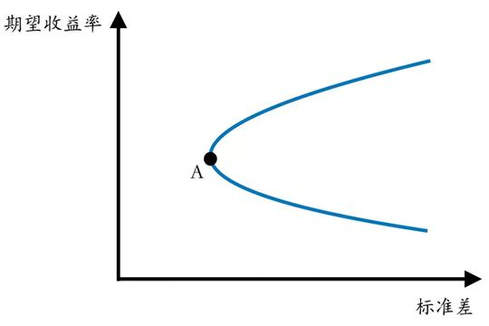

这条曲线被叫做***有效前沿(efficient frontier)***。由于它的形状像一枚子弹尖，所以有时也叫做*马科维兹子弹(Markowitz bullet)*。有效前沿存在一个波动率最小的位置A，并且在这个点以上的位置才是真正“有效”的；我们是固定预期收益算得的最低风险而得到的这条曲线，如果再固定风险并选择最大的预期收益，则会筛选掉有效前沿的下半部分。所以，很多时候人们所说的“有效前沿”会特指上半部分。

#### **夏普比率**

有效前沿左侧的区域是通过风险资产无法配置出的。但是如果把无风险资产加入资产配置，那么左侧的一些位置是可以获取的。

我们选择有效前沿上的一个资产配置$P$，并选择比例$α≥0$，将本金的 $α$ 配置于$P$，并将$1−α$ 配置于无风险资产。如果$α≤1$，那么$1−α≥0$，也就是说，我们将 $1−α $倍的本金存入银行或买入债券，获取那部分的无风险利率。如果$α≥1$，那么$1−α≤0$，意思是，我们贷款本金$α−1$ 倍的资金，支付无风险利率，并用贷款连同本金一并配置于$P$。如此，以$α$ 为系数，使用$P$ 和无风险资产配制出一个组合，我们将它的收益随机变量记为 $r_α$。计算得到
$$
E[r_α]=E[αr_P+(1-α)r_f]=αE[r_P]+(1-α)r_f
$$

$$
σ_α=\sqrt{Var(αr_P+(1-α)r_f)}=ασ_P
$$

以上配置组合在期望收益率-标准差曲线上表现为一条经过有效边界上一点的射线，这条线被称为***资本配置线（CAL, Capital Allocation Line）***，线上的每一点表示一个风险资产与无风险资产组成的投资组合。

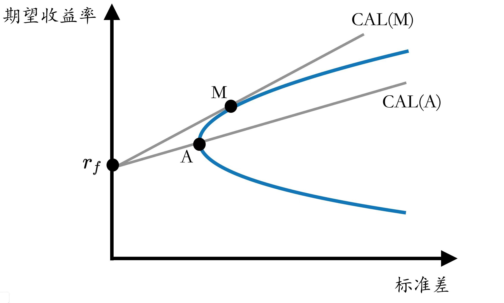

CAL 的斜率为$Sharpe(P)=\frac{E(r_P)-r_f}{σ_P}$​，在金融学中，我们把这一比率称为***报酬－波动性比率（reward-to-variability ratio）***，又称***夏普比率（Sharpe Ratio）***。容易发现，**夏普比率刻画了投资组合每承受一单位总风险，会产生多少超额报酬**。也就是说，可以认为，夏普比率越高的投资组合越佳；同时也能发现，在给定的标准差上，夏普比率更高的 CAL 拥有更高的期望收益。

#### 市场组合和资本市场线

用市场信息计算得来的有效前沿上必定有一个夏普比率最高的点M，我们将其叫做***市场组合(market portfolio)***。穿过M的资产配置线CAL(M)叫做***资本市场线(capital market line)***。资本市场线的意义在于，固定标准差，那么市场上收益预期最高的投资组合在这条线上；或者，固定预期收益，那么市场上标准差最低的投资组合在这条线上。所以，资本配置线可以直观地理解为理论上的“最佳配置线”。

### 4.2.3 CAPM 模型

资本资产定价模型（Capital Asset Pricing Model，简称CAPM）建立于MPT之上，用简单的数学公式表述了资产的收益率与风险系数$β$ 以及系统性风险之间的关系。

#### **模型假设**

CAPM 假设，市场上所有的投资者对于风险和收益的评估仅限于对于收益变量的预期值和标准差的分析，而且所有投资者都是完全理智的。并且，市场是完全公开的，所有投资者的信息和机会完全平等，任何人都可以以唯一的无风险利率无限制地贷款或借出。因此，所有投资者必定在进行资产分配时计算同样的优化问题，并且得到同样的有效前沿和资本市场线。

为了最大化预期收益并最小化标准差，所有投资者必定选择资本市场线上的一点作为资产配置。也就是说，所有投资者都按一定比例持有现金和市场组合M。因此，M 是名副其实的“市场组合”，因为整个市场都是按照这个组合来分配资产的。所以 M 的波动性和不确定性不单单是市场组合的风险，也是整个市场的风险，叫做***系统性风险(systematic risk)***。

#### **CAPM 公式**

CAPM 公式表示了任何风险资产的收益率和市场组合的收益率之间关系。在这个公式中，任何风险资产的收益率都可以被分为两个部分：无风险收益和风险收益（β 收益）。

对于某一风险资产$S$，有$E[r_S]=r_f+β_S(E[r_M]-r_f)$，其中$r_S$是$S$的收益变量，$r_M$是市场组合的收益变量，$r_f$是市场的无风险利率，$β_S=\frac{Cov(r_S,r_M)}{Var(r_M)}$是组合 $S$ 对于市场风险的敏感度。$E[r_M]-r_f$是市场组合的风险收益，$β_S(E[r_M]-r_f)$是资产$S$的风险收益，可以理解为，资产$S$承担了$β_S$倍的市场风险，所以将会得到相应倍数的风险补偿。

在CAPM 下，风险组合$S$ 的预期收益是完全由它的 $β_S$决定的，与这个资产自己的风险$σ_S $是没有关系的。也就是说，假设风险资产$S$有巨大的风险$σ_S $，但是它和市场组合的相关性 $β_S$ 很小，那么$S$ 预期的收益率其实是很小的。

通过 CAPM 公式，还可以推算出资产$S$  的夏普比率$Sharpe(S) $和市场组合$M$ 的夏普比率 $Sharpe(M) $的关系: $Sharpe(S) =Corr(r_S,r_M)Sharpe(M)$。也就是说，组合$S$  的夏普比率等于$M$  的夏普比率乘以$M$  与 $S$ 的相关系数。在 MPT 模型中，$M$  是所有风险组合中夏普比率最高的，也就是最有效的。这个公式告诉我们， $S$ 和$M$ 的相关性越高，$S$ 的夏普比率就越高，收益与风险的比值也就越大。

#### **CAPM 的应用**

CAPM 公式的应用在理论上是一个悖论，那是因为在 CAPM 的假设下所有投资者都持有市场组合 $M$，那么投资者也没有必要去单独计算每一个风险资产的收益率 ，因为他所持有的资产配置已经是最优的了。但实际上，投资者的效用标准都不一样，资产配置也大相庭径，并不存在一个一致认同的市场组合，这时 CAPM 公式就可以派上用场。在现实环境里，我们可以将一个概括市场整体的组合（比如大盘指数）作为市场组合，并以其为基准计算每个风险资产的系统性风险$β$。这样，我们根据对市场整体趋势的判断以及对风险控制的需要，选择适当的$β $进行资产配置。

### 4.2.4 套利定价理论（APT）与多因子模型

套利定价理论可以被理解为CAPM的一个推广，由APT给出的定价模型与CAPM一样，都是均衡状态下的模型，不同的是：CAPM把收益单纯的归为市场变化这一个因子引起的，而APT把收益归因在不同的因子上面。

APT 模型认为，套利行为是现代有效市场（即市场均衡价格）形成的一个决定因素，如果市场未达到均衡状态的话，市场上就会存在无风险套利机会，套利行为会使得市场重新回到均衡状态。APT 模型用多个因素来解释风险资产的收益，并根据无套利原则，得到风险资产均衡收益与多个因素之间存在（近似的）线性关系。也就是说，股票或者组合的预期收益率是与一组影响它们的系统性因素的预期收益率线性相关的，影响股票预期收益率的因素从CAPM 中的单一因素扩展到多个因素。**多因子模型（Multiple-Factor Model, MFM）**正是基于 APT 模型的思想发展出来的完整的风险模型。

现代金融理论认为，股票的预期收益是对股票持有者所承担风险的报酬，多因子模型正是对于风险—收益关系的定量表达，不同因子代表不同风险类型的解释变量。多因子模型定量刻画了股票预期收益率与每个因子之间的线性关系，可以表示为
$$
\tilde{r_j}=\sum_{k=1}^{K}X_{jk}*\tilde{f_k}+\tilde{u_j}
$$
其中，$X_{jk}$是股票$j$在因子$k$上的因子载荷，$\tilde{f_k}$是因子$k$的因子收益，$\tilde{u_j}$是股票$j$的残差收益率。

多因子模型常用三类因子：技术因子（动量、换手率、量比、波动等），宏观因子（GDP增长、工业增加值、CPI、利率、M1、M2等），基本面因子（估值、营业收入、净利润、负债等）。


## 4.3 常见的因子分类和有效性检验方法

### 4.3.1 基于日频数据的量化因子构建

#### 日频初始量化指标计算过程

从数据频率上看，日频数据是构建量化因子最常用的数据类型。以交易日为单位，市场每天会产生大量公开的价量及其衍生数据。此外，财报相关的低频率基本面数据，也可以较为方便地加工成基于交易日的日频数据，用于因子计算。

**常用日频基础数据列表**

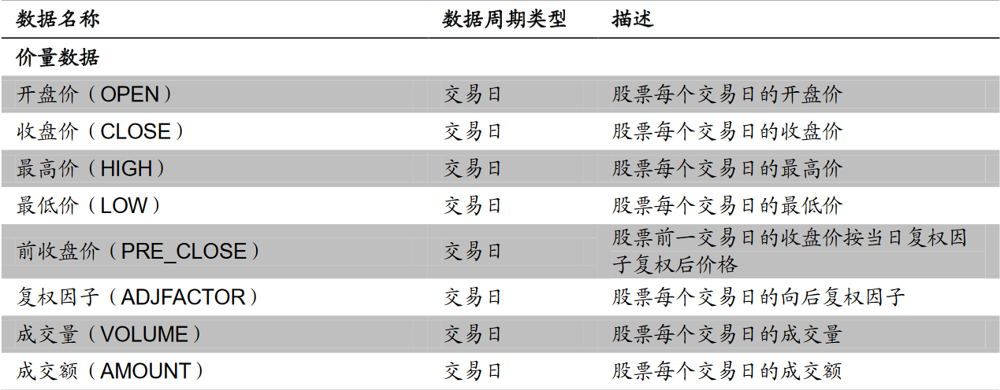

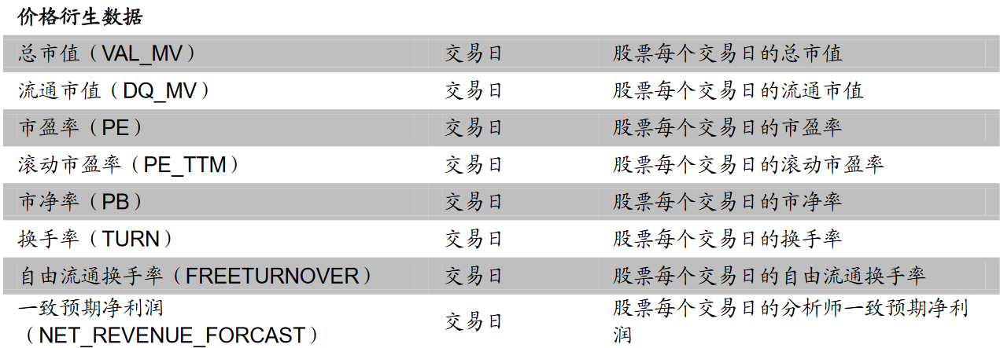

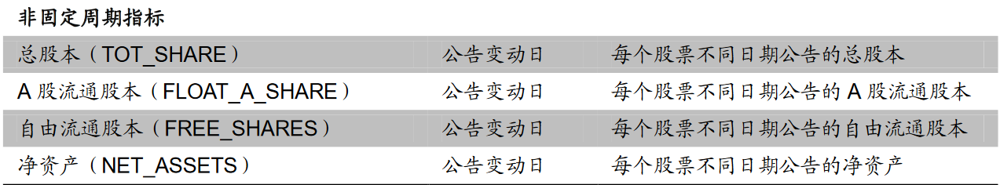

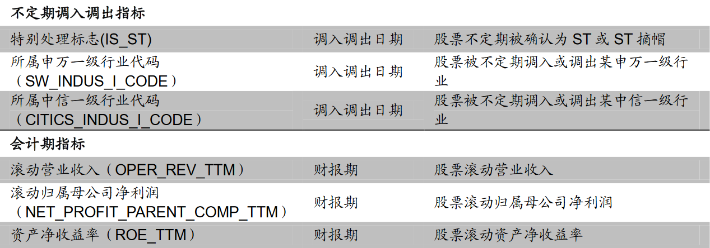

上表列举了较为常用的几种不同周期的日频基础数据。一般情况下，日频因子的初始量化指标计算过程便是通过设置不同参数提取上述指标的过程。

量化因子计算的常见操作过程为，处理以交易日为时间序列、不同标的为截面维度的数据类型。上表中不同周期类型的数据，除交易日类型的价量数据、价格衍生数据外，其他基本面数据，如财报数据、不定期公告数据，均可以利用最近数值填充法，将其处理为以交易日为时间序列的面板数据。

#### 日频量化指标计算算子

作为处理量化指标的原子运算单元，量化指标的面板数据结构决定了算子主要由时间序列算子与截面数据算子两种形式构成。常用的算子如下表所示。


算子的输入和输出都必须为面板数据。上述算子包含了处理面板数据时，用到的绝大多数计算方法。通过上述算子的递归迭代，基本可以满足目前主要因子计算所需的因子计算过程

#### 利用计算机语言表达量化计算过程的递归逻辑

量化计算过程即为一种递归过程。通过某种可以描述递归逻辑的表达范式，可以编写范式脚本，描述预先定义好的递归逻辑过程，并通过专用程序解析范式脚本，进行数据计算。 计算机程序语言天然被设计用以描述这样的逻辑范式。由于 λ 算子与图灵机、递归函数等价，因此无论是基于 λ 算子的函数式编程语言，还是基于图灵机的过程、命令范式语言，都可以用来构建量化计算过程。

选择计算机语言作为量化计算过程的逻辑描述工具有两种方案可供选择，一是完全借鉴现有的 R、Matlab 等传统量化研究中比较常用的语言，构建其语法的解释器，并实现上述算子与初始量化指标计算过程。二是完全构建一套新的计算机语言，专门用于量化计算过程的逻辑范式描述，最大程度地保证对该语言的控制力。 出于快速实现的考虑，本文采用第二种方式，即构建了一套自己的语言，通过构建量化计算过程的方式，在服务器中计算并维护 BARRA 风格因子。

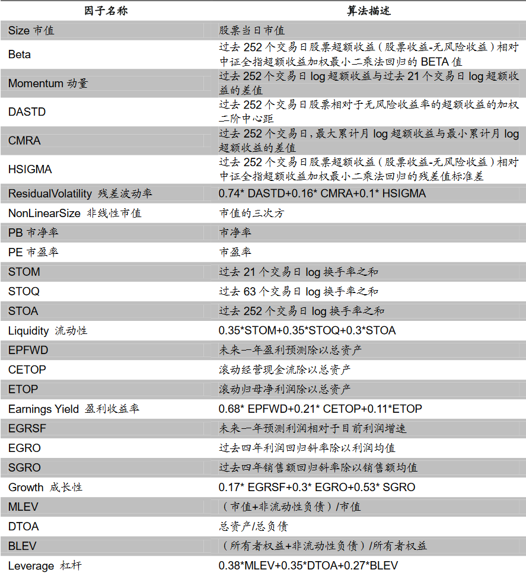

BARRA 风格因子计算方式如上表所示。其中，除市值、市盈率等可以直接从初始量化指标计算过程中获得，其他指标均需要经过数次量化指标计算算子的递归迭代得到。其定义方式的迭代逻辑相对复杂，但逻辑过程固定，且需要计算的中间指标与最终指标的数量均有限。对于这种固定且数量较少，但相对需要多层次复杂迭代的递归逻辑，直接将逻辑转换为程序语言是一种较高效的方式。

### 4.3.2 基于高频数据的量化因子构建

随着传统量化选股方式的广泛应用，经典日频因子的效果逐渐降低，并逐渐转化为风险因子。因此，除利用自动因子生成方式，尽可能挖掘传统基础数据的有效信息外，引入新的量化因子数据源是提供组合 ALPHA 的重要方式。自 2010 年交易所推出LEVEL2 行情源以来，透过描述市场成交细节的日内高频行情信息，分析、寻找价格形成的细节脉络成为构建新的 ALPHA 因子的重要方式。 相较于日频数据，高频数据虽然拥有更高的数据密度与不同的数据结构，但就单个标的来看，依然可以将其定义为一种时间序列数据进行处理。因此，对应的因子计算过程的大体思路依然可以沿用上一节所述的量化因子计算过程这一框架。

#### 高频初始量化指标计算过程

下表列示了交易所的 LEVEL2 行情产品，基于此可以构建不同种类的高频初始量化指标计算过程。

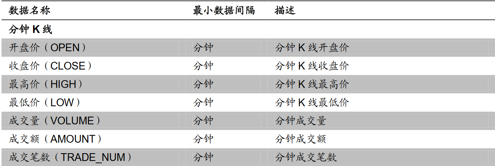

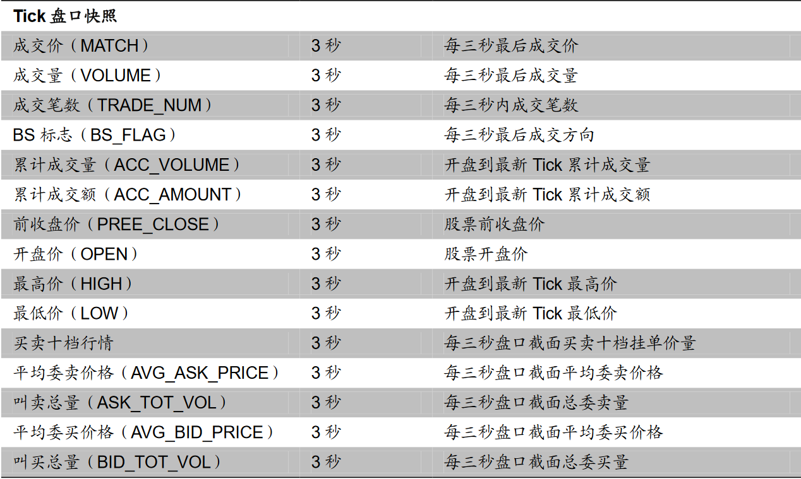

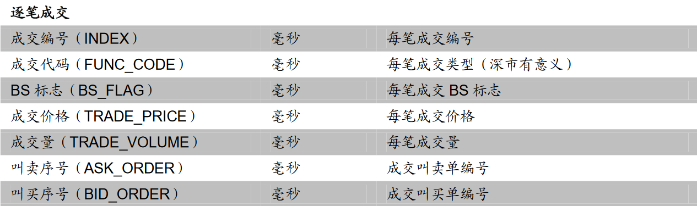

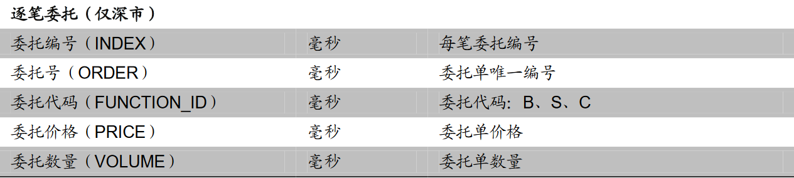

高频与日频数据间的最大差异在于不同的时间周期与数据结构。与传统的日频数据相比，除单日数据量大增外，时间单位的不整齐也是高频数据的另一重要特征。除分钟数据严格的在每个交易日的 240 分钟均有数据外，Tick 数据、逐笔数据均会因标的成交热度不同而有较大差异，其时间序列有明显的时间间隔不均匀特性。

#### 高频量化计算算子

从算子类型角度看，与日频数据相同，高频数据算子依然由初等函数、一阶谓词逻辑以及基本的时间序列函数和截面统计函数构成。由于高频数据具有数据规模大、时间间隔不均匀的特性，在处理过程中有以下几点需要注意。

**分段的数据处理过程。**由于高频数据规模很大，因此单次数据处理往往需要按标的或者按时间窗口对数据规模进行划分。一次性计算所有指标对应的所有时段数据，很有可能因为计算资源有限而无法实现。 **高频数据的低频化。**间隔不均匀的时间序列数据往往需要先变为均匀时间间隔的数据后，才能进一步处理。将数据处理为最小时间间隔单位可以保证不损失信息，然而却会因为空值填充给本来就需要降噪的高频数据增加更多噪音。因此，将高频数据利用统计或者抽样方式处理为低频数据是更常用的方式。 **计算的时间窗口应当避免跨交易日。**日内数据包含当天的市场交易观点和信息，很多时候依赖随机过程模型进行统计抽样。集合竞价的交易制度与隔夜信息会扭曲数据随机过程的特性，对于抽样后的再处理会有一定程度的干扰。因此在降低数据频率，选择计算的时间窗口时应尽可能规避跨交易日。而且，对集合竞价数据也需特别处理。

参考：

- https://pdf.dfcfw.com/pdf/H3_AP202111081527725354_1.pdf?1636370064000.pdf
- http://pdf.dfcfw.com/pdf/H3_AP201812281280201395_1.pdf
- https://www.htsec.com/jfimg/colimg/upload/20190617/57351560753225842.pdf

### 4.3.3 常见的因子有效性检验方法

一直以来，投资者普遍认为因子代表某种系统性风险，它能够解释投资组合的收益或帮助进行资产定价。追踪好有效因子，或许可以帮助获得额外的  alpha 收益。Smart Beta  遵循了这种思路，通过一系列历史数据测算结果来帮助编制因子指数，试图以现在的模型经验，去构造未来的收益图像，获得风险溢价。因子在量化投资中扮演着非常重要的角色。价值因子、质量因子、低波动因子等是被验证过的有效因子。在这些光鲜的、能对资产进行定价的“有效因子”的背后，仍旧有着无数的被验证过无效或者尚且待验证的因子。

在[《风险管理 | 风险和收益中的取与舍》](https://zhuanlan.zhihu.com/p/387535262)中，我们提到了  beta 因子和 alpha 因子。上述的这些有效因子是 beta 因子，用于资产定价、解释风险溢价，而 alpha 因子则更关注其带来  alpha 收益的能力。因此，在评估一个因子的有效性时，通常认为 beta 因子能够进行资产定价，或 alpha  因子在一定时间内能够解释未来的股票收益。学术届更关注的是 beta  因子的检验——解释风险溢价的能力，热衷于追逐因子测试的结果显著性；而将因子用于投资实践的人则更关注 alpha 因子的检验——带来 alpha  收益的能力，看重因子预测股票收益的能力及稳定性。因此，衡量一个新的因子最终走向有效或无效的方法在不同领域中是有所区别的。

**学术角度，P值帮助判别因子有效性**

**01 P 值确定统计显著性**

从学术的角度来看，衡量 beta 因子有效性的一把重要尺子是 p 值。p 值的作用是在假设检验中确定结果的统计显著性，这也是假设检验的最终目标。p 值表示在原假设 H0 下出现观察结果或比之更极端情形的概率（Fisher1925）。

通俗地讲，原假设  H0 就像是我们提出的声明，一系列的数据信息是我们要查找的证据，p 值代表的是支持这个“声明”成立的证据的强度。p  值小，证据强度小，说明在假设声明成立的情况下，这个证据不太能被看到（随机变量取值与观测值相差较多），推翻这个声明不会产生太大的错误——这个时候就应该怀疑这个声明错了，原假设不成立。但假如能看到这个证据（随机变量取值与观测值接近），说明声明很可能是成立的——无法拒绝原假设。所以，p  值并非是原假设成立的概率，而是支持原假设的证据被看到的概率。除了 p  值，通常还会有一个显著性水平，它是人们设定的阈值，是判定证据的有效和无效的边界。低于这个阈值，则认为声明无效。

参考：

- https://bigquant.com/wiki/doc/yinzi-youxiaoxing-zhengquan-20150626-9WPIjRDVwU
- https://www.windquant.com/qntcloud/article?131fdd2d-17c0-4830-82db-4e2cf5815005
- https://zhuanlan.zhihu.com/p/401407917


## 4.4 行业与市值中性化

在股票市场中，投资者常常利用多种因子来预测股票的未来收益，并根据预测结果制定投资策略。然而，这些因子的有效性往往会受到股票市值、行业归属、投资风格等因素的影响。比如，某个因子对于大市值的股票可能非常有效，而对小市值的股票则效果较弱；同样，某个因子在某个行业中可能非常有用，但在另一个行业中可能并不适用。因此，我们需要对因子进行处理，剔除掉因子中可能包含的其他因素，使得我们的因子更加纯粹，更能反映其自身的信息。

因子中性化，也被称为正交化，是一种剔除已有常见因子影响的方法。在实际操作中，我们一般只考虑市值和行业这两个方面的影响，这两种影响分别称为市值中性化和行业中性化。

市值中性化是一种常用的因子中性化方法，其主要目标是剔除股票市值对因子影响，从而得到更纯粹的因子值。这种方法尤其适用于处理连续性数据。在具体操作中，市值中性化通常通过对市值取对数然后进行线性回归的方法来实现。我们通常设定一个模型，如下式所示：$$
Y = \beta \cdot \ln(\text{MarketValue}) + \alpha + \varepsilon
$$**其中：**

- $Y$是我们关注的因子
- $MarketValue$ 是股票的市值
- $ln()$ 是自然对数函数，用于将偏态的市值数据转换为更接近正态分布的数据
- $\beta$ 和 $\alpha$ 是回归系数，需要通过数据来估计
- $\varepsilon$ 是回归残差，代表在控制了市值影响之后，因子的真实值

在进行回归分析后，我们得到的$ \varepsilon$就是市值中性化后的因子。这个因子已经剔除了市值的影响，因此能更真实地反映其他因素的影响。在 Python 中，可以使用 statsmodels.api 来实现这个过程。代码如下：

```python
import numpy as np
import pandas as pd
import statsmodels.api as sm

# 假设我们有一个包含市值因子和收益的数据框 DataFrame
# 数据框的列包括：'日期'、'股票代码'、'市值'、'收益'等

# 假设我们已经从数据源加载了数据，存储在变量 data 中

# 选择所需的列
data = data[['日期', '股票代码', '市值', '收益']]

# 根据日期进行分组
groups = data.groupby('日期')

# 定义一个函数来执行市值中性化
def market_neutralize(group):
    # 提取市值和收益的数据列
    market_cap = group['市值']
    returns = group['收益']

    # 添加截距项
    X = sm.add_constant(market_cap)

    # 执行线性回归，拟合收益率与市值的关系
    model = sm.OLS(returns, X)
    results = model.fit()

    # 提取回归系数
    beta = results.params['市值']

    # 计算市值中性化后的收益
    neutralized_returns = returns - beta * market_cap

    # 将市值中性化后的收益添加到数据框中
    group['市值中性化收益'] = neutralized_returns

    return group

# 对每个日期的数据进行市值中性化
neutralized_data = groups.apply(market_neutralize)
```

行业中性化是为了剔除因子在不同行业间的差异，得到真正意义上的因子收益，使得因子在所有行业之间的表现更加稳定。行业中性化更多针对离散数据，具体来说，行业中性化可以通过两种方法进行：行业均值做差和回归取残差。

- 行业均值做差
  
  通过将股票按照行业进行分组，计算每个行业分组的因子行业均值，然后将每个股票的因子值减去对应的行业的因子的均值，得到的差值就是该因子在行业中性化后的中性值。
  
  假设我们要计算因子$Y$的行业中性化值，对于股票$i$所在的行业$Industry_i$，该方法可以用以下公式表示：$$\varepsilon_i = Y_i - \overline{Y}_{\text{Industry}_i}$$ **其中**：
  - $Y_i$是股票i的因子值
  - $\overline{Y}_{\text{Industry}_i}$是股票i所在行业的因子均值
  - $\varepsilon_i$就是股票i的行业中性化后的因子值

- 回归取残差
  
  对于离散数据的回归法使用哑变量线性回归法。假设当前股票中一共有n个行业，那么就有n个哑变量。原理和结果与行业均值做差法一样，可以用以下公式表示：$$Y_i = \sum_{j=1}^{n} \text{Industry}_{ij}*\beta_{j} + \alpha + \varepsilon_i$$**其中**：
  - $\text{Industry}_{ij}$是股票i所在行业的哑变量（如果股票$i$属于行业$j$，则$\text{Industry}_{ij}=1$，否则$\text{Industry}_{ij}=0$）
  - $\beta_{j}$是行业j的回归系数
  - $\alpha$是截距项
  - $\varepsilon_i$就是股票i的行业中性化后的因子值
  
  行业中性化的目标是找到因子$Y$和行业哑变量之间的关系，然后将行业因素的影响从因子$Y$中剔除，得到真正的因子收益$\varepsilon$。


## 4.5 Python多因子选股策略实践

多因子选股模型是一个用来选择股票投资组合的策略，它考虑了多个与预期收益相关的因子。这种模型的理念基于这样的理论：单一因子可能无法全面捕捉到市场的所有变化，而多个因子的组合可以提供更全面、更稳定的预测。

多因子选股模型的核心思想是通过多个因子的组合来选择股票，因子可以通过历史数据来计算，然后用来预测未来的股票表现，以期获取更全面、更稳定的预测。这些因子可以包括基本面因子、技术分析因子、宏观经济因子等。例如：

- 基本面因子：包括市盈率（PE）、市净率（PB）、营业收入增长率等
- 技术分析因子：包括动量（Momentum）、波动率（Volatility）等
- 宏观经济因子：包括利率、通货膨胀率等

在实现多因子选股模型时，需要进行以下步骤：

- 确定目标和约束条件

  明确多因子模型要达到的投资目标收益率、风险水平等要求。同时考虑实际的投资约束,例如组合数目限制、行业比例限制等。

- 选择因子并计算

  根据目标和约束条件,选择合适的股票因子,如PE, PB等。收集数据计算得到每只股票的各因子值。

- 异常值处理

  检查数据中的异常值和错报数据,进行处理和滤除,保证因子值的质量。

- 因子标准化

  因为不同因子的取值范围差异很大,需要进行标准化处理,例如去均值和缩放等。

- 确定因子权重

  根据因子的重要性给予不同权重,通常通过统计方法比如主成分分析来确定。

- 构建多因子模型

  结合因子值和权重,建立多因子评分模型,得到各股票的综合评分。

- 股票筛选和组合优化

  根据评分进行股票筛选,并进行组合优化,获得符合目标和约束条件的优化组合。

- 回测和调整模型

  使用历史数据回测多因子模型的效果,根据结果进行调整和改进。


以下是一个使用Python实现一个简单的多因子选股模型的基本示例：

```python
import pandas as pd
import numpy as np
from sklearn.preprocessing import StandardScaler
from sklearn.linear_model import LinearRegression
from sklearn.model_selection import train_test_split

# 读取和准备数据
df = pd.read_csv('stock_data.csv')
X = df[['PE', 'PB', 'ROE']] # 特征因子
y = df['Returns'] # 目标变量

# 拆分训练数据和测试数据
X_train, X_test, y_train, y_test = train_test_split(X, y, test_size=0.2, random_state=42)

# 标准化处理
scaler = StandardScaler()
X_train = scaler.fit_transform(X_train)
X_test = scaler.transform(X_test)

# 构建线性回归模型
model = LinearRegression()
model.fit(X_train, y_train)

# 查看模型系数,确定因子权重
print('Factor weights:', model.coef_)

# 使用模型预测测试数据的收益
y_pred = model.predict(X_test)

# 创建一个DataFrame来存储股票的预测收益
predicted_returns = pd.DataFrame({
    'Stock': X_test.index,
    'Predicted return': y_pred
})

# 根据预测的收益选择股票
selected_stocks = predicted_returns[predicted_returns['Predicted return'] > 0.1]

print('Selected stocks:', selected_stocks)
```

以上示例实现了一个线性回归的多因子模型，通过PE、PB、ROE三个因子来预测股票收益,并利用模型系数作为因子权重。这个模型仅仅是一个基本的多因子模型，并且采用了线性回归作为预测模型，在实际情况下，可以根据需求调整和改进，增加更多因子，使用更复杂的模型，例如神经网络、随机森林等，或者使用更复杂的特征工程技术，例如PCA、特征选择等。此外，这个模型没有进行任何形式的模型验证，例如交叉验证、超参数调优等，可进一步针对性优化。