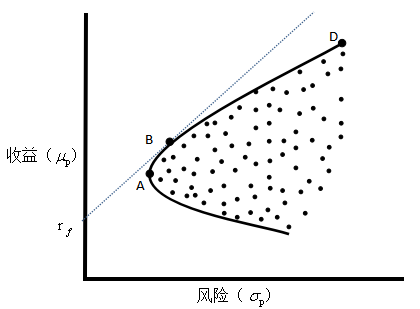
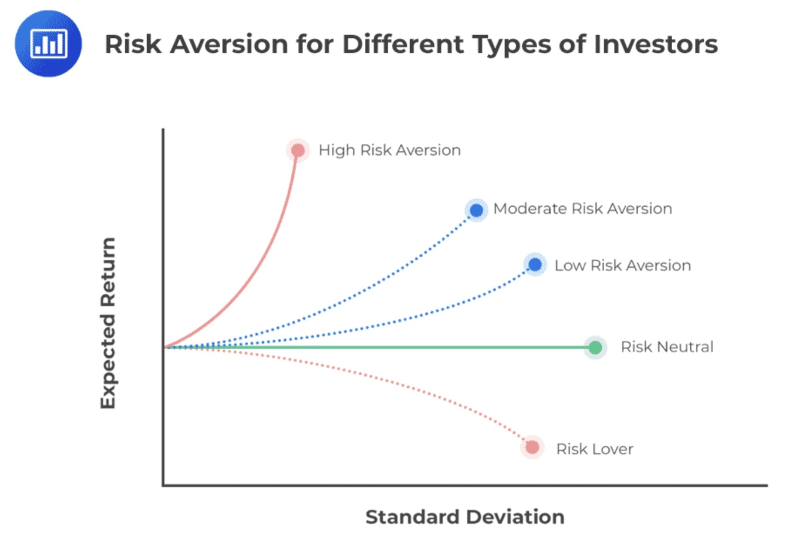
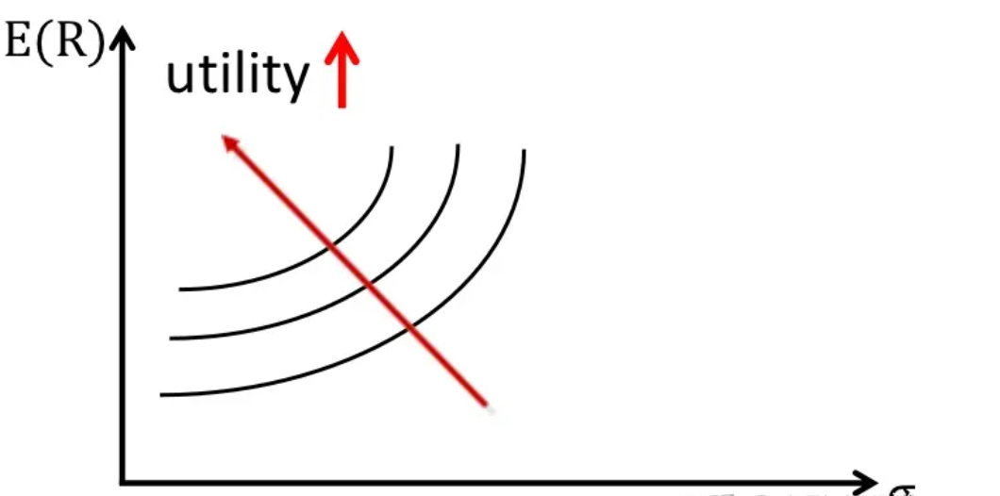
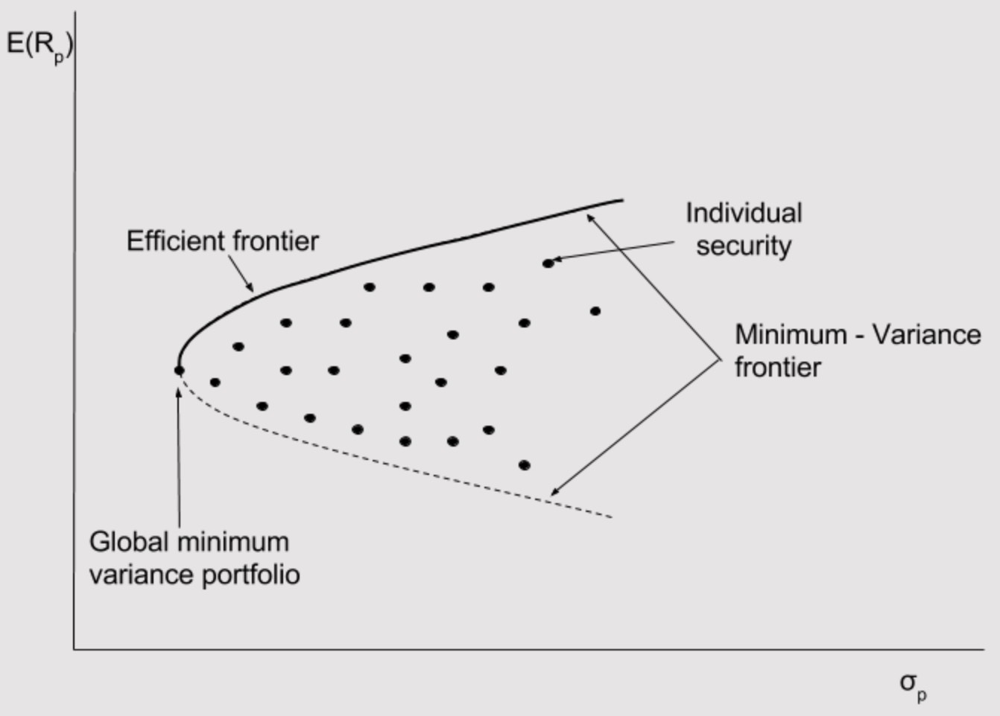
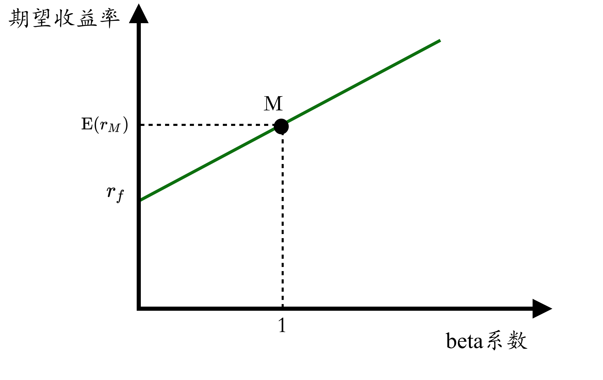
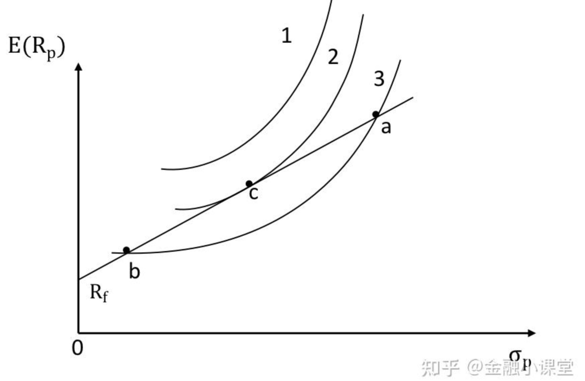
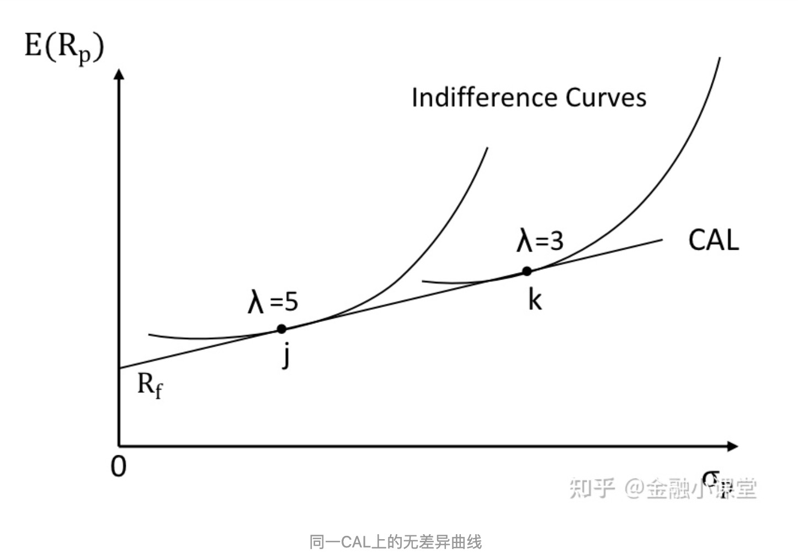
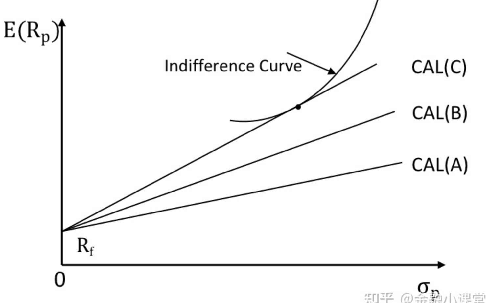
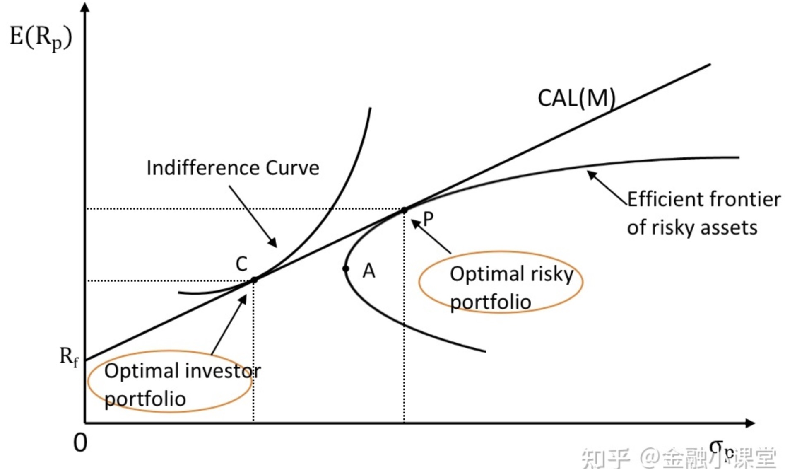
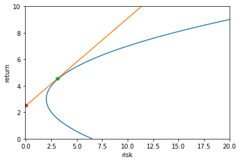

# ch06_量化调仓策略

目录

6.1 如何衡量投资组合的收益率

6.2 如何衡量投资组合的风险

6.3 最优化方法计算投资组合的最佳仓位

6.4 Python实现最佳仓位控制

6.5 投资组合的有效前沿与资本市场线（选修）

6.6 CAPM资本资产定价模型（选修）

## 6.1 如何衡量投资组合的收益率

### 6.1.1 投资组合收益率的计算方法

投资组合的收益率是指投资组合在一定时间内的总体收益率。投资组合的收益率可以通过加权平均每个资产的收益率来计算。具体地，假设投资组合中有n个资产，每个资产的收益率为r1, r2, ..., rn，每个资产的权重为w1, w2, ..., wn，则投资组合的收益率为：
$$ 投资组合的收益率 = w_1 \times r_1 + w_2 \times r_2 + ... + w_n \times r_n $$
其中，权重wi表示资产i在投资组合中的占比，满足w1 + w2 + ... + wn = 1。投资组合的收益率是衡量投资组合表现的重要指标，它可以帮助投资者评估投资组合的回报水平，并与市场指数或其他投资组合进行比较。

### 6.1.2 投资组合的绝对收益率和相对收益率

投资组合的收益率不仅取决于投资组合本身的表现，还取决于市场的整体表现。因此，在比较投资组合的收益率时，需要将其与市场平均收益进行比较，以便更好地评估投资组合的表现。因此，衡量投资组合的收益率通常使用两种指标：绝对收益率和相对收益率。

1. 绝对收益率是指投资组合的实际收益与初始投资金额之间的比率。计算公式如下：
   $$绝对收益率 = \frac{投资组合的实际收益 - 初始投资金额}{初始投资金额} \times 100\% $$

    例如，如果你的投资组合初始投资金额为 10000 元，最终实现的收益为 12000 元，则绝对收益率为 (12000 - 10000) / 10000 = 0.2，即 20%。

2. 相对收益率是指投资组合的实际收益与市场平均收益之间的比率。计算公式如下：
   $$相对收益率 = \frac{投资组合的实际收益 - 市场平均收益}{市场平均收益} \times 100\% $$
    例如，如果你的投资组合实现的收益为 12000 元，而市场平均收益为 10000 元，则相对收益率为 (12000 - 10000) / 10000 = 0.2，即 20%。


## 6.2 如何衡量投资组合的风险

### 6.2.1 风险的定义

**风险**是指在未来可能发生的不确定性事件所带来的潜在损失。  
在投资领域中，风险通常指投资所面临的不确定性和潜在的损失。投资的风险通常由多种因素决定，包括市场波动、政治和经济环境、行业和公司的基本面等。投资的风险越高，意味着投资者可能面临更大的损失，但同时也可能获得更高的回报。

### 6.2.2 投资组合的风险

**投资组合的风险**是指投资组合在未来可能出现的损失或波动的程度。投资组合的风险通常由其波动性、损失概率和损失幅度等因素来衡量。投资组合的风险越高，意味着投资者可能面临更大的损失，但同时也可能获得更高的回报。因此，在进行投资决策时，需要综合考虑投资组合的风险和预期回报，以便做出更加明智的决策。

### 6.2.3 衡量投资组合的风险

投资组合的风险可以通过多种方式进行衡量，以下是一些常见的方法：  

1. 方差和标准差：方差和标准差是衡量投资组合波动性的常用指标。方差是每个资产收益率与平均收益率之差的平方的平均值，标准差是方差的平方根。  
   方差和标准差越大，表示数据分布越分散，反之则表示数据分布越集中。  
   在投资领域中，方差和标准差通常用于衡量资产或投资组合的波动性，即风险。  
   方差和标准差的计算公式如下：

    方差：$\sigma^2 = \frac{1}{n}\sum_{i=1}^{n}(x_i - \mu)^2$

    标准差：$\sigma = \sqrt{\frac{1}{n}\sum_{i=1}^{n}(x_i - \mu)^2}$

    其中，$x_i$表示第i个数据点，$\mu$表示所有数据点的平均值，$n$表示数据点的数量。

    下面是一个Python函数，可以计算投资组合的方差和标准差：

    ```python
    import numpy as np
   
    def portfolio_volatility(weights, returns):
    """
        计算投资组合的波动性（标准差）
        :param weights: 投资组合中每个资产的权重
        :param returns: 每个资产的收益率
        :return: 投资组合的标准差
        """
        portfolio_return = np.dot(weights, returns)
        portfolio_volatility = np.sqrt(np.dot(weights.T, np.dot(np.cov(returns), weights)))
        return portfolio_volatility
    ```


2. Beta系数：Beta系数是衡量投资组合相对于市场整体波动的指标，用投资组合与市场组合的协方差与市场组合的方差的比值计算。
   $$
   \beta_{i}=\frac{\operatorname{Cov}\left(r_{i}, r_{m}\right)}{\operatorname{Var}\left(r_{m}\right)}
   $$
   Beta系数为1表示投资组合的波动与市场整体波动相同，小于1表示波动小于市场整体波动，大于1表示波动大于市场整体波动。  
   Beta系数的计算方法是将资产或投资组合的收益率与市场指数的收益率进行回归分析，得到回归系数即为Beta系数。Beta系数越高，表示资产或投资组合的风险越高，但同时也可能获得更高的回报。Beta系数的计算可以使用统计软件或在线工具进行。

3. Value at Risk（VaR）：VaR是衡量投资组合在一定置信水平下的最大可能损失的指标。  

   令$\alpha \in(0,1)$ 而$F_{L}$为事件$L$的分布函数，则VaR如下
   $$
   \operatorname{VaR}_{\alpha}(L)==\inf \left\{y \in \mathbb{R} \mid F_{L}(y) \geq \alpha\right\}
   $$
   即VaR是满足使损失不超过y的概率大于等于$\alpha$的最小的y值.

   例如，一个10%的VaR表示在90%的时间内，投资组合的损失不会超过VaR的值。VaR通常用于衡量投资组合的风险水平，以便投资者能够更好地控制风险。  
   VaR的计算方法有多种，其中最常用的是历史模拟法、蒙特卡罗模拟法和正态分布法。历史模拟法是基于历史数据进行模拟，蒙特卡罗模拟法是基于随机模拟进行模拟，正态分布法是基于正态分布进行模拟。  
   VaR的计算方法和置信水平的选择会影响到VaR的准确性和可靠性，因此需要根据具体情况进行选择。

4. Conditional Value at Risk（CVaR）[^1]：CVaR是VaR的扩展，它衡量的是在VaR损失超过一定阈值时的平均损失。

   即在一定的置信水平1-α上，测算出损失超过VaR值的条件期望值
   $$
   \operatorname{CVaR}_{1-\alpha}=-\frac{\int_{0}^{1-\alpha} \operatorname{VaR}_{\alpha}(L) d r}{1-\alpha}
   $$
   CVaR模型在一定程度上克服了VaR模型的缺点不仅考虑了超过VaR值的频率，而且考虑了超过VaR值损失的条件期望，有效的改善了VaR模型在处理损失分布的后尾现象时存在的问题，通常也被认为比VaR更加保守。  

## 6.3 最优化方法计算投资组合的最佳仓位
在前面的学习中，我们分别从截面（多因子模型）和时序（择时策略）两个方面学习了如何对各个股票的未来收益率进行预测；在多因子模型中，我们在同一个时间截面上，计算出每个股票在不同因子上的暴露，通过线性/非线性的方法将多个因子合成综合因子作为股票未来收益率强弱的预测值；在择时策略中，我们计算每个股票的时序信号，更进一步地，我们可以将离散的时序信号值连续化，使得不同股票的择时信号不再是0或1，连续信号的差异化使得在截面上不同股票的择时信号能够进行强弱比较。
细心的读者可能已经发现了，上文多因子模型和时序策略，提到的最终目标，都是在每一个时间截面上，输出股票对未来收益率的预测值，并且在截面上不同股票之间进行强弱比较。这是因为在实盘中，往往有多种限制约束着我们的投资行为。一个最现实的考量就是资金，以A股为例，买卖股票最小的单位为1手，即100股；如果时序模型同时有100支股票产生买入信号1，又或者多因子模型预测值前100支股票具有同样的值；但此时我们可支配的资金只足够交易50支股票，那么如何从100支股票中定量地挑选50支股票呢？所以尽可能地，我们希望在同一时间截面上，不同股票的预测值之间是有差异的。
无论是作为主观投资者重仓少数证券，还是基于量化模型的策略，都会面临如上的问题，每一个证券买多少。假设我们的限制条件很少，例如只有前文提到的资金限制，而截面上不同股票的预测值差异足够大，我们能够恰如其分地选出目标数量的证券；而如果截面上的预测值差异不够大，例如我们需要在100支相同预测值相近的股票中挑选实际交易的50支股票，量化模型还可以借助组合优化的方法。
由此，便引出了本节内容的主题，投资组合优化，即如何分配资金。下文中我们将详细介绍各类优化方法，在此之前，首先我们先对常用的数学符号进行约定，如下表所示。
$$
\begin{array}{cc}N & \text { 组合内证券数量 } \\ \omega & \text { 权重向量 }(\mathbb{N} \times 1) \\ \omega_{\mathrm{i}} & \text { 证券 } \mathrm{i} \text { 的权重 } \\ \mu & \text { 预期收益率向量 }(\mathbb{N} \times 1) \\ \sigma & \text { 证券波动率向量 }(\mathbb{N} \times 1) \\ \sigma_{\mathrm{i}} & \text { 证券 } \mathrm{i} \text { 的波动率 } \\ \sigma_{i j} & \text { 证券 } \mathrm{i} \text { 和证券 } \mathrm{i} \text { 之间的协方差 } \\ \Sigma & \text { 方差协方差矩阵 }(\mathbb{N} \times \mathbb{N}) \\ \sigma_{\mathrm{p}} & \text { 组合波动率 } \\ \mu_{\mathrm{p}} & \text { 组合收益率 } \\ \lambda & \text { 风险厌恶系数 } \\ \mathrm{r}_{f} & \text { 无风险收益率 }\end{array}
$$
### 6.3.1 等权重
那么在没有任何信息或者偏好时，等权重是最简单的办法，即赋予组合中每个证券相同的权重，意味着我们视每个证券具有同等的重要性。
$$
\omega_{i}=\frac{1}{N}
$$
值得一提的是，虽然等权重看起来非常简单，不需要复杂的数学求解，但是等权重组合的业绩表现往往是非常抢眼的，因此在研究中常被用来作为比较基准。
### 6.3.2 市值加权
对于股票组合而言，在没有任何信息或者偏好时，还有另外一种使用非常普遍的组合方法，即市值加权。通常地，小市值的股票收益率的日波动是大于大市值股票的，因为小市值股票和大市值股票能承载的资金量是不同的，令小市值股票涨/跌1%需要的资金可能远小于大市值的股票。而如果我们希望在组合内各个股票平等的分配资金，由于大小市值这种属性，等权重组合可能需要非常频繁调仓。而市值加权，根据定义，对于选出的股票，按照其市值加权，即
$$
\omega_{i}=C a p_{i} / \sum_{i} C a p_{i} \\
C a p_{i} 为股票 i 的市值
$$
市值加权不需要频繁调仓，往往流动性也最强；不过，市值加权会给与高估值股票过多权重，给与低估值股票过少权重，因此结果在一些结构性行情下可能并不占优。
### 6.3.3 最小方差组合
Minimum Variance。前文两种组合方法，都是在没有任何信息或者偏好时可以使用的。然而，在实际投资过程中，每个投资者都暴露在海量的信息中，同时每个投资者的风险偏好也是不同的。对于风险厌恶的投资者，自然是希望投资者的风险是最小的。由于总体的风险是未知的，在组合优化中，我们常常用历史收益率的方差最为代理变量，追求组合整体的方差最小，数学表达为，
$$
\operatorname{Min} \ \sigma_{\mathrm{p}}=\omega^{\prime} \Sigma \omega \\
\Rightarrow \ \omega \propto \Sigma ^{-1} \mathbf{1}
$$
### 6.3.4 最大分散度
Maximum Diversification。从组合的方差-协方差矩阵我们可知，组合的整体风险一部分来源于各个证券自身的方差，另一部分来源于证券之间的协方差。因此，如果我们想降低组合风险，就应该尽量分散投资。在2008年，Choueifaty和Coignard于是提出了最大分散度优化，该方法的数学表达为，
$$
\operatorname{Max} \quad D(w)=\frac{\omega^{\prime} \sigma}{\sqrt{\omega^{\prime} \Sigma \omega}} \\
\Rightarrow \ \omega \propto \Sigma^{-1} \sigma
$$
目标函数被称为分散比率，分母为组合波动率，分子为成分的波动率加权平均。该方法最大化资产线性加权波动率与投资组合波动率的比值，故称为最大分散化资产配置组合。
### 6.3.5 风险平价
风险平价（Risk Parity）从风险的角度进行均衡配置，以追求所有证券对组合的风险贡献相同。首先定义所谓的边际风险贡献，即每增加1单位证券$i$的权重$ \omega_{i} $所引起的组合整体风险的变化，
$$
\begin{aligned} M R C_{i}=\frac{\partial \sigma_{p}}{\partial \omega_{i}} & =\frac{\omega_{i} \sigma_{i}^{2}+\sum_{j \neq i} \omega_{j} \rho_{i j} \sigma_{i} \sigma_{j}}{\sigma_{p}} \\ & =\frac{\sum_{j=1}^{N} \omega_{j} \rho_{i j} \sigma_{i} \sigma_{j}}{\sigma_{p}} \\ & =\frac{\rho_{i p} \sigma_{i} \sigma_{p}}{\sigma_{p}} \\ & =\left(\frac{\rho_{i p} \sigma_{i}}{\sigma_{p}}\right) \sigma_{p} \\ & =\beta_{i} \sigma_{p}\end{aligned}
$$
其中$\beta_{i}$表示证券$i$收益率相对于投资组合收益率的$\beta$系数；
定义了证券的边际风险贡献后，乘以其权重我们既可以得到风险贡献，
$$
\mathrm{RC}_{\mathrm{i}}=\omega_{\mathrm{i}} \times M R C_{i}=\omega_{\mathrm{i}} \frac{\partial \sigma_{\mathrm{p}}}{\partial \omega_{i}}
$$
由 Risk Parity 的定义有，
$$
\mathrm{RC}_{\mathrm{i}}=\mathrm{RC}_{\mathrm{j}} \\
\Rightarrow  \omega_{i} \frac{\partial \sigma_{p}}{\partial \omega_{i}}=\omega_{j} \frac{\partial \sigma_{p}}{\partial \omega_{j}}, \quad \forall i, j \\
$$
因此，风险平价组合的目标函数为，
$$
\operatorname{Min} \sum_{i=1}^{N} \sum_{j=1}^{N}\left(R C_{i}-R C_{j}\right)^{2} \\
\Rightarrow \quad \omega_{i} \propto \frac{1}{\beta_{i}}
$$
在 Risk Parity投资组合中，证券的权重和它相对于组合的 β 成反比；β 越高，其权重越低，从而有效的分散了风险，每个资产对组合的边际风险贡献相同。
### 6.3.6 均值方差优化
以上的介绍的最小方差、最大分散度、风险平价的优化方法，都还是集中在风险上。而我们常说，一个优秀的投资策略，往往是在给定风险水平下实现组合收益最大化，或者在给定收益水平实现组合风险最小化。稍微有一些金融相关背景的读者可能已经提前猜到了，最终我们绕不开的优化方法，也是组合优化问题中的老大哥，即Markowitz的均值方差优化。
其目标函数为，
$$
\operatorname{Max} \quad \omega^{\mathrm{T}} \mu-\frac{\lambda}{2} \omega^{\prime} \Sigma \omega
$$
理论上来讲，组合成分间存在无数个混搭方式，每种方式得到一个收益风险对，将所有结果集合在一起，就形成了可行域，如图所示。可行域中并不是所有点都是“好结果”，只有处于可行域上侧边缘的点才是最优值，即MVO的解，如图中A到D之间连线，这条线称为有效前沿。任何异于有效前沿的点，均能找到相同风险（收益）下收益（风险）更高（低）的组合。

图片来源：CQR
其中，图上的A点即前文讨论过的最小方差组合，位于有效前沿的最左端；而如果我们自无风险收益率起做一条射线，与有效前沿相切于B点，改点即为所有可行域中夏普比率最大的点，因此也被称为最大夏普组合。故也有另外一种常见的，最大化组合夏普比率，其目标函数为。
$$
\operatorname{Max} \frac{\omega^{\prime} \mu}{\sqrt{\omega^{\prime} \sum \omega}}
$$
相比于前文介绍的各个优化方法，均值方差优化引入了更多的参数。在实践中，也面临着更多的问题。由于引入了更多的参数，尤其是对预期收益率的估计，会使得优化结果对参数的输入非常敏感，结果就是优化出的权重在时序上换手较快；容易输出极端大或极端小的权重，最终组合时常在个别证券上集中度过高；基于历史数据的均值方差组合，由于估计误差，在样本外甚至很难超越等权重组合。当然列举诸多问题，并非是说均值方差模型徒有虚名。恰恰相反，均值方差模型在组合优化领域是最常用也最经典的，正是因此，我们应该更深入的去了解经典模型背后的优劣，使其在投资实践中发挥最大的价值。事实上，针对这些问题后续的改进工作也一直没有停过，比较出名的例如Black-Litterman模型，又或是Bayes-Stein模型，由于篇幅所限，暂时就不在此提及，有兴趣的同学可以自行去深入了解一下。
### 6.3.7 常见约束
在实际投资中，往往除了最现实的资金限制外，还会有各种各样的限制。比较常见的限制有，
**约束1：单资产权重的范围限制**：
$$
\omega_{lb} \leq \omega \leq \omega_{ub}
$$
**约束2：做空限制**
在A股市场融券的成本较高，因此一般是默认存在做空限制
$$
\begin{array}{l}\omega^{T} \mathbf{1}=1 \\ \omega \geq \mathbf{0}\end{array}
$$
另外，常见的量化策略例如指数增强和中性对冲，往往都有明确对标的基准指数，由此衍生出相对基准指数内的成分股的一些限制，
**约束3：行业中性化**
$$
\left(\omega-\omega_{\text {benchmark }}\right)^{T} I_{\text {industry } \in D}=\mathbf{0}
$$
其中，$\omega_{benchmark}$是基准指数内各成分股的权重向量，$I_{indusrty}$是代表行业的哑变量矩阵。
**约束4：风险敞口限制**
$$
\left|\left(\omega-\omega_{\text {benchmark }}\right)^{T}\right| f \leq f_{ub} \in[0,1]
$$
其中，$\omega_{benchmark}$是基准指数内各成分股的权重向量，$f$是风险因子暴露向量，$f_{ub}$是因子的风险敞口上限。
## 6.4 Python实现最佳仓位控制
在Python中我们可以使用scipy库构建组合优化模型，实现最佳仓位控制。
首先，我们导入如下Python库

```python
import akshare as ak
import datetime
import warnings
import pandas as pd
import numpy as np
from scipy.optimize import minimize
warnings.filterwarnings('ignore')

# 定义一些辅助函数
def get_weights(df: pd.DataFrame, target='sharp', canshort=False) -> pd.Series:
    '''
    :param df: 资产日度涨跌幅矩阵
    :param target: 优化目标 sharp→最大夏普比组合 rp→风险平价组合  var→最小风险组合
    :param canshort: 是否可以做空
    :return: 组合比率
    '''
    MeanReturn = df.mean().values  # 期望收益
    Cov = df.cov()  # 协方差
   
# 定义优化函数、初始值、约束条件
# 负夏普比
def neg_sharp(w):
    R = w @ MeanReturn
    Var = w @ Cov @ w.T
    sharp = R / Var ** 0.5
    return -sharp * np.sqrt(240)

# 风险
def variance(w):
    Var = w @ Cov @ w.T
    return Var * 10000

def RiskParity(w):
    weights = np.array(w)  # weights为一维数组
    sigma = np.sqrt(np.dot(weights, np.dot(Cov, weights)))  # 获取组合标准差
    # sigma = np.sqrt(weights@cov@weights)
    MRC = np.dot(Cov, weights) / sigma  # MRC = Cov@weights/sigma
    # MRC = np.dot(weights,cov)/sigma
    TRC = weights * MRC
    delta_TRC = [sum((i - TRC) ** 2) for i in TRC]
    return sum(delta_TRC)

# 设置初始值
w0 = np.ones(df.shape[1]) / df.shape[1]
# 约束条件 w之和为1
cons = [{'type': 'eq', 'fun': lambda w: np.sum(w) - 1}]
bnds = tuple((0, 1) for w in w0)  # 做多的约束条件，如果可以做空，则不传入该条件

if target == 'sharp':
    fc = neg_sharp
elif target == 'rp':
    fc = RiskParity
elif target == 'var':
    fc = variance

if canshort:
    res = minimize(fc, w0, method='SLSQP', constraints=cons, options={'maxiter': 100})
else:
    res = minimize(fc, w0, method='SLSQP', constraints=cons, options={'maxiter': 100}, bounds=bnds)

# if target == 'sharp':
#     print('最高夏普:', -res.fun)
# elif target == 'rp':
#     print('风险平价:', res.fun)
# elif target == 'var':
#     print('最低风险:', res.fun)

# print('最优比率:', res.x)
# print('年化收益:', ReturnYearly(res.x) * 100, "%")
weight = pd.Series(res.x, index=df.columns)
return weight
```
借助akshare我们下载股票的复权收盘价，计算日收益率
```python
def get_ret(code,start_date,end_date):
    data = ak.stock_zh_a_hist(symbol=code, period="daily", start_date=start_date, end_date=end_date, adjust="hfq")
    data.index = pd.to_datetime(data['日期'], format='%Y-%m-%d')  # 设置日期索引
    close = data['收盘']  # 日收盘价
    close.name = code
    ret = close.pct_change() # 日收益率
    return ret

end_date = datetime.datetime.now().strftime('%Y%m%d')
index_stock_cons_weight_csindex_df = ak.index_stock_cons_weight_csindex(symbol="000016")
stock_codes = index_stock_cons_weight_csindex_df['成分券代码'].to_list()
start_date =(index_stock_cons_weight_csindex_df['日期'].iat[0] - pd.Timedelta(days=365*1)).strftime('%Y%m%d')

ret_list = []
for code in stock_codes:
    ret = get_ret(code,start_date=start_date,end_date=end_date)
    ret_list.append(ret)
df_ret = pd.concat(ret_list,axis=1).dropna()
数据和模型都准备好后，我们就可以在时间轴上滚动计算最优化模型的权重，注意不要使用未来数据。
records = []
for trade_date in df_ret.loc[index_stock_cons_weight_csindex_df['日期'].iat[0]:].index.to_list():
    df_train = df_ret.loc[:trade_date].iloc[-1-240:-1]
    df_test = df_ret.loc[trade_date]
    StockSharpDf = get_weights(df_train, target='sharp')  # 最大夏普组合
    StockRPDf = get_weights(df_train, target='rp')  # 风险平价组合
    StockVarDf = get_weights(df_train, target='var')  # 最小风险组合
    records.append([trade_date,
                    (df_test.mul(StockSharpDf)).sum(),
                    (df_test.mul(StockRPDf)).sum(),
                    (df_test.mul(StockVarDf)).sum(),
                    df_test.mean()])
df_record = pd.DataFrame(records,columns=['日期','最大夏普组合','风险平价组合','最小风险组合','等权重组合'])
df_record = df_record.set_index('日期')
```


### 参考资料
[如何分配资金？组合优化的是是非非](https://mp.weixin.qq.com/s/Xm6tmd4WQEDnMw7Dft8TPw)
[浅析资产配置的几种方法](https://mp.weixin.qq.com/s/0WBpcEkWaNTIJ8H-u_9-OA)
[投资组合优化模型](https://mp.weixin.qq.com/s?__biz=MzAxNTc0Mjg0Mg==&mid=2653297069&idx=1&sn=0ce39862e32f523faf81a971caa357ad&scene=21#wechat_redirect)
[【实战】寻找最优投资组合：马科维兹 | 风险平价 | 最大夏普](https://www.wolai.com/stupidccl/vUp4zkiqPf2axRJvLAFfaa)


## 6.5 投资组合的有效前沿与资本市场线（选修）
### 6.5.1 效用函数（Utility Function）

效用函数是用来衡量投资者对不同投资组合所获得的满足程度，公式如下，
$$
U=E(R)-\frac{1}{2} \lambda \sigma^2    
$$
$E(R)$ 是组合预期收益， $\sigma$ 是组合标准差， $\lambda$ 是厌恶系数。

上面公式可以简单的理解为用收益减去方差，收益看作是正面的，由于方差有正有负，所以减去负面的那一半，那么剩下的就是对其满足感的量化。由于可以给出量化数值，那么就可以针对不同的组合进行排序。

如果给定效用值 $U^{\prime}$ ，即在 $U$ 不变的情况下，对上公式稍作变形，
$$
E(R)=U^{\prime}+\frac{1}{2} \lambda \sigma^2
$$

这个公式就是 $E(R)$ 关于 $\sigma$ 的一元二次函数 ( $\lambda$ 为投资者风险厌恶程度，用常数表示)。

当投资者是风险厌恶(risk-averse)时， $\lambda>0$ ，那么图形就是一个开口向上的曲线， $\lambda$ 决定开口的大小。 $\lambda$ 越大，越风险厌恶，开口也越窄，说明增大一点风险，需要更多的收益来补足一样的满足感(曲线红色)； $\lambda$ 越小，风险厌恶程度降低，开口越大，可以忍受更大一点的风险，所以可以不需 要补偿那么多的收益来获得同样的满足感(曲线蓝色)。

当投资者是风险中性(risk-neutral)时， $\lambda=0$ ，投资者在预期收益下，对风险水平不关心，满足 感一样(曲线绿色)。

当投资者是风险喜好(risk-seeking)时， $\lambda<0$ ，图形开口向下， $\lambda$ 负的越多，投资者越风险喜 好，向下开口越宱，说明追求收益可以承受更大风险(曲线7)； $\lambda$ 负的越少，投资者风险喜好越 小，向下开口越宽，愿意承受的风险更弱，但是仍属于风险喜好类型（曲线risk lover）。



### 6.5.2 无差异曲线（Indifference Curves）

在相同的效用(utility)下，不同的风险有着对应的收益，但都可以满足同样的效用，把这些风险和收益组连成一条线，就是无差异曲线。

例如，上图中的7条曲线都是无差异曲线，每一条曲线代表不同的utility，同一条曲线上有不同的风险和收益情况，但utility都是一样的。

对于风险厌恶者而言，如下图所示，曲线越往上方、左侧走，utility越大。



### 6.5.3 有效前沿（Efficient Frontier）

假设投资组合有两个风险资产(注意: 考虑的是风险资产)，组合收益为两个资产的加权平均，
$$
R_p=w_1 R_1+\left(1-w_1\right) R_2 
$$
组合的风险用方差来衡量，
$$
\sigma_p=\sqrt{w_1^2 \sigma_1^2+w_2^2 \sigma_2^2+2 w_1 w_2 \operatorname{COV}\left(R_1, R_2\right)}=\sqrt{w_1^2 \sigma_1^2+w_2^2 \sigma_2^2+2 w_1 w_2 \rho_{1,2} \sigma_1 \sigma_2}
$$

当两个资产间相关系数为 1 时，
$$
\sigma_p=\sqrt{w_1^2 \sigma_1^2+w_2^2 \sigma_2^2+2 w_1 w_2 \sigma_1 \sigma_2}=\sqrt{\left(w_1 \sigma_1+w_2 \sigma_2\right)^2}=w_1 \sigma_1+w_2 \sigma_2  \tag{4}
$$

当两个资产之间相关系数小于 1 时，
$$
\sigma_p=\sqrt{w_1^2 \sigma_1^2+w_2^2 \sigma_2^2+2 w_1 w_2 \rho \sigma_1 \sigma_2}<w_1 \sigma_1+w_2 \sigma_2 \tag{5}
$$
当相关系数 $\rho=-1$ 时，
$$
\sigma_p=\sqrt{w_1^2 \sigma_1^2+w_2^2 \sigma_2^2-2 w_1 w_2 \sigma_1 \sigma_2}=\sqrt{\left(w_1 \sigma_1-w_2 \sigma_2\right)^2}=w_1 \sigma_1-w_2 \sigma_2 \tag{6}
$$

因为只有两个资产，所以 $w_2=1-w_1 ，(4)$ 式可以看作是关于权重的一个线性方程，见下图最 右边边界 $\rho=1$ 的情况，当其中一个资产为 $100 \%$ 的时候，就是上下两个顶端端点，波动率和收 益也是线性关系。
当相关系数 $\rho$ 逐渐变小的时候，如果把 $w_2=1-w_1$ 进行替换，观察公式(5)，根号项里面便有 了平方项，此时波动率变化就不是一个线性的情况，所以导致波动率和收益率的变化会呈现弧形往 左侧收缩。

当 $\rho$ 等于-1时，调整两个资产权重，可以使得(6)式等于0，即两个资产负相关从而来抵消组合的波 动，从而构建一个类似无风险的组合，从图形上看就构成了最左边的端点。当权重变化为其它情 况，就是上下两条边界。


以上是最简单两个风险资产的情况，形状类似一个三角形，如果风险资产的数量继续增加到一定数量时，将会变为下图的情况，



图中曲线区域内及边界上的组合都是可以构建的投资组合，我们把整个边界(实线和虚线)称之为最小方差边界。边界内的组合我们称之为无效组合(inefficient portfolios)，很显然作为理性投资者，在相同的风险下，肯定选择更高预期收益的组合，所以主要考虑的是上半部分的实线边界，我们把这个边界称之为马科维兹有效前沿(Markowitz efficient frontier)。在图形的最左侧，我们能找到一个最小方差的组合，我们称之为全局最小方差组合(global minimum-variance portfolio)。在有效前沿之上的区域，是无法实现的区域。

*有效前沿可以理解为是市场能提供的最优的风险资产投资组合。

### 6.5.4 资产配置线（Capital Allocation Line）

构建投资组合, 往往需要将风险资产和无风险资产一起考虑。
假设组合里有无风险资产和一个风险资产,
$$
R_p=w_{\text {risk-free }} R_{\text {risk-free }}+w_{\text {risky }} R_{\text {risky }} \tag{7}
$$
既然是无风险资产, 那么它和风险资产之间没有什么必然关联, 所以一般都是认为风险资产和无风 险资产之间的相关系数为零, 由于无风险, $\sigma_{r i s k-f r e e}$ 也是0, 于是有,
$$
\sigma_p=w_{\text {risky }} \sigma_{\text {risky }} \tag{8}
$$
公式(8)带入公式(7), 于是 $R_p$ 期望收益,
$$
\begin{aligned}
E\left(R_p\right) & =E\left[w_{\text {risk-free }} R_{\text {risk-free }}+\frac{\sigma_p}{\sigma_{\text {risky }}} R_{\text {risky }}\right] \\
& =E\left[\left(1-\frac{\sigma_p}{\sigma_{\text {risky }}}\right) R_{\text {risk-free }}+\frac{\sigma_p}{\sigma_{\text {risky }}} R_{\text {risky }}\right] \\
& =E\left[R_{\text {risk-free }}+\frac{\left(R_{\text {risky }}-R_{\text {risk-free }}\right)}{\sigma_{\text {risky }}} \sigma_p\right] \\
& =R_{\text {risk-free }}+\frac{E\left(R_{\text {risky }}\right)-R_{\text {risk-free }}}{\sigma_{\text {risky }}} \sigma_p
\end{aligned}
$$
于是, 我们得到了如下图所示的资产配置线(CAL)公式,
$$
E\left(R_p\right)=R_{\text {risk-free }}+\frac{E\left(R_i\right)-R_{\text {risk-free }}}{\sigma_i} \sigma_p \tag{9}
$$



有了资产配置线，那么怎么配置资产就需要进一步根据投资者的无差异曲线来确定，毕竟资产配置是要满足投资者需求的，于是我们可以将无差异曲线和CAL线放到一张图中，两条线相切的点就是我们需要寻找的点。

如下图所示，无差异曲线2、3与CAL线相交，其中无差异曲线3与CAL分别交于a，b点，但是却不是最优的组合，因为无差异曲线2与CAL相切于c点，无差异曲线2位于曲线3上方，说明无差异曲线2的效用更高，所以c才是最优的组合点。寻找最优的组合必须要找到无差异曲线与CAL线的切点，如果是相交于两个或者多个点，如刚才所讲，就会出现一个更高的无差异曲线，与之相切，这才是最优的情况，所以需要找的是切点。



在同一CAL上的无差异曲线, 越往左侧, 越是风险厌恶, 厌恶系数 $\lambda$ 的值也就越大。下图中, 左侧 的无差异曲线有更大的厌恶系数, 说明改投资者更加风险厌恶, 所以会选择 $\mathrm{j}$ 点的组合。选择 $\mathrm{k}$ 点的 投资者, 虽然也是风险厌恶, 但是相对于前者, 风险厌恶程度变低。



需要注意的是，CAL线不止一条，如果需要找到满足投资者需求的最优组合，就需要找到与无差异曲线相切的CAL。下图中，CAL(C)才是需要的那条。



所以，**CAL与无差异曲线的切点可以得到投资者所需的组合**，之前已经提到通过无差异曲线与有效前沿可以找到可以提供的最优组合，所以现在供需都已找到，最后就是找到两者的桥梁，来得到最优组合(optimal portfolio)。

通过下图就可以更为清晰的讲解，



从图中看到，左侧无差异曲线与一条CAL线相切于点C，同时这条CAL又与有效前沿相切于点P，此时这条CAL线即满足了投资者的需求，同样市场也能提供找到，于是这条CAL就是我们需要找的，简记为CAL(M)以示区分。因为CAL线可以不止一条，但是同时满足供需两个限定条件的就这一条。

如果有一条CAL比CAL(M)斜率大，此时可以与无差异曲线找到切点，但是却无法与有效前沿相切，这就意味着无法在实际中构建出这种组合；

如果又有一条CAL比CAL(M)斜率小，此时找到与有效前沿的切点后，却无法与无差异曲线相切，因为此时产生多个交点，还在其上方还能找到切点，那么就没有根据投资者的无差异曲线找到满足条件的最优组合。

所以CAL(M)能满足供需两个情况，这才是我们需要的。

我们把切点C叫做optimal investor portfolio，因为这是根据投资者无差异曲线得到的。切点P我们叫做optimal risky portfolio，因为是有效前沿得到的，有效前沿考虑的都是风险资产。所以这两个组合最大的区别就是，optimal investor portfolio添加了risk-free asset，即optimal risky portfolio+risk-free asset。由于无风险资产和optimal risky portfolio之前的权重比例可以变动，所以实际上CAL(M)的所有点都可以成为最优组合。

当 $\sigma_p=0$ 时, 也就是组合里没有风险资产, 所以就只有无风险收益 $R_f$ 。当全部为optimal risky portfolio时, 即在 $\mathrm{P}$ 点时, 此时的收益全部为最优风险资产的收益。在 $\mathrm{P}$ 点左侧, 就是正如上面刚说 的, 是风险和无风险资产权重的变化, 权重之和为1。P点的右侧, 就是以同样的risk- free rate来 借入资金时，投资到optimal risky portfolio，从而获得超过optimal risky portfolio的预期收益。

由于每个投资者都可以对市场有不同的预期, 那么对于预期回报, 风险资产收益的相关系数, 标准 差都会有不同的观点, 那么就会产生很多不同的CAL和optimal risky asset portfolio。为了简化分 析, 在现代投资组合理论中, 引入了同质预期(homogeneous expectations)。这意味着所有投资 者对证券的评价和经济局势的看法都一致。这样，投资者对于投资标的收益率的概率分布预期是一 致的，所有投资者的证券收益的期望收益率与协方差矩阵相等，从而投资者有一样的有效前沿、 optimal risky portfoilo和CAL。

当满足homogeneous expectations假设后, P点optimal risky portfolio也可以被叫做市场组合 (market portfolio)。CAL(M)也被称之为资本市场线(Capital Market Line), 简称CML。

于是, 此时的组合期望收益公式变为,
$$
E\left(R_p\right)=R_{\text {risk-free }}+\frac{E\left(R_M\right)-R_{\text {risk-free }}}{\sigma_M} \sigma_p=R_{\text {risk-free }}+\left(E\left(R_M\right)-R_{\text {risk-free }}\right) \frac{\sigma_p}{\sigma_M}
$$
$R_M$ 、 $\sigma_M$ 分别为market portfolio的收益和标准差。 $E\left(R_M\right)-R_{\text {risk-free }}$ 实际上就是市场组 合的市场风险溢价, 为了赚取更多收益, 就可以以 $R_{r i s k-f r e e}$ 来借入资金, 投资到market portfolio中, 这也就是之前所讲的, 为什么在 $\mathrm{P}$ 点右侧还有延长线。

- https://zhuanlan.zhihu.com/p/522827424
- https://academic-accelerator.com/encyclopedia/zh/efficient-frontier
- https://www.cnblogs.com/frankcui/p/16214923.html


## 6.6 CAPM资本资产定价模型（选修）
### 6.6.1 一种最简单的量化模型：现代资产组合理论（MPT）

下面进入这一讲的重点，我们将要介绍一些最简单的量化模型。

现代资产组合理论（modern portfolio theory，MPT），是由Harry Markowitz在1952年提出的，他本人也是在38年之后获得了诺贝尔经济学奖。不过，在讲这个模型之前，我们先来讲一下**风险**。

我们常常说一个理性的投资人是*追求利润*并且*厌恶风险*的，所以理性的投资人一直在做的事情就是最大化利润，并且最小化风险。但是我们怎样来衡量风险呢？我们熟知的余额宝就属于风险比较低的理财产品，而股票市场就属于风险比较高的投资。但这样的认识是我们凭感觉得来的，我们能不能用什么办法具体地来计算相应的风险呢？答案是我们可以使用收益率序列的**方差**来表征风险。（还有其他表征风险的方式，方差是一种最基本的方法，

举个栗子，我们可以查看一下余额宝（天弘基金）和平安银行股票（000001.SZ）近期的每日收益率（这里只是举例子，计算可能不科学，因为余额宝在非交易日也会有收益）

| 日期         | 余额宝（每万份收益） | 平安银行股票（折算每万份收益） |
| :--------- | :--------- | :-------------- |
| 2018-01-24 | 1.0592     | -6.8259         |
| 2018-01-25 | 1.0451     | -300.5464       |
| 2018-01-26 | 1.0454     | -105.6338       |
| 2018-01-29 | 1.0531     | -220.6406       |
| 2018-01-30 | 1.0601     | -65.5022        |
| 2018-01-31 | 1.0758     | 293.0403        |
| 2018-02-01 | 1.0690     | -14.2349        |
| 2018-02-02 | 1.0761     | 14.2552         |
| 2018-02-05 | 1.0788     | 355.8719        |

当我们要来评价相应的风险的时候就可以计算出两者实际的“风险”究竟是多少。余额宝收益率序列标准差为$\sigma = 0.0123$，平安银行股票收益率序列标准差为$\sigma = 221.8064$。（风险一般用方差$var$来表示，由于这个例子中其方差差距太大，因此就只写标准差）有了这样的数字我们就可以对于其“风险”进行比较了。

下面来讲一下MPT是什么。MPT中的portfolio中文叫做资产组合，资产组合是什么呢？假设市面上有$n$个可以进行投资的标的，一个资产组合可以表示为一个$n$维的向量$P = (w_1, w_1, \cdots, w_n)$，向量的每一维代表该投资组合投资到相应标的的金额比例，且满足$\sum_{i=1}^n w_i = 1$。

每个标的的收益$r_i$都是一个随机变量。资产组合的收益$r_p$也是一个随机变量，并且可以表示为$r_p = \sum_{i=1}^n w_i r_i$。

刚刚我们说了，每个标的的风险可以写成$var(r_i) = cov(r_i, r_i)$。资产组合的的风险也可以写出来$var(r_p) = \sum_{i=1}^n \sum_{j=1}^n cov(r_i, r_j)$。

MPT这个理论要做的就是**在达到期望收益的情况下，最小化投资风险**。因此，对于一个理性的投资者来说，就是要解如下的一个优化问题

$$
\min var(r_p) = \sum_{i=1}^n \sum_{j=1}^n cov(r_i, r_j) \\
s.t. \mathbb{E}(r_p) = \sum_{i=1}^n w_i \mathbb{E}(r_i) \ge \mu, \sum_{i=1}^n w_i = 1
$$

其中的$\mu$就是预期的收益率。我们可以看出，给定一个预期的收益率$\mu$，我们可以解到一个可以最小化风险的资产组合，并且可以得到该资产组合的风险。相应地，我们可以画出在MPT框架下的收益-风险曲线。这条曲线就是下图中的蓝线，也称作**有效前沿**（efficient frontier）或者马科维兹子弹（Markowitz bullet）——更详细介绍见6.5节。



图中的红点为代表无风险利率，我们可以看到它的风险为0，收益为一个特定的值$r_f$，可以简单地把它理解为银行存款利率。蓝线上绿色的点是这条线上**夏普比率**最高的点，这一点对应的资产组合称作**市场组合**（market portfolio）。夏普比率定义为相比于无风险投资的超额收益相对于所承受风险的比值

$$
Sharpe = \dfrac{\mathbb{E}(r_p) - r_f}{var(r_p)}
$$

可以简单地这样理解，有效前沿上的资产组合是都是相应给定收益下风险最小的资产组合，而市场组合是有效前沿上投资收益-风险比（即投资效率）最高的资产组合。注意到，市场组合中不包括无风险资产。如果资产组合能够包括无风险资产，那么还可以组合出橙线以下区域的收益-风险配置，这条橙色的线我们称之为**资本市场线**（capital market line）。为什么这条线上的点可以通过加入无风险资产构建出来呢？简单来说，比如资本市场线上红点和绿点之间的线段，可以通过购买$\alpha$比例的无风险资产再加上$1-\alpha$比例的市场组合来得到。当$\alpha=1$时，全部购买无风险资产，在红点处；当$\alpha=0$时，就为市场组合，在绿点处。其实$\alpha$还可以为负数，这时候相当于以无风险利率从市场借钱，然后购买更多的市场组合，对应的点就在绿点上方的射线上了。

敲黑板，
* 我们使用**方差**来衡量**风险**
* 通过**资产组合**的配置可以降低风险，中和收益
* **有效前沿**是在诸多有风险资产上配置资产组合能达到的最好情况，**市场组合**是其中投资效率最高的一个资产组合
* **资本市场线**是加入无风险资产资产之后能够配置出来收益-风险特征的边界

### 6.6.2 进一步的量化模型：资本资产定价模型（CAPM）

资本资产定价模型（Capital Asset Pricing Model，CAPM）是由Jack Treynor, William F. Sharpe, John Lintner和Jan Mossin等人在MPT基础上独立提出的，CAPM是可以由MPT推导出来的，但这里不做推导了，我们直接写公式。

CAPM表述的是任何一种风险资产的收益率相对于市场组合收益率之间的关系

$$
\mathbb{E}(r_s) = r_f + \beta_s ( \mathbb{E}(r_M) - r_f ) 
$$

$r_s$表示某种风险资产的收益率，可以理解为某只股票的收益率；$r_f$是无风险资产收益率；$r_M$是市场组合收益率；$\beta_s$表示该风险资产相对于市场的敏感性，它的计算公式为$\beta_s = \dfrac{cov(r_s, r_M)}{var(r_M)}$，它反映的是该风险资产收益随着市场组合收益波动的关联性大小。在牛市期间，如果买入$\beta_s > 1$的股票，可能赚钱比市场平均收益更多的收益；在熊市期间，如果持有$\beta_s < 1$的股票能够避免过多的损失，甚至如果某风险资产的$\beta_s < 0$，则该风险资产能帮助你在熊市期间赚钱（比如股票的空头）。

我们来看一下$\beta_s$的计算公式，其分母部分计算方法为$var(r_M) = \sum_{i=1}^N \sum_{j=1}^N w_i w_j cov(r_i, r_j)$，分子部分的计算方法为$cov(r_s, r_M) = \sum_{i=1}^N w_i cov(r_s, r_i)$。通常来讲，市场组合中的证券数目是相当大的。举例来说，A股市场的股票数目现在有三千多只，如果再加上期货、基金可能会有上万中投资标的。相应的分母部分需要计算$N^2$量级个的协方差，运算量非常大。我们之后介绍的因子模型可以解决这样的问题。

总结一下，资本资产定价模型主要说的就是，在投资者都是风险厌恶的情况下，如果某投资标的有更多的收益，那么它会承担更多的风险。收益和风险满足公式所描述的线性关系。

参考：
- https://zh.wikipedia.org/wiki/%E8%B5%84%E6%9C%AC%E8%B5%84%E4%BA%A7%E5%AE%9A%E4%BB%B7%E6%A8%A1%E5%9E%8B
- http://efinance.org.cn/cn/1966/Capital%20Asset%20Pricing%20Model.pdf

[^1]: 
