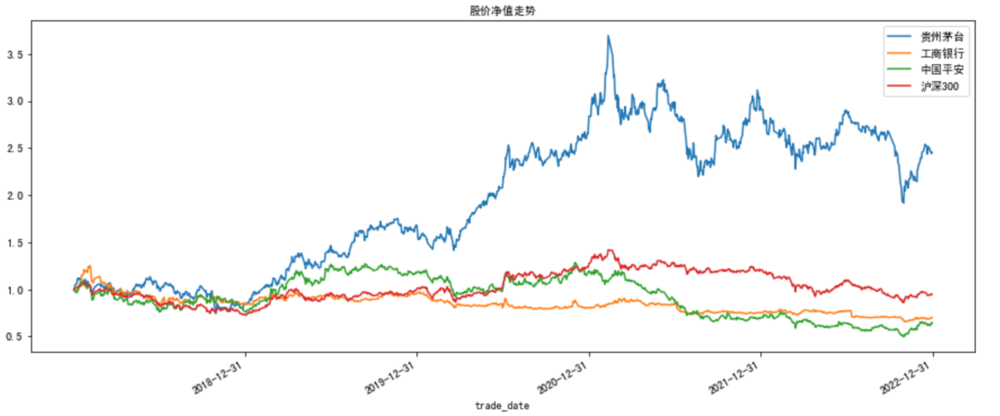
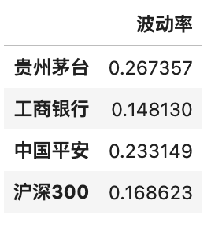
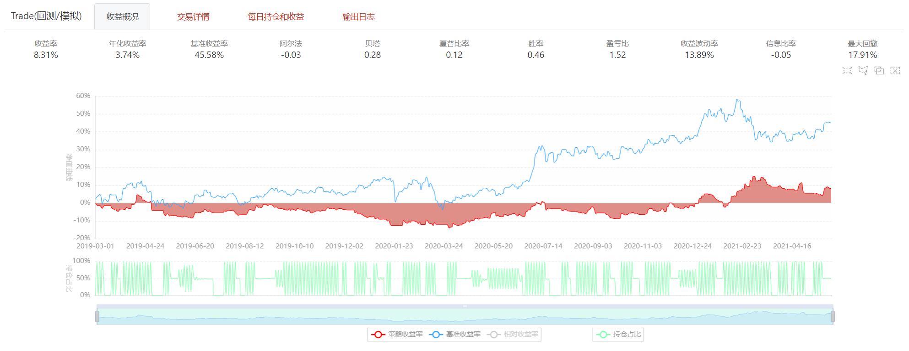

# 07_量化回测

目录

7.1 pandas计算策略评估指标

7.2 聚宽平台量化回测实践

7.3 Backtrader量化回测框架实践

7.4 BigQuant量化框架实战

7.5 手写回测代码

## 7.1 pandas计算策略评估指标
本章节介绍关于金融量化分析的一些基本概念，如年华收益率、基准年化收益率、最大回撤等。在严格的量化策略回测中，这些概念都是需要掌握并熟练使用的，这样能够全面的评估量化策略。市面上，很多策略回测笼统地使用所谓的“胜率”来确定策略的好坏，这是一种非常业余而且不可靠的分析方法。在衡量基金业绩好坏的时候，大部分人也只是看基金的年化收益，忽略了基金的风险情况（波动率）。市场中充斥着大量类似的业余的分析方法，这些方法导致很多所谓的回测看起来很美好，其实在统计上根本站不住脚，即所谓的“统计骗局”。
因此在量化回测过程中，需要从收益、稳定性、胜率、风险四个方面来综合评估策略好坏。熟练掌握评估指标，还能够帮助大家识别一些经典“骗局”，如
- 只展示基金的年化收益，而不提基金的波动率或者最大回撤
- 使用周收益率来计算夏普比率，而不是使用日收益率来计算

### 数据准备
为了帮助大家深入了解指标计算逻辑和实现方式，本章节采用指标讲解和代码实现相结合的方式进行讲解。再具体计算过程中，选择的目标标的是贵州茅台（600519.SH）、工商银行（601398.SH）、中国平安（601318.SH），策略基准是沪深300指数（000300.XSHG），策略采用最简单的方式：买入持有。持有周期为20180101 - 20221231，共1826个自然日。数据获取如下所示
```python
import pandas as pd  
import numpy as np
import matplotlib.pyplot as plt
import tushare as ts
%matplotlib inline   

# 无视warning
import warnings
warnings.filterwarnings("ignore")

# 正常显示画图时出现的中文和负号
from pylab import mpl
mpl.rcParams['font.sans-serif']=['SimHei']
mpl.rcParams['axes.unicode_minus']=False

#起始和结束日期可以自行输入，否则使用默认
def get_data(code, start_date, end_date):
    # 配置 tushare token
    my_token = 'XXXXX'  
    pro = ts.pro_api(my_token)

    df = pro.daily(ts_code=code, start_date=start_date, end_date=end_date)
    df.index = pd.to_datetime(df.trade_date)

    return df.close

#以上证综指、贵州茅台、工商银行、中国平安为例
stocks={
    '600519.SH':'贵州茅台',
    '601398.SH':'工商银行',
    '601318.SH':'中国平安'
}

df = pd.DataFrame()
for code,name in stocks.items():
    df[name] = get_data(code, '20180101', '20221231')

# 按照日期正序
df = df.sort_index()

# 本地读入沪深300合并
df_base = pd.read_csv('000300.XSHG_2018_2022.csv')
df_base.index = pd.to_datetime(df_base.trade_date)
df['沪深300'] = df_base['close']
```

### 净值曲线
净值曲线是一组时间序列的曲线，其含义表示为股票或基金在不同时间的价值相对于期初的价值的倍数。 再具体分析中，我们可以将期初价格定位1，那么如果你在当前时间点手里的净值是1.4，就意味着当前时间的资产价值是期初的1.4倍。
```python
# 以第一交易日2018年1月1日收盘价为基点，计算净值并绘制净值曲线
df_worth = df / df.iloc[0]
df_worth.plot(figsize=(15,6))
plt.title('股价净值走势', fontsize=10)
plt.xticks(pd.date_range('20180101','20221231',freq='Y'),fontsize=10)
plt.show()
```


### 年化收益率

**累计收益率**：

$R_t = \frac{P_T - P_{t}} {P_{t}}$

$P_T$ 表示在期末资产的价格

$P_{t}$ 表示期初资产价格。

**年化收益率**：

$R_p = (1 + R)^\frac{m}{n} - 1$

$R$ 表示期间总收益率，m是与n（可以是天数、周数、月数）相对应的计算周期，根据计算惯例，m=252、52、12分别指代日、周、月向年化的转换；n为期间自然日天数。

年化收益的一个直观的理解是，假设按照某种盈利能力，换算成一年的收益大概能有多少。这个概念常常会存在误导性，比如，这个月股票赚了5%，在随机波动的市场中，这是很正常的现象。如果据此号称年化收益为5%×12个月=60%，这就显得不太可信了，实际上每个月的收益不可能都这么稳定。所以在听到有人说年化收益的时候，需要特别留意一下具体的情况，否则很容易被误导。


```python
# 区间累计收益率(绝对收益率)
total_return = df_worth.iloc[-1]-1
total_return = pd.DataFrame(total_return.values,columns=['累计收益率'],index=total_return.index)
total_return

# 年化收益率
annual_return = pd.DataFrame((1 + total_return.values) ** (252 / 1826) - 1,columns=['年化收益率'],index=total_return.index)
annual_return
```


### 波动率
波动率是对收益变动的一种衡量，本质也是风险，波动率和风险，都是用来衡量收益率的不确定性的。我们用方差来表示，年波动率等于策略收益和无风险收益的标准差除以其均值，再除以交易日倒数的平方根，通常交易日取252天。

$Volatility = \sqrt{\frac{252}{n-1} \sum\limits_{i=1}^n (r_p - \hat{r_p})^2}$


$r_p$表示策略每日收益率

$\hat{r_p}$表示策略每日收益率的平均值

$n$表示策略执行天数

```python
df_return = df / df.shift(1) - 1
df_return = ((df_return.iloc[1:] - df_return.mean()) ** 2)

volatility = pd.DataFrame(np.sqrt(df_return.sum() * 252 / (1826-1)),columns=['波动率'],index=total_return.index)
volatility
```



### 最大回撤
选定周期内任一历史时点往后推，于最低点时的收益率回撤幅度的最大值。最大回撤用来描述可能出现的最糟糕的情况。最大回撤是一个重要的风险指标，对于量化策略交易，该指标比波动率还重要。
P为某一天的净值，i为某一天，j为i后的某一天，Pi为第i天的产品净值，Pj则是Pi后面某一天的净值

则该资产的最大回撤计算如下：

$MaxDrawdown = \frac{max(P_i - P_j)} {P_{i}}$

```python
def max_drawdown_cal(df):
    md = ((df.cummax() - df)/df.cummax()).max()
    return round(md, 4)

max_drawdown = {}

stocks={
    '600519.SH':'贵州茅台',
    '601398.SH':'工商银行',
    '601318.SH':'中国平安',
    '000300.XSHG': '沪深300'
}

for code,name in stocks.items():
    max_drawdown[name]=max_drawdown_cal(df[name])

max_drawdown = pd.DataFrame(max_drawdown,index=['最大回撤']).T
max_drawdown

```


### Alpha系数和Beta系数
关于Alpha系数和Beta系数有很多详尽的解释，这里就用最简单的一句话来帮助大家简单理解。Beta系数代表投资中的系统风险，而在投资中除了系统风险外还面临着市场波动无关的非系统性风险。 Alpha系数就代表投资中的非系统性风险，是投资者获得与市场波动无关的回报。

可以使用资本资产定价模型（CAPM）来估计策略的beta和alpha值，CAPM模型为：

$E(r_i) = r_f + \beta(E(r_m) - r_f)$

$E(r_i)$表示投资组合的预期收益率

$r_f$表示无风险利率

$r_m$表示市场指数收益率

$\beta$表示股市波动风险与投资机会中的结构性与系统性风险。


因此CAPM的计量模型可以表示为

$r_i = \alpha + \beta r_m + \epsilon_\alpha$

$\epsilon_\alpha$表示随机扰动，可以理解为个体风险

```python
from scipy import stats

#计算每日收益率 收盘价缺失值（停牌），使用前值代替
rets=(df.iloc[:,:4].fillna(method='pad')).apply(lambda x:x/x.shift(1)-1)[1:]

#市场指数为x，个股收益率为y
x = rets.iloc[:,3].values
y = rets.iloc[:,:3].values
capm = pd.DataFrame()
alpha = []
beta = []
for i in range(3):
    b, a, r_value, p_value, std_err=stats.linregress(x,y[:,i])
    #alpha转化为年化
    alpha.append(round(a*250,3))
    beta.append(round(b,3))
    
capm['alpha']=alpha
capm['beta']=beta
capm.index=rets.columns[:3]
#输出结果：
capm
```


### 夏普比率
夏普比率（sharpe ratio）表示每承受一单位总风险，会产生多少的超额报酬，该比率越高。夏普比率是在资本资产定价模型进一步发展得来的。

$SharpeRatio = \frac{R_p - R_f} {\sigma_p}$

$R_p$表示策略年化收益率

$R_F$表示无风险收益率

$\sigma_p$表示年化标准差


```python
# 超额收益率以无风险收益率为基准 假设无风险收益率为年化3%
ex_return=rets - 0.03/250

# 计算夏普比率
sharpe_ratio=np.sqrt(len(ex_return))*ex_return.mean()/ex_return.std()
sharpe_ratio=pd.DataFrame(sharpe_ratio,columns=['夏普比率'])
sharpe_ratio
```


### 信息比率
信息比率含义与夏普比率类似，只不过其参照基准不是无风险收益率，而是策略的市场基准收益率。

$InformationRatio = \frac{R_p - R_f} {\sigma_t}$

$R_p$表示策略年化收益率

$R_F$表示无风险收益率

$\sigma_t$表示策略与基准每日收益率差值的年化标准差


```python
###信息比率
ex_return = pd.DataFrame() 
ex_return['贵州茅台']=rets.iloc[:,0]-rets.iloc[:,3]
ex_return['工商银行']=rets.iloc[:,1]-rets.iloc[:,3]
ex_return['中国平安']=rets.iloc[:,2]-rets.iloc[:,3]

#计算信息比率
information_ratio = np.sqrt(len(ex_return))*ex_return.mean()/ex_return.std()
#信息比率的输出结果
information_ratio = pd.DataFrame(information_ratio,columns=['信息比率'])
information_ratio

```


## 7.2 聚宽平台量化回测实践

### 平台介绍

聚宽（https://www.joinquant.com/） 成立于2015年5月，是一家量化交易平台，为投资者提供做量化交易的工具与服务，帮助投资者更好地做量化交易。
整体来看，聚宽具有以下几点优势
1. 聚宽让做量化交易的成本极大降低 
2. 提供多种优质的便于取用的数据 
3. 提供投资研究功能，便于自由地统计、研究、学习等 
4. 提供多种的策略评价指标与评价维度 
5. 支持多种策略的编写、回测、模拟、实盘
6. 具备丰富且活跃的量化社区，可以发帖、学习、比赛等。

### 策略实现
本部分将介绍如何在聚宽平台实现一个双均线策略（具体参照ch05择时策略），并且在聚宽平台上进行回测，
来测试整体收益率。

策略代码如下，核心点有：
- 选择标的为：002594.XSHE 比亚迪
- 选择基准为：000300.XSHG 沪深300
- 策略为：当5日线金叉10日线，全仓买入；当5日线死叉10日线全仓卖出。
  
```python
# 导入函数库
from jqdata import *

# 初始化函数，设定基准等等
def initialize(context):
    # 设定沪深上证作为基准
    set_benchmark('000300.XSHG')
    # 开启动态复权模式(真实价格)
    set_option('use_real_price', True)
    # 输出内容到日志 log.info()
    log.info('初始函数开始运行且全局只运行一次')
    # 过滤掉order系列API产生的比error级别低的log
    # log.set_level('order', 'error')

    ### 股票相关设定 ###
    # 股票类每笔交易时的手续费是：买入时佣金万分之三，卖出时佣金万分之三加千分之一印花税, 每笔交易佣金最低扣5块钱
    set_order_cost(OrderCost(close_tax=0.001, open_commission=0.0003, close_commission=0.0003, min_commission=5), type='stock')

    ## 运行函数（reference_security为运行时间的参考标的；传入的标的只做种类区分，因此传入'000300.XSHG'或'510300.XSHG'是一样的）
      # 开盘前运行
    run_daily(before_market_open, time='before_open', reference_security='000300.XSHG')
      # 开盘时运行
    run_daily(market_open, time='open', reference_security='000300.XSHG')
      # 收盘后运行
    run_daily(after_market_close, time='after_close', reference_security='000300.XSHG')

## 开盘前运行函数
def before_market_open(context):
    # 输出运行时间
    log.info('函数运行时间(before_market_open)：'+str(context.current_dt.time()))

    # 给微信发送消息（添加模拟交易，并绑定微信生效）
    # send_message('美好的一天~')

    # 要操作的股票：比亚迪（g.为全局变量）
    g.security = '002594.XSHE'

## 开盘时运行函数
def market_open(context):
    log.info('函数运行时间(market_open):'+str(context.current_dt.time()))
    security = g.security
    # 获取股票的收盘价
    close_data5 = get_bars(security, count=5, unit='1d', fields=['close'])
    close_data10 = get_bars(security, count=10, unit='1d', fields=['close'])
    # close_data20 = get_bars(security, count=20, unit='1d', fields=['close'])
    # 取得过去五天，十天的平均价格
    MA5 = close_data5['close'].mean()
    MA10 = close_data10['close'].mean()
    # 取得上一时间点价格
    #current_price = close_data['close'][-1]
    # 取得当前的现金
    cash = context.portfolio.available_cash

    # 五日均线上穿十日均线
    if (MA5 > MA10) and (cash > 0):
        # 记录这次买入
        log.info("5日线金叉10日线，买入 %s" % (security))
        # 用所有 cash 买入股票
        order_value(security, cash)
    # 五日均线跌破十日均线
    elif (MA5 < MA10) and context.portfolio.positions[security].closeable_amount > 0:
        # 记录这次卖出
        log.info("5日线死叉10日线, 卖出 %s" % (security))
        # 卖出所有股票,使这只股票的最终持有量为0
        for security in context.portfolio.positions.keys():
            order_target(security, 0)

## 收盘后运行函数
def after_market_close(context):
    log.info(str('函数运行时间(after_market_close):'+str(context.current_dt.time())))
    #得到当天所有成交记录
    trades = get_trades()
    for _trade in trades.values():
        log.info('成交记录：'+str(_trade))
    log.info('一天结束')
    log.info('##############################################################')
```

在聚宽上回测策略结果如下，虽然策略整体具备较好的收益，但需要提示的是该策略并不稳定。
1. 该策略带入了后验知识。因为我们大致知道2018-2020年左右比亚迪处于上涨周期，该周期内基本上五日线在10日线以上。
2. 该策略会有很强的回撤。例如回测的后半段，该策略已经开始较大幅度回撤，因此需要结合其他策略来进行止盈止损。
3. 该策略回测周期不够长。本策略仅回测了两年，并且处于较强周期内，因此不具备较强的回测意义。
   


## 7.3 Backtrader平台量化回测实践
### Backtrader简介
Backtrader是一款基于Python的开源的量化回测框架，功能完善，安装简单。    
Backtrader官方文档(英文) https://www.backtrader.com/docu/   
Backtrader非官方文档(中文) https://www.heywhale.com/mw/project/63857587d0329ee911dcd7f2   


### Backtrader量化回测框架实践
本部分将介绍如何在Backtrader实现一个双均线策略（具体参照ch05择时策略），并且在该平台上进行回测，
来测试整体收益率。

策略代码如下，核心点有：
- 选择标的为：002594.XSHE 比亚迪
- 选择基准为：000300.XSHG 沪深300
- 策略为：当5日线金叉10日线，全仓买入；当5日线死叉10日线全仓卖出。
```python
# 导入函数库
from __future__ import (absolute_import, division, print_function, unicode_literals) 
import datetime
import pymysql
import pandas as pd
import backtrader as bt
import tushare as ts
import numpy as np


# 数据获取(从Tushare中获取数据)
""" 
数据获取一般都是通过连接数据库从数据库中读取，对于不了解数据库来源的新手可以从Tushare中直接获取数据
"""
def get_data(stock_code):
    """
    stock_code:股票代码,类型: str
    return: 股票日线数据,类型: DataFrame
    """
    token = 'Tushare token'   # 可通过进入个人主页-接口TOKEN获得

    ts.set_token(token)
    pro = ts.pro_api(token)

    data_daily = pro.daily(ts_code = stock_code, start_date='20180101', end_date='20230101')
    data_daily['trade_date'] = pd.to_datetime(data_daily['trade_date'])
    data_daily = data_daily.rename(columns={'vol': 'volume'})
    data_daily.set_index('trade_date', inplace=True) 
    data_daily = data_daily.sort_index(ascending=True)
    dataframe = data_daily
    data_daily['openinterest'] = 0
    dataframe['openinterest'] = 0
    data = bt.feeds.PandasData(dataname=dataframe,
                               fromdate=datetime.datetime(2018, 1, 1),
                               todate=datetime.datetime(2023, 1, 1)
                               )

    return data


# 双均线策略实现
class DoubleAverages(bt.Strategy):

    # 设置均线周期
    params = (
        ('period_data5', 5),
        ('period_data10', 10)
    )

    # 日志输出
    def log(self, txt, dt=None):
        dt = dt or self.datas[0].datetime.date(0)
        print('%s, %s' % (dt.isoformat(), txt))

    def __init__(self):
        # 初始化数据参数

        self.dataclose = self.datas[0].close   # 定义变量dataclose,保存收盘价
        self.order = None   # 定义变量order,用于保存订单
        self.buycomm = None    # 定义变量buycomm,记录订单佣金
        self.buyprice = None    # 定义变量buyprice,记录订单价格

        self.sma5 = bt.indicators.SimpleMovingAverage(self.datas[0], period=self.params.period_data5)  # 计算5日均线
        self.sma10 = bt.indicators.SimpleMovingAverage(self.datas[0], period=self.params.period_data10)  # 计算10日均线

    def notify_order(self, order):
        if order.status in [order.Submitted, order.Accepted]:  # 若订单提交或者已经接受则返回
            return

        if order.status in [order.Completed]:
            if order.isbuy():
                self.log(
                    'Buy Executed, Price: %.2f, Cost: %.2f, Comm: %.2f' %
                    (order.executed.price, order.executed.value, order.executed.comm))

                self.buyprice = order.executed.price
                self.buycomm = order.executed.comm
            else:
                self.log('Sell Executed, Price: %.2f, Cost: %.2f, Comm: %.2f' %
                        (order.executed.price, order.executed.value, order.executed.comm))
            self.bar_executed = len(self)
        elif order.status in [order.Canceled, order.Margin, order.Rejected]:
            self.log('Order Canceled/Margin/Rejected')

        self.order = None


    def notify_trade(self, trade):
        if not trade.isclosed:   # 若交易未关闭则返回
            return
        self.log('Operation Profit, Total_Profit %.2f, Net_Profit: %.2f' %
                (trade.pnl, trade.pnlcomm))    # pnl表示盈利, pnlcomm表示手续费

    def next(self):   # 双均线策略逻辑实现
        self.log('Close: %.2f' % self.dataclose[0])   # 打印收盘价格

        if self.order:   # 检查是否有订单发送
            return

        if not self.position:   # 检查是否有仓位
            if self.sma5[0] > self.sma10[0]:
                self.log('Buy: %.2f' % self.dataclose[0])
                self.order = self.buy()

        else:
            if self.sma5[0] < self.sma10[0]:
                self.log('Sell: %.2f' % self.dataclose[0])
                self.order = self.sell()


if __name__ == '__main__':
    cerebro = bt.Cerebro()   # 创建策略容器
    cerebro.addstrategy(DoubleAverages)    # 添加双均线策略
    data = get_data('000001.SZ')
    cerebro.adddata(data)   # 添加数据
    cerebro.broker.setcash(10000.0)   # 设置资金
    cerebro.addsizer(bt.sizers.FixedSize, stake=100)   # 设置每笔交易的股票数量
    cerebro.broker.setcommission(commission=0.01)   # 设置手续费
    print('Starting Portfolio Value: %.2f' % cerebro.broker.getvalue())   # 打印初始资金
    cerebro.run()   # 运行策略
    print('Final Portfolio Value: %.2f' % cerebro.broker.getvalue())   # 打印最终资金
    cerebro.plot()
```


## 7.4 BigQuant量化框架实战

### BigQuant简介
BigQuant是一个人工智能量化投资平台。    
BigQuant官网 https://bigquant.com/


### 策略实现
本部分将介绍如何在BigQuant实现一个双均线策略（具体参照ch05择时策略），并且在该平台上进行回测，
来测试整体收益率。

策略代码如下，核心点有：
- 选择标的为：600519.SHA 贵州茅台、601392.SHA 工商银行
- 选择基准为：000300.HIX 沪深300
- 策略为：当5日线金叉10日线，全仓买入；当5日线死叉10日线全仓卖出。

```python
from bigdatasource.api import DataSource
from biglearning.api import M
from biglearning.api import tools as T
from biglearning.module2.common.data import Outputs
 
import pandas as pd
import numpy as np
import math
import warnings
import datetime
 
from zipline.finance.commission import PerOrder
from zipline.api import get_open_orders
from zipline.api import symbol
 
from bigtrader.sdk import *
from bigtrader.utils.my_collections import NumPyDeque
from bigtrader.constant import OrderType
from bigtrader.constant import Direction

def m3_initialize_bigquant_run(context):
    context.set_commission(PerOrder(buy_cost=0.0003, sell_cost=0.0013, min_cost=5))


def m3_handle_data_bigquant_run(context, data):
    today = data.current_dt.strftime('%Y-%m-%d')  
    stock_hold_now = {e.symbol: p.amount * p.last_sale_price
                 for e, p in context.perf_tracker.position_tracker.positions.items()}

    cash_for_buy = context.portfolio.cash    
    
    try:
        buy_stock = context.daily_stock_buy[today]  
    except:
        buy_stock=[]  

    try:
        sell_stock = context.daily_stock_sell[today]  
    except:
        sell_stock=[] 
    
    stock_to_sell = [ i for i in stock_hold_now if i in sell_stock ]

    stock_to_buy = [ i for i in buy_stock if i not in stock_hold_now ]  

    stock_to_adjust=[ i for i in stock_hold_now if i not in sell_stock ]
    
    if len(stock_to_sell)>0:
        for instrument in stock_to_sell:
            sid = context.symbol(instrument) 
            cur_position = context.portfolio.positions[sid].amount 
            if cur_position > 0 and data.can_trade(sid):
                context.order_target_percent(sid, 0) 
                cash_for_buy += stock_hold_now[instrument]
    

    if len(stock_to_buy)+len(stock_to_adjust)>0:
        weight = 1/(len(stock_to_buy)+len(stock_to_adjust)) 
        for instrument in stock_to_buy+stock_to_adjust:
            sid = context.symbol(instrument) 
            if  data.can_trade(sid):
                context.order_target_value(sid, weight*cash_for_buy) 

def m3_prepare_bigquant_run(context):
    df = context.options['data'].read_df()

    def open_pos_con(df):
        return list(df[df['buy_condition']>0].instrument)

    def close_pos_con(df):
        return list(df[df['sell_condition']>0].instrument)

    context.daily_stock_buy= df.groupby('date').apply(open_pos_con)

    context.daily_stock_sell= df.groupby('date').apply(close_pos_con)

m1 = M.input_features.v1(
    features="""# #号开始的表示注释
# 多个特征，每行一个，可以包含基础特征和衍生特征
buy_condition=where(mean(close_0,5)>mean(close_0,10),1,0)
sell_condition=where(mean(close_0,5)<mean(close_0,10),1,0)""",
    m_cached=False
)

m2 = M.instruments.v2(
    start_date=T.live_run_param('trading_date', '2019-03-01'),
    end_date=T.live_run_param('trading_date', '2021-06-01'),
    market='CN_STOCK_A',
    instrument_list="""600519.SHA
601392.SHA""",
    max_count=0
)

m7 = M.general_feature_extractor.v7(
    instruments=m2.data,
    features=m1.data,
    start_date='',
    end_date='',
    before_start_days=60
)

m8 = M.derived_feature_extractor.v3(
    input_data=m7.data,
    features=m1.data,
    date_col='date',
    instrument_col='instrument',
    drop_na=False,
    remove_extra_columns=False
)

m4 = M.dropnan.v2(
    input_data=m8.data
)

m3 = M.trade.v4(
    instruments=m2.data,
    options_data=m4.data,
    start_date='',
    end_date='',
    initialize=m3_initialize_bigquant_run,
    handle_data=m3_handle_data_bigquant_run,
    prepare=m3_prepare_bigquant_run,
    volume_limit=0.025,
    order_price_field_buy='open',
    order_price_field_sell='open',
    capital_base=1000000,
    auto_cancel_non_tradable_orders=True,
    data_frequency='daily',
    price_type='后复权',
    product_type='股票',
    plot_charts=True,
    backtest_only=False,
    benchmark='000300.HIX'
)

```




## 7.5 手写回测代码 - 手把手实现一个傻瓜式量化回测框架

### 为什么？

#### 为什么要开发？

1.  为了避免重复造轮子，简化策略的回测，开发该框架
2.  VNPY等框架
    1.  过于复杂，继承嵌套太多，不易理解
    2.  回测需填入合约名称、保证金比率、手续费等详细参数，但对于一个策略的雏形验证，往往不需要这么精细
    3.  有时候回测标的是指数或估值，市场上并没有相关合约

#### 为什么叫傻瓜式？

🔴  无需安装，只需引用一个StupidHead.py文件

🟢  架构简单，没有复杂的类继承及嵌套关系，纯函数模式

🟡  策略编写简单

#### 解决什么痛点？

🔴  回测结果表现无需手写

🟢  封装常用技术指标

🔵  策略参数优化问题

🟣  可直接对接模拟盘、实盘

### 怎么用？

#### 引入StupidHead.py

-   **talib安装**

    技术指标库，调用C++的talib库，安装有点麻烦，步骤如下：

    🔴 先解压下面文件到`C:\ta-lib`

    [ta-lib-0.4.0-msvc.zip](file/ta-lib-0.4.0-msvc_A4PDuU5so5.zip "ta-lib-0.4.0-msvc.zip")

    🟢 安装C++编译包

    [vc\_redist.x64.exe](file/vc_redist.x64_8NE1PgLK3r.exe "vc_redist.x64.exe")

    🟡  安装talib

    Ctrl+F 找到对应版本的的ta-lib包，下载到本地，pip安装

    <https://www.lfd.uci.edu/~gohlke/pythonlibs/>

    
    ```python
    pip install TA_Lib-0.4.17-cp37-cp37m-win_amd64.whl
    ```

```python
# %% 引入包
import pandas as pd
import math
import matplotlib.pyplot as plt
import talib  # http://mrjbq7.github.io/ta-lib/doc_index.html
import numpy as np
from sqlalchemy import create_engine
from hyperopt import tpe, hp, fmin, STATUS_OK, Trials
from hyperopt.pyll.base import scope
import importlib
import warnings

warnings.filterwarnings('ignore')

plt.rcParams['font.sans-serif'] = 'SimHei'
plt.rcParams['axes.unicode_minus'] = False


# %% 自定义函数


def setpos(pos, *args):
    HQDf = args[1]
    idx = args[2]
    HQDf.loc[idx, 'pos'] = pos


def CalculateResult(HQDf):
    def get_max_drawdown(array):
        array = pd.Series(array)
        cummax = array.cummax()
        return array / cummax - 1

    # HQDf = HQDf.fillna(method='ffill')
    HQDf = HQDf.fillna(0)
    HQDf['base_balance'] = HQDf.close / HQDf.close[0]  # 基准净值
    HQDf['chg'] = HQDf.close.pct_change()  # 单日涨跌幅
    # 计算策略净值
    HQDf['strategy_balance'] = 1.0
    for i in range(0, len(HQDf)):
        if i > 0:
            HQDf.loc[HQDf.index[i], 'strategy_balance'] = HQDf.iloc[i - 1]['strategy_balance'] * (1. + HQDf.iloc[i]['chg'] * HQDf.iloc[i - 1]['pos'])
    HQDf['drawdown'] = get_max_drawdown(HQDf['strategy_balance'])  # 回撤
    StatDf = {}
    StatDf['MaxDrawDown'] = min(HQDf['drawdown'])  # 最大回撤
    StatDf['return'] = HQDf['strategy_balance'][-1] - 1  # 区间收益
    # 计算年化收益
    years = (HQDf.index[-1] - HQDf.index[0]).days / 365
    if years <= 1:
        StatDf['yearReturn'] = StatDf['return'] / years
    else:
        StatDf['yearReturn'] = (HQDf['strategy_balance'][-1] / 1) ** (1 / years) - 1
    StatDf['return/maxdrawdown'] = -1 * StatDf['return'] / StatDf['MaxDrawDown']

    # 计算夏普比
    x = HQDf["strategy_balance"] / HQDf["strategy_balance"].shift(1)
    x[x <= 0] = np.nan
    HQDf["return"] = np.log(x).fillna(0)
    daily_return = HQDf["return"].mean() * 100
    return_std = HQDf["return"].std() * 100
    daily_risk_free = 0.015 / np.sqrt(240)
    StatDf['sharpe_ratio'] = (daily_return - daily_risk_free) / return_std * np.sqrt(240)
    # HQDf = HQDf.dropna()
    return HQDf, StatDf


def plotResult(HQDf):
    fig, axes = plt.subplots(4, 1, figsize=(16, 12))
    HQDf.loc[:, ['base_balance', 'strategy_balance']].plot(ax=axes[0], title='净值曲线')
    HQDf.loc[:, ['drawdown']].plot(ax=axes[1], title='回撤', kind='area')
    HQDf.loc[:, ['pos']].plot(ax=axes[2], title='仓位', kind='area', stacked=False)
    HQDf['empty'] = HQDf.close[HQDf.pos == 0]
    HQDf['long'] = HQDf.close[HQDf.pos > 0]
    HQDf['short'] = HQDf.close[HQDf.pos < 0]
    HQDf.loc[:, ['long', 'short', 'empty']].plot(ax=axes[3], title='开平仓点位', color=["r", "g", "grey"])
    plt.show()


def CTA(HQDf, loadBars, func, **kwargs):
    HQDf['pos'] = np.nan
    # for idx, hq in tqdm(HQDf.iterrows()):
    for idx, hq in HQDf.iterrows():
        TradedHQDf = HQDf[:idx]
        idx_num = TradedHQDf.shape[0]
        if idx_num < loadBars:
            continue
        func(TradedHQDf, HQDf, idx, idx_num, **kwargs)
        HQDf[:idx].pos = HQDf[:idx].pos.fillna(method='ffill')
    HQDf, StatDf = CalculateResult(HQDf)
    # print(StatDf)
    return HQDf, StatDf


def hypeFun(space, target):
    """
    贝叶斯超参数优化
    :param space: 参数空间
    :param target: 优化目标
    :return:
    """

    def hyperparameter_tuning(params):
        HQDf, StatDf = CTA(**params)
        return {"loss": -StatDf[target], "status": STATUS_OK}

    trials = Trials()
    best = fmin(
        fn=hyperparameter_tuning,
        space=space,
        algo=tpe.suggest,
        max_evals=100,
        trials=trials
    )

    print("Best: {}".format(best))
    return trials, best


```

```python
from StupidHead import *
```

#### 编写策略

-   策略逻辑
    -   `TradedHQDf `
        -   历史行情`DataFrame`
        -   函数内第一行 `TradedHQDf = args[0]`&#x20;
    -   开多、开空、空仓通过`setpos`函数即可：
        -   setpos(1, \*args)    ——满仓开多
        -   setpos(-1, \*args)    ——满仓开空
        -   setpos(0, \*args)    ——空仓
        -   setpos(0.5, \*args)    ——50%仓位开多
        -   setpos(-0.5, \*args)    ——50%仓位开空

```python
def doubleMa(*args, **kwargs):
    TradedHQDf = args[0]
    fast_ma = talib.SMA(TradedHQDf.close, timeperiod=kwargs['fast'])
    fast_ma0 = fast_ma[-1]
    fast_ma1 = fast_ma[-2]
    slow_ma = talib.SMA(TradedHQDf.close, timeperiod=kwargs['slow'])
    slow_ma0 = slow_ma[-1]
    slow_ma1 = slow_ma[-2]
    cross_over = fast_ma0 > slow_ma0 and fast_ma1 < slow_ma1
    cross_below = fast_ma0 < slow_ma0 and fast_ma1 > slow_ma1
    if cross_over:
        setpos(1, *args)
    elif cross_below:
        setpos(-1, *args)
```

#### 回测策略

[T888\_1d.csv](file/T888_1d_j84jdLF4_M.csv "T888_1d.csv")

[T888\_15m.csv](file/T888_15m_H9xjdfqijb.csv "T888_15m.csv")

```python
from stupids.StupidHead import *


def doubleMa(*args, **kwargs):
    TradedHQDf = args[0]
    fast_ma = talib.SMA(TradedHQDf.close, timeperiod=kwargs['fast'])
    fast_ma0 = fast_ma[-1]
    fast_ma1 = fast_ma[-2]
    slow_ma = talib.SMA(TradedHQDf.close, timeperiod=kwargs['slow'])
    slow_ma0 = slow_ma[-1]
    slow_ma1 = slow_ma[-2]
    cross_over = fast_ma0 > slow_ma0 and fast_ma1 < slow_ma1
    cross_below = fast_ma0 < slow_ma0 and fast_ma1 > slow_ma1
    if cross_over:
        setpos(1, *args)
    elif cross_below:
        setpos(-1, *args)


if __name__ == '__main__':
    HQDf = pd.read_csv('data\T888_1d.csv', index_col='date')
    HQDf.index = pd.to_datetime(HQDf.index)
    ctaParas = {'fast': 5, 'slow': 10}
    ResultTSDf, StatDf = CTA(HQDf, 30, doubleMa, **ctaParas)
    plotResult(ResultTSDf)

    


```

#### 参数优化

> 📌采用机器学习中贝叶斯超参数优化方法，以极短的时间寻找出最优参数

```python
# sapce 是参数空间，定义贝叶斯搜索的空间
# func 技术指标名称
# fast slow 为技术指标的参数范围
space = {
        "HQDf": HQDf,
        "loadBars": 40,
        "func": doubleMa,
        "fast": hp.quniform("fast", 3, 30, 1),
        "slow": hp.quniform("slow", 5, 40, 1),
    }

# 调用贝叶斯搜索，第一个参数为参数空间，第二个为优化目标（求解优化目标极值）
trials, best = hypeFun(space, 'sharpe_ratio')

BestResultTSDf, BestStatDf = CTA(HQDf, 30, doubleMa, **best)
plotResult(BestResultTSDf)

```

### 框架原理和细节

### more

1.  修改`setpos(pos, *args)`+行情订阅，可以直接变为实盘
2.  可以添加组合回测功能
3.  完善代码可读性
