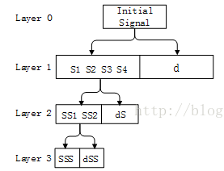
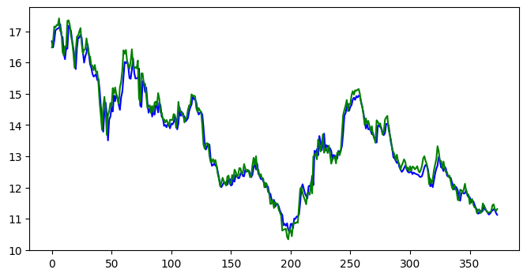

# 8.1 小波分析去噪与股价预测

## 1. 小波分析概述

### 1.1 小波分析简介

小波分析（wavelet analysis）或小波变换（wavelet transform）是一种常用的统计工具，它用有限长或快速衰减的“母小波”（mother wavelet）的振荡波形来表示信号。该波形受缩放和平移以匹配输入的信号。最早被运用于信号处理与分析领域中，通过对声音、图像、地震等信号进行降噪、重建和提取，进而确定不同信号的震动周期出现在哪个时间或频域上。现如今已被广泛应用于其他交叉领域中。

在金融预测领域中，小波分析可以被看成是时频分析，它有效地克服了傅里叶变换（Fourier transform）在单分辨率上的缺陷，具有多分辨率分析特点，在时域和频域上具有较强的表征信号局部信息的能力。

### 1.2 小波分析原理

小波（Wavelet），即小区域的波，是一种特殊的、长度有限，平均值为零的波形。它有两个特点：一是“小”，二是具有正负交替的“波动性”，即直流分量为零。小波分析将信号分解成一系列小波函数的叠加，而这些小波函数都是由一个母小波（mother wavelet）函数经过平移与尺度伸缩得来的。故而子小波可以通过尺度（$s$，频率的反函数）函数和时间（$n$）位置或平移来描述。

用这种不规则的小波函数可以逼近那些非稳态信号中尖锐变化的部分，也可以去逼近离散不连续具有局部特性的信号，从而更为真实的反映原信号在某一时间尺度上的变化。小波分析这种局部分析的特性使其成为对非稳态、不连续时间序列进行量化的一个有效工具。

算法的实质是对原始信号的滤波分析过程。通过将信号映射到由小波函数构成的一类正交子空间，使得信号可以在不同尺度空间进行展开。从频谱分析的角度看，小波变换是将信号分解为低频和高频分量两部分，高频字段又被称为细节子带（detailed subband），低频分量又被称为近似子带（approximate subband）。具体而言，小波变换首先将原始信号作为输入信号，通过一组正交的小波基分解成高频和低频部分，然后将得到的低频部分作为输入信号（对高频部分也即信号的细节部分不再继续分解），再次进行小波分解，得到下一级的高频部分和低频部分，以此类推。随着小波分解的层级增加，其在频域上的分辨率就越高。



**Note**: 图源自[Link](https://blog.csdn.net/cqfdcw/article/details/84995904)

因此，小波变换具有多分辨率分析（MultiResolution Analysis，MRA）的特点，并且在时频两域都具有表征信号局部特征的能力。小波分析是时间（空间）频率的局部化分析，它通过伸缩平移运算对信号（函数）逐步进行多尺度细化，能自动适应时频信号分析的要求，可聚焦到信号的任意细节。

小波变化可以分为连续小波变化（the Continuous Wavelet Transform, CWT）与离散小波变换（Discrete Wavelet Transform, DWT）。离散小波变化DWT是数据的紧凑表示，长用于降噪与数据压缩。连续小波变化CWT更适合于信号特征的提取。CWT作为时间系列间歇式波动特征提取的工具被广泛的应用的地球物理学研究中。

### 1.3 Python 实现小波分析

小波分析是数字信号处理领域中的一种重要方法。其主要作用是平滑和过滤，将序列中过于频率的噪声变动过滤掉。小波分析常用于金融时间序列的处理，因为金融时间序列往往是非平稳的，且存在很多噪声。

借助python 的开源库 `pywt` 可以轻松实现小波分析，接下来对该工具包的一些基本使用方法进行介绍。

**工具包使用**

- 安装

关于 `PyWavelets` 的更多用法，请查阅其官方文档：[link](https://pywavelets.readthedocs.io/en/latest/ref/wavelets.html#wavelet-families)及 [pyWavelets使用笔记](https://www.docin.com/p-74261596.html)。


```shell
pip install PyWavelets
```

- import module

```python
import pywt 
print(pywt.families())  # 打印出小波族
print(pywt.families(short=False))
```

```python
['haar', 'db', 'sym', 'coif', 'bior', 'rbio', 'dmey', 'gaus', 'mexh', 'morl', 'cgau', 'shan', 'fbsp', 'cmor']
['Haar', 'Daubechies', 'Symlets', 'Coiflets', 'Biorthogonal', 'Reverse biorthogonal', 'Discrete Meyer (FIR Approximation)', 'Gaussian', 'Mexican hat wavelet', 'Morlet wavelet', 'Complex Gaussian wavelets', 'Shannon wavelets', 'Frequency B-Spline wavelets', 'Complex Morlet wavelets']
```

- haar: Haar
- db: Daubechies
- sym: Symlets
- coif: Coiflets
- bior: Biorthogonal
- rbio: Reverse biorthogonal
- dmey: "discrete: Fir approximation of Meyer wavelet
- gaus: Gaussian wavelets
- mexh: Mexican hat wavelet
- morl: Morlet wavelet
- cgau: Complex Gaussian wavelets
- shan: Shannon wavelets
- fbsp: Frequency B-Spline wavelets
- cmor: Complex Morlet wavelets

- 显示小波族中包含的小波名称


```python
print(pywt.wavelist('db'))
```

```python
['db1', 'db2', 'db3', 'db4', 'db5', 'db6', 'db7', 'db8', 'db9', 'db10', 'db11', 'db12', 'db13', 'db14', 'db15', 'db16', 'db17', 'db18', 'db19', 'db20', 'db21', 'db22', 'db23', 'db24', 'db25', 'db26', 'db27', 'db28', 'db29', 'db30', 'db31', 'db32', 'db33', 'db34', 'db35', 'db36', 'db37', 'db38']
```


- 小波对象


```python
help(pywt.Wavelet)
```

```
Help on class Wavelet in module pywt._extensions._pywt:

class Wavelet(builtins.object)
 |  Wavelet(name, filter_bank=None) object describe properties of
 |  a wavelet identified by name.
 |  
 |  In order to use a built-in wavelet the parameter name must be
 |  a valid name from the wavelist() list.
 |  To create a custom wavelet object, filter_bank parameter must
 |  be specified. It can be either a list of four filters or an object
 |  that a `filter_bank` attribute which returns a list of four
 |  filters - just like the Wavelet instance itself.
 |  
 |  Methods defined here:
 |  
 |  __len__(self, /)
 |      Return len(self).
 |  
 |  __reduce__(...)
 |      Helper for pickle.
 |  
 |  __repr__(self, /)
 |      Return repr(self).
 |  
 |  __str__(self, /)
 |      Return str(self).
 |  
 |  get_filters_coeffs(...)
 |  
 |  get_reverse_filters_coeffs(...)
 |  
 |  wavefun(...)
 |      wavefun(self, level=8)
 |      
 |      Calculates approximations of scaling function (`phi`) and wavelet
 |      function (`psi`) on xgrid (`x`) at a given level of refinement.
 |      
 |      Parameters
 |      ----------
 |      level : int, optional
 |          Level of refinement (default: 8).
 |      
 |      Returns
 |      -------
 |      [phi, psi, x] : array_like
 |          For orthogonal wavelets returns scaling function, wavelet function
 |          and xgrid - [phi, psi, x].
 |      
 |      [phi_d, psi_d, phi_r, psi_r, x] : array_like
 |          For biorthogonal wavelets returns scaling and wavelet function both
 |          for decomposition and reconstruction and xgrid
 |      
 |      Examples
 |      --------
 |      >>> import pywt
 |      >>> # Orthogonal
 |      >>> wavelet = pywt.Wavelet('db2')
 |      >>> phi, psi, x = wavelet.wavefun(level=5)
 |      >>> # Biorthogonal
 |      >>> wavelet = pywt.Wavelet('bior3.5')
 |      >>> phi_d, psi_d, phi_r, psi_r, x = wavelet.wavefun(level=5)
 |  
 |  ----------------------------------------------------------------------
 |  Static methods defined here:
 |  
 |  __new__(*args, **kwargs) from builtins.type
 |      Create and return a new object.  See help(type) for accurate signature.
 |  
 |  ----------------------------------------------------------------------
 |  Data descriptors defined here:
 |  
 |  biorthogonal
 |      Is biorthogonal
 |  
 |  dec_hi
 |      Highpass decomposition filter
 |  
 |  dec_len
 |      Decomposition filters length
 |  
 |  dec_lo
 |      Lowpass decomposition filter
 |  
 |  family_name
 |      Wavelet family name
 |  
 |  family_number
 |      Wavelet family number
 |  
 |  filter_bank
 |      Returns tuple of wavelet filters coefficients
 |      (dec_lo, dec_hi, rec_lo, rec_hi)
 |  
 |  inverse_filter_bank
 |      Tuple of inverse wavelet filters coefficients
 |      (rec_lo[::-1], rec_hi[::-1], dec_lo[::-1], dec_hi[::-1])
 |  
 |  name
 |  
 |  number
 |  
 |  orthogonal
 |      Is orthogonal
 |  
 |  rec_hi
 |      Highpass reconstruction filter
 |  
 |  rec_len
 |      Reconstruction filters length
 |  
 |  rec_lo
 |      Lowpass reconstruction filter
 |  
 |  short_family_name
 |      Short wavelet family name
 |  
 |  symmetry
 |      Wavelet symmetry
 |  
 |  vanishing_moments_phi
 |      Number of vanishing moments for scaling function
 |  
 |  vanishing_moments_psi
 |      Number of vanishing moments for wavelet function
```

参数说明：`name`: 小波名称；`filter_bank`: 使用提供的滤波器组。示例：


```python
wavelet = pywt.Wavelet('db8')
print(wavelet)
```

```python
Wavelet db8
  Family name:    Daubechies 
  Short name:     db
  Filters length: 16  # 滤波器长度
  Orthogonal:     True  # 正交
  Biorthogonal:   True  # 双正交
  Symmetry:       asymmetric  # 对称性，不对称
  DWT:            True  # 离散小波变换
  CWT:            False  # 连续小波变换
```

- 离散小波变换的小波滤波系数


```python
def print_array(arr):
    print('[%s]'%','.join(['%.14f'%x for x in arr]))
    
#离散小波变换的小波滤波系数
# dec_lo Decomposition filter values 分解滤波值， rec 重构滤波值
#db3.filter_bank 返回 4 个属性
print(wavelet.filter_bank == (wavelet.dec_lo, wavelet.dec_hi, wavelet.rec_lo, wavelet.rec_hi))  # True
print(wavelet.dec_len) 
print(wavelet.rec_len)  # 16 
```

```python
True
16
16
```


## 2. Python实践：基于小波分解与支持向量机进行股票预测

### 2.1 获取数据

接下来，我们借助 `tushare` 工具包获取股票数据，并使用小波分解进行实战演练。关于 `tushare` 的具体用法，请查阅 [官方文档](http://tushare.org/classifying.html#id8)。

**注**： 此处需要在 tushare 官网申请一个账号，然后得到 token 后，赋值传给 `ts_token` 才能通过数据接口获取数据。


```python
ts_token = ''
```

这里是用 000001 平安银行为例，下载从 `2015-1-1` 到最近某一天的股价数据


```python
import datetime
import tushare as ts

ts.set_token(ts_token) 
pro = ts.pro_api()

time_temp = datetime.datetime.now() - datetime.timedelta(days=1)
end_dt = time_temp.strftime('%Y%m%d')
```


```python
df = ts.pro_bar(ts_code='000001.SZ', start_date='20150101', end_date=end_dt, freq='D')

#把数据按时间调转顺序，最新的放后面，从 tushare 下载的数据是最新的在前面，为了后面准备 X,y 数据方便
df = df.iloc[::-1]
df.reset_index(inplace=True)

df.head() #用 df.head() 可以查看一下下载下来的股票价格数据，显示数据如下：
```

Result：

<table border="1" class="dataframe">
  <thead>
    <tr style="text-align: right;">
      <th></th>
      <th>index</th>
      <th>ts_code</th>
      <th>trade_date</th>
      <th>open</th>
      <th>high</th>
      <th>low</th>
      <th>close</th>
      <th>pre_close</th>
      <th>change</th>
      <th>pct_chg</th>
      <th>vol</th>
      <th>amount</th>
    </tr>
  </thead>
  <tbody>
    <tr>
      <th>0</th>
      <td>2077</td>
      <td>000001.SZ</td>
      <td>20150105</td>
      <td>15.99</td>
      <td>16.28</td>
      <td>15.60</td>
      <td>16.02</td>
      <td>15.84</td>
      <td>0.18</td>
      <td>1.14</td>
      <td>2860436.43</td>
      <td>4.565388e+06</td>
    </tr>
    <tr>
      <th>1</th>
      <td>2076</td>
      <td>000001.SZ</td>
      <td>20150106</td>
      <td>15.85</td>
      <td>16.39</td>
      <td>15.55</td>
      <td>15.78</td>
      <td>16.02</td>
      <td>-0.24</td>
      <td>-1.50</td>
      <td>2166421.40</td>
      <td>3.453446e+06</td>
    </tr>
    <tr>
      <th>2</th>
      <td>2075</td>
      <td>000001.SZ</td>
      <td>20150107</td>
      <td>15.56</td>
      <td>15.83</td>
      <td>15.30</td>
      <td>15.48</td>
      <td>15.78</td>
      <td>-0.30</td>
      <td>-1.90</td>
      <td>1700120.67</td>
      <td>2.634796e+06</td>
    </tr>
    <tr>
      <th>3</th>
      <td>2074</td>
      <td>000001.SZ</td>
      <td>20150108</td>
      <td>15.50</td>
      <td>15.57</td>
      <td>14.90</td>
      <td>14.96</td>
      <td>15.48</td>
      <td>-0.52</td>
      <td>-3.36</td>
      <td>1407714.21</td>
      <td>2.128003e+06</td>
    </tr>
    <tr>
      <th>4</th>
      <td>2073</td>
      <td>000001.SZ</td>
      <td>20150109</td>
      <td>14.90</td>
      <td>15.87</td>
      <td>14.71</td>
      <td>15.08</td>
      <td>14.96</td>
      <td>0.12</td>
      <td>0.80</td>
      <td>2508500.23</td>
      <td>3.835378e+06</td>
    </tr>
  </tbody>
</table>
只用数据里面的收盘价字段的数据，也可以测试用更多价格字段作为预测输入数据


```python
from sklearn.preprocessing import MinMaxScaler
import matplotlib.pyplot as plt

#只用数据里面的收盘价字段的数据，也可以测试用更多价格字段作为预测输入数据
data_set = df.loc[:, ['close']]
#只取价格数据，不要表头等内容
data_set = data_set.values
# #对数据做规则化处理，都按比例转成 0 到 1 之间的数据，这是为了避免真实数据过大或过小影响模型判断
sc = MinMaxScaler(feature_range = (0, 1))
data_set_scaled = sc.fit_transform(data_set)
 
print(data_set_scaled.shape)
 
plt.figure()
plt.plot(data_set_scaled,"r-")
```

Result:


### 2.2 使用小波分解降噪


```python
import pywt 
import numpy as np

#小波去噪处理
data_set_scaled=data_set_scaled.reshape(-1)
 
w = pywt.Wavelet('db8')  # 选用Daubechies8小波
maxlev = pywt.dwt_max_level(len(data_set_scaled), w.dec_len)
threshold = 0.05  # Threshold for filtering
 
coeffs = pywt.wavedec(data_set_scaled, 'db8', level=maxlev)  # 将信号进行小波分解
print(coeffs[0].shape)
print(len(coeffs))
for i in range(1, len(coeffs)):
    coeffs[i] = pywt.threshold(coeffs[i], threshold*max(coeffs[i]))  # 将噪声滤波
    
data_set_scaled_wv = pywt.waverec(coeffs, 'db8')  # 将信号进行小波重构
 
plt.plot(data_set_scaled_wv,"b--")
 
data_set_scaled_wv = np.array(data_set_scaled_wv)
# training_set_scaled=training_set_scaled.reshape(-1,1)
print(data_set_scaled_wv.shape)
```

Result:

```python
(31,)
8
(2078,)
```



  

### 2.3 构建训练样本集

- 准备 X 和 y 数据

就类似前面解释的，先用最近一个交易日的收盘价作为第一个 y，然后这个交易日以前的 30 个交易日（滞后阶数 lag 为30）的收盘价作为 X。
这样依次往前推，例如最近第二个收盘价是第二个 y，而最新第二个收盘价以前的 30 个交易日收盘价作为第二个 X，依次往前准备出大量的 X 和 y，用于后面的训练。

**注**： 此处针对 `X` 和 `y` 的处理略有不同，X 选择的是小波分解重构之后的数据，而 `y` 则选择的没有进行小波分解重构的数据


```python
X_data = []
y_data = []
lags = 30

for i in range(lags, len(data_set_scaled)):
    X_data.append(data_set_scaled_wv[i-lags:i])
    y_data.append(data_set_scaled[i])

X_data, y_data = np.array(X_data), np.array(y_data)

# X_train=X_train.reshape(-1,1,devia)
print(X_data.shape)
print(y_data.shape) 
```

```python
(2048, 30)
(2048,)
```


- 分割数据集

在实际操作中，通常会对数据进行分割，得到训练数据集和测试数据集，常用的分割比例为 7/3，8/2。此外，在科研论文中，通常会设置多个不同的分割比例来确保实证结果的稳健型。此处，为方便起见，我们选择 2022年前的数据作为训练集，2022年之后的数据作为测试集。


```python
split_date = '20211231'
train_length = df[df['trade_date']== split_date].index.values - lags
X_train = X_data[:train_length[0], :]
y_train = y_data[:train_length[0]]
X_test = X_data[train_length[0]:, :]
y_test = y_data[train_length[0]:]

X_train.shape, X_test.shape
```

Result:


```python
((1674, 30), (374, 30))
```

### 2.4 构建模型与评价指标

- 选择评价指标

此处，选择 `MSE` 和 `MAE` 两个常见的评价指标来进行评价。


```python
from sklearn.metrics import mean_absolute_error, r2_score
from sklearn.metrics import accuracy_score
from sklearn.metrics import mean_squared_error

# Calculating directional accuracy
def direct_accuracy(real_Y, pred_Y):
    # Turn numpy into pandas to difference the series
    temp_real = pd.DataFrame(real_Y)
    
    pd_real = temp_real.diff().dropna() # Difference
    
    temp_pred = pred_Y[1:]-real_Y[:-1]
    pd_pred = pd.DataFrame(temp_pred)
    
    # Set the value to 1 if the changes of series is positive
    
    real_direct = np.ones(len(pd_real)) # Default value is set to 1
    pred_direct = np.ones(len(pd_pred))
    
    # Change the value to -1 if the changes is negative
    row, col = np.where(pd_real<0)
    real_direct[row] = -1 
    
    row, col = np.where(pd_pred<0)
    pred_direct[row] = -1
    
    return accuracy_score(real_direct, pred_direct)

def cal_metrics(pred, real, mean_name):
    metric = np.array(['Means', 'MSE', 'MAE'])
    mse = mean_squared_error(real, pred).round(4)
    mae = mean_absolute_error(real, pred).round(4)
    metric = np.vstack((metric, [mean_name, mse, mae]))
    return metric
```


```python
from sklearn.svm import LinearSVR

from sklearn.pipeline import make_pipeline

regr = make_pipeline(LinearSVR(random_state=2023, max_iter=1000))

regr.fit(X_train, y_train)

pred_train=regr.predict(X_train)
pred_test=regr.predict(X_test)
```


### 2.5 预测结果与评价值

- 绘制样本外预测值与真实值对比图


```python
price_pred_test = sc.inverse_transform(pred_test.reshape(-1, 1))
price_real_test = sc.inverse_transform(y_test.reshape(-1, 1))

plt.figure(figsize=(8, 4))
plt.plot(price_pred_test,"b-")
plt.plot(price_real_test,"g-")
 
plt.show()
```

 Result:      


- 计算 MSE 和 MAE

```python
metric_train = cal_metrics(pred_train, y_train, 'Train_set')
metric_test = cal_metrics(pred_test, y_test, 'Test_set')
metric_train, metric_test
```

Result:


```python
(array([['Means', 'MSE', 'MAE'],
        ['Train_set', '0.0004', '0.0133']], dtype='<U32'),
 array([['Means', 'MSE', 'MAE'],
        ['Test_set', '0.0003', '0.012']], dtype='<U32'))
```

### 2.6 完整代码


```python
import pywt 
import numpy as np
import datetime
import tushare as ts
from sklearn.metrics import mean_absolute_error, r2_score
from sklearn.metrics import accuracy_score
from sklearn.metrics import mean_squared_error
from sklearn.svm import LinearSVR
from sklearn.pipeline import make_pipeline


import warnings 
warnings.filterwarnings('ignore')


# Calculating directional accuracy
def direct_accuracy(real_Y, pred_Y):
    # Turn numpy into pandas to difference the series
    temp_real = pd.DataFrame(real_Y)
    
    pd_real = temp_real.diff().dropna() # Difference
    
    temp_pred = pred_Y[1:]-real_Y[:-1]
    pd_pred = pd.DataFrame(temp_pred)
    
    # Set the value to 1 if the changes of series is positive
    
    real_direct = np.ones(len(pd_real)) # Default value is set to 1
    pred_direct = np.ones(len(pd_pred))
    
    # Change the value to -1 if the changes is negative
    row, col = np.where(pd_real<0)
    real_direct[row] = -1 
    
    row, col = np.where(pd_pred<0)
    pred_direct[row] = -1
    
    return accuracy_score(real_direct, pred_direct)

def cal_metrics(pred, real, mean_name):
    metric = np.array(['Means', 'MSE', 'MAE'])
    mse = mean_squared_error(real, pred).round(4)
    mae = mean_absolute_error(real, pred).round(4)
    metric = np.vstack((metric, [mean_name, mse, mae]))
    return metric


# ts_token = ''
ts.set_token(ts_token) #需要在 tushare 官网申请一个账号，然后得到 token 后才能通过数据接口获取数据
pro = ts.pro_api()

time_temp = datetime.datetime.now() - datetime.timedelta(days=1)
end_dt = time_temp.strftime('%Y%m%d')

df = ts.pro_bar(ts_code='000001.SZ', start_date='20150101', end_date=end_dt, freq='D')

#把数据按时间调转顺序，最新的放后面，从 tushare 下载的数据是最新的在前面，为了后面准备 X,y 数据方便
df = df.iloc[::-1]
df.reset_index(inplace=True)

from sklearn.preprocessing import MinMaxScaler
import matplotlib.pyplot as plt

#只用数据里面的收盘价字段的数据，也可以测试用更多价格字段作为预测输入数据
data_set = df.loc[:, ['close']]
#只取价格数据，不要表头等内容
data_set = data_set.values
# #对数据做规则化处理，都按比例转成 0 到 1 之间的数据，这是为了避免真实数据过大或过小影响模型判断
sc = MinMaxScaler(feature_range = (0, 1))
data_set_scaled = sc.fit_transform(data_set)


#小波去噪处理
data_set_scaled=data_set_scaled.reshape(-1)
 
w = pywt.Wavelet('db8')  # 选用Daubechies8小波
maxlev = pywt.dwt_max_level(len(data_set_scaled), w.dec_len)
threshold = 0.05  # Threshold for filtering
 
coeffs = pywt.wavedec(data_set_scaled, 'db8', level=maxlev)  # 将信号进行小波分解
for i in range(1, len(coeffs)):
    coeffs[i] = pywt.threshold(coeffs[i], threshold*max(coeffs[i]))  # 将噪声滤波
    
data_set_scaled_wv = pywt.waverec(coeffs, 'db8')  # 将信号进行小波重构
 
data_set_scaled_wv = np.array(data_set_scaled_wv)

X_data = []
y_data = []
lags = 30

for i in range(lags, len(data_set_scaled)):
    X_data.append(data_set_scaled_wv[i-lags:i])
    y_data.append(data_set_scaled[i])

X_data, y_data = np.array(X_data), np.array(y_data)

split_date = '20211231'
train_length = df[df['trade_date']== split_date].index.values - lags
X_train = X_data[:train_length[0], :]
y_train = y_data[:train_length[0]]
X_test = X_data[train_length[0]:, :]
y_test = y_data[train_length[0]:]


## 构建线性支持向量机模型
regr = make_pipeline(LinearSVR(random_state=2023, max_iter=1000))

regr.fit(X_train, y_train)

pred_train=regr.predict(X_train)
pred_test=regr.predict(X_test)

metric_train = cal_metrics(pred_train, y_train, 'Train_set')
metric_test = cal_metrics(pred_test, y_test, 'Test_set')
print(metric_train, metric_test)

price_pred_test = sc.inverse_transform(pred_test.reshape(-1, 1))
price_real_test = sc.inverse_transform(y_test.reshape(-1, 1))

plt.figure(figsize=(8, 4))
plt.plot(price_pred_test,"b-")
plt.plot(price_real_test,"g-")
 
plt.show()
```

Results:

```python
[['Means' 'MSE' 'MAE']
 ['Train_set' '0.0004' '0.0133']] [['Means' 'MSE' 'MAE']
 ['Test_set' '0.0003' '0.012']]
```


​    

## Reference

1. [Python中 pywt 小波分析库中的一些基本使用方法](https://www.jianshu.com/p/f3907c76362f)
2. [PyWavelets](https://pywavelets.readthedocs.io/en/latest/index.html#)
3. [形象易懂讲解算法I——小波变换](https://zhuanlan.zhihu.com/p/22450818)
4. [小波分析要点](https://mp.weixin.qq.com/s/O42x0dhIcJJdalq8qJFWyA)
5. [小波包变换（Wavelet Packet Transform）的学习笔记](https://zhuanlan.zhihu.com/p/58596902)
6. [Pytorch实现的小波去噪优化后的LSTM股票预测算法](https://blog.csdn.net/qq_43344047/article/details/118607710)
7. 宋锐彪,刘海鸿.基于小波分析的滑动GA-BP-GRACH模型对股票的预测研究[J].数学的实践与认识,2023,53(03):117-126. [link](https://kns.cnki.net/kcms2/article/abstract?v=3uoqIhG8C44YLTlOAiTRKibYlV5Vjs7ioT0BO4yQ4m_mOgeS2ml3UJX5BzGMytIq_3in5N7KmhvLsEN57FOi4EcTHpSREe57&uniplatform=NZKPT)