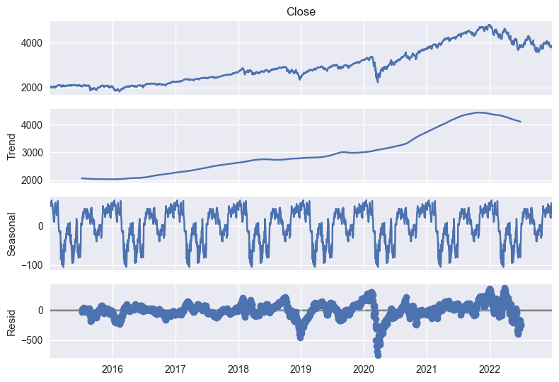
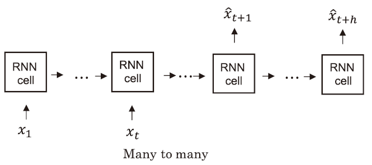
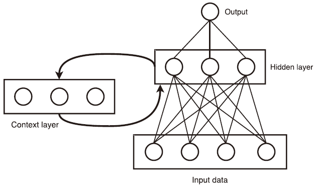
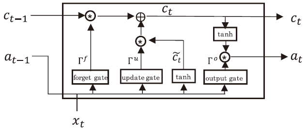
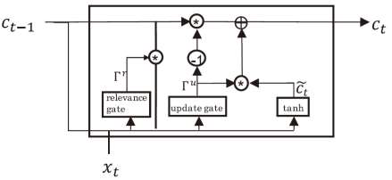

# 8.3 时间序列预测与量化择时

## 1.  时间序列预测模型
### 1.1 时间序列

一个时间序列是由一个按一定顺序排列并且在时间上观察得到的一段取值序列组成。在量化投资领域中, 主流的量价数据, 基本面数据都是具有时序信息的金融数据, 因此对时序数据的研究和学习是在量化投资的学习过程中的重要组成部分。

时间序列分析中，通常会把一个时间序列分解为趋势（Trend）、季节性（Seasonality）和残差（Residual）三部分。

1. 趋势（Trend）: 趋势描述了时间序列的长期方向。例如，股票市场中的一种常见趋势是牛市，这是一个长期上升的市场。
   
2. 季节性（Seasonality）: 季节性描述了时间序列在一年或者一天内的周期性波动。例如，零售业的销售额通常在假日和周末有显著增加，这就是季节性的表现。
   
3. 残差（Residual）: 残差是时间序列在移除了趋势和季节性后剩下的部分。这部分通常被认为是随机的，但有时也包含有用的信息。例如，如果残差在某些时间点显著高于或低于零，这可能表示存在一些未被模型捕捉的因素。
   

此处以美国标普500指数的价格数据作为例子，选取2015年到2022年的标普500指数价格数据，我们使用statsmodel对数据进行最基本的季节性分析。


```Python
import yfinance as yf
import pandas as pd
import matplotlib.pyplot as plt
from statsmodels.tsa.seasonal import seasonal_decompose
plt.style.use('seaborn')

plt.figure(figsize=(20,8))
# 下载标普500的数据
data = yf.download('^GSPC', start='2015-01-01', end='2022-12-31')

# 选择收盘价格
close = data['Close']

# 进行季节性分解
result = seasonal_decompose(close, model='additive', period=252)

# 绘制趋势，季节性和残差
result.plot()
plt.show()
```



通过分析时序数据的趋势，季节性信息和残差信息，我们能够看到数据更宏观/更规律性的变化。就像标普500的变化，可以看到指数整体趋势是在2016年到2021年中下段整体上升，在2022年开始遭遇了宏观的下跌。整体指数变化的季节性趋势在每一年都比较稳定，根据财报，公告等披露时间而存在着季节性波动。

### 1.2 常见时间序列模型
#### 1.2.1 ARIMA

ARIMA，全称自回归积分移动平均模型（AutoRegressive Integrated Moving Average），是一种广泛用于时间序列预测的模型。ARIMA模型能够捕获一系列不同的常见时间数据结构。

ARIMA模型是三种模型的结合：AR(自回归)、I(整合)、MA(移动平均)。每个部分都针对时间序列数据的一种特性：

1. AR (AutoRegressive): 自回归部分是指模型使用观察值与前面一些观察值（即“滞后”）之间的依赖关系。例如，我们可能会用昨天的股价来预测今天的股价，或者用过去几天的平均气温来预测明天的气温。自回归模型的阶数是指用于预测的滞后观察值的数量。
   
2. I (Integrated): 整合部分代表了模型对数据进行差分，以使其更加平稳。一些时间序列数据会随着时间的推移而显示出趋势行为，这可能使得预测变得复杂。为了消除这种趋势，我们可以使用差分，即计算序列的连续观察值之间的变化。整合的阶数是指进行差分的次数。
   
3. MA (Moving Average): 移动平均部分代表模型使用观察值的误差和前面一些观察值的误差之间的依赖关系。移动平均模型的阶数是指用于预测的滞后误差项的数量。

ARIMA模型通常表示为ARIMA(p,d,q)，其中p是自回归的阶数，d是差分的阶数，q是移动平均的阶数。

ARIMA模型的一般形式可以写为： $$(1 - \sum_{i=1}^{p} \phi_i L^i) (1 - L)^d X_t = (1 + \sum_{i=1}^{q} \theta_i L^i) \varepsilon_t$$ 其中，$L$是滞后算子（即 $LX_t = X_{t-1}$$），$$X_t$是时间序列数据, $\phi_i$和 $\theta_i$是模型参数， $\varepsilon_t$$是白噪声序列。

#### 1.2.2 GARCH

##### GARCH模型详细介绍

GARCH（广义自回归条件异方差模型）是一种用于预测金融时间序列数据波动性的模型。GARCH模型由Bollerslev在1986年提出，是Engle在1982年提出的ARCH模型的扩展。

##### GARCH模型的形式

GARCH模型的一般形式如下：

$$\sigma_t^2 = \alpha_0 + \sum_{i=1}^{p} \alpha_i r_{t-i}^2 + \sum_{j=1}^{q} \beta_j \sigma_{t-j}^2$$


其中，$\sigma_t^2$ 是时间 t 的条件方差，$r_{t-i}$ 是过去的收益率，$\sigma_{t-j}^2$ 是过去的条件方差，$\alpha_0, \alpha_i, \beta_j$ 是需要估计的参数，p 是AR部分的阶数，q 是MA部分的阶数。

##### GARCH模型的特点

GARCH模型的一个重要特点是它假设波动性是时间可变的。这是一个重要的假设，因为在金融市场，资产的波动性通常是不断变化的。这种变化可以是突然的，也可以是渐进的，GARCH模型都能很好地捕捉到这种波动性的变化。

此外，GARCH模型还假设波动性具有长记忆性，即过去的波动性会对未来的波动性产生影响。这在金融市场中是常见的现象，例如，市场在经历了一段时间的高波动性之后，往往会有一段时间的低波动性。

#### 1.2.3 **循环神经网络（RNN）**

循环神经网络 (RNN) 专门用于处理序列数据，例如与机器翻译相关的问题中 的单词序列、语音识别中的音频数据或预测问题中的时间序列。所有这些问题 都呈现出一个共同特征，即数据之间存在时间依赖性。传统的前馈神经网络无法考虑这些依赖性，RNN通过引入过去的时间信息来解决了这个问题。RNN的特点在于其隐藏层之间的节点是有连接的，隐藏层的输入不仅包括输入层的输出，还包括上一时刻隐藏层的输出。



##### 基础RNN

基础RNN是最初的RNN模型，它的主要问题是无法有效地捕捉到时间序列中的长期依赖性（Long-term Dependencies）。这是因为当序列过长时，模型的性能会快速下降，这个问题被称为梯度消失和梯度爆炸。



##### LSTM（Long Short-Term Memory）

为了解决基础RNN的这个问题，1997年，Hochreiter和Schmidhuber提出了LSTM模型。LSTM通过引入一个称为"门"（Gate）的机制来控制信息的流动，这使得LSTM能够在较长的序列中捕捉到依赖关系。LSTM的主要组成部分是一个遗忘门（Forget Gate），一个输入门（Input Gate）和一个输出门（Output Gate），这些门一起帮助模型决定何时忘记旧的信息，何时更新新的信息。



##### GRU（Gated Recurrent Unit）

GRU是Cho等人在2014年提出的，是LSTM的一种变体，它将LSTM的遗忘门和输入门合并为一个"更新门"（Update Gate）。由于GRU比LSTM有更少的参数，因此计算上会更加高效，同时在一些任务上，GRU的表现与LSTM相当。



从基础RNN到LSTM再到GRU，循环神经网络的发展历程是一个不断寻找更有效处理序列数据的方法的过程。在许多序列预测任务中，RNN及其变体已经取得了显著的成功。时序数据也是一样，在金融时序预测的领域上，LSTM和GRU的应用至今非常流行。


## 2.  时序预测模型与量化择时

通过引入时序预测模型对股票/期货价格的预测，我们可以获取更多指标来辅助量化择时的决策。最直白的方式是使用时序模型预测的收益结果来预测明天标的的上涨/下跌，在设定的交易规则下（如明日的价格低于过去五天的收盘价均线），当预测结果满足买入条件时，进行交易，满足卖出条件时卖出。

## Reference

1. Torres, José F., et al. "Deep Learning for Time Series Forecasting: A Survey." Big Data 9.1 (2021): 3-21..