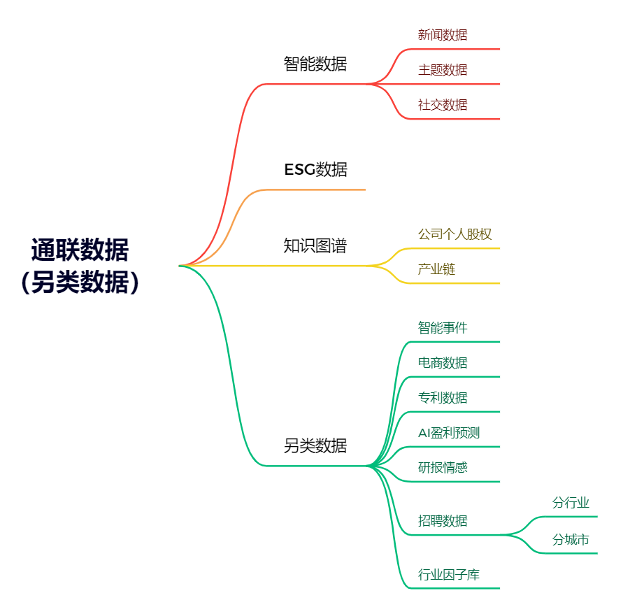

# 8.4 非结构化数据与量化策略

## 1. 非结构化数据 

### 1.1 非结构化数据的定义

非结构化数据是一种不符合预定义数据模型或者不容易适应关系表结构的数据，它通常包括文本和多媒体内容。这种类型的数据无法被数据库应用程序或者数据分析工具直接解析，因此需要特殊的预处理以便于进一步的分析和处理。

与结构化数据（例如，数据库表中的数据，其中每一列都有预定义的数据类型）相比，非结构化数据是杂乱无章的，没有明显的组织结构，也没有固定的格式。例如，社交媒体帖子、博客文章、图片、音频文件、视频内容等，都属于非结构化数据。

### 1.2 非结构化数据类型介绍

非结构化数据类型是多种多样的，常见的非结构化数据类型包括：

- 文本数据：这是非结构化数据中最常见的类型，包括电子邮件、微博、推文、博客、评论、产品评价、新闻文章等。

- 图像数据：这包括从各种来源获取的图像，例如，社交媒体上的个人照片、卫星图像、医学扫描图像等。

- 音频数据：从音乐文件到语音命令、电话呼叫记录、播客等，都属于音频数据。

- 视频数据：这包括从监控录像到YouTube视频、电视节目、电影等各种类型的视频内容。

- 社交媒体数据：这是一种特殊类型的文本数据，但是除了文本之外，还包括图像、视频、用户行为数据（如点赞、分享、评论等）以及其他元数据（如发布时间、地理位置等）。

每种类型的非结构化数据都有自己的特点，需要特定的工具和技术来处理。例如，文本数据需要进行自然语言处理（NLP），图像数据需要进行图像识别和处理，音频和视频数据则需要音频/视频处理技术。

除了上面提到的大量的新闻/流媒体讯息数据之外，知识图谱类型数据也慢慢在另类数据市场中占据一席之地。股票公司产业链，供应链数据，持股数据等以图状结构进行储存的数据，都进入了量化投资的视野。

更有甚者，行业招聘数据，卫星遥感数据的应用相关的研究都已经在业界开展。 可以预见的是，在量价数据市场高相关性挤占的环境下，从更多的信息渠道和数据源寻找信息的增量，是当前国内市场一个必然的趋势。不过不同于美股市场的成熟环境，国内的非结构化数据大多都是在17年后才开始逐步构建，因此数据的噪声和不规范化目前都还是非常严重的问题，相比于美股市场应用另类数据的方式，在A股市场上，保证数据的有效性，进行有效的数据去噪，或许是独属A股的一个重要命题。

## 2.非结构化数据在量化策略中的应用

### 2.1 非结构化数据在量化投资中的应用方向

在量化投资中，非结构化数据的使用已经超出了常规的股票价格和交易量等结构化数据的范畴。这些非结构化数据为量化投资提供了更丰富和多元化的信息，可以帮助投资者更深入地理解市场动态，更准确地预测市场走势。

以下是非结构化数据在量化投资中的一些应用方向：

- 情绪分析：通过分析社交媒体帖子、新闻报道、财经博客等文本数据中的情绪，可以了解市场对某只股票或整个市场的情绪。这种情绪分析可以帮助预测股价走势，因为市场情绪往往会影响投资者的交易行为。

- 图像识别：使用图像识别技术处理卫星图像、航空图像等可以获取一些企业的运营信息。例如，通过分析卫星图像，可以估计零售商的停车场的车辆数量，从而推断该零售商的销售情况。

- 自然语言处理：自然语言处理(NLP)技术可以用于分析财报、新闻文章、社交媒体帖子等文本数据，提取有用的信息，例如公司的运营状况、行业动态、市场情绪等。

- 网络数据：互联网上的用户行为数据，例如搜索引擎查询、网页点击流等，也可以用于预测股价走势。例如，一个公司的搜索引擎查询量的增加可能预示着该公司的股价将上涨。

### 2.2 非结构化数据应用的实例

- 一家名为 Orbital Insight 的公司就使用卫星图像数据来预测零售商的销售情况。他们分析了零售商停车场的卫星图像，通过计算停车场中的车辆数量，预测了零售商的季度销售。他们发现，这种方法预测的销售情况与零售商实际报告的销售情况高度相关。

- 另一家名为 Dataminr 的公司则利用社交媒体数据来预测股市走势。他们分析了 Twitter 上的帖子，通过情绪分析和大数据分析技术，预测了股市的短期走势。据报道，这种方法在预测股市大幅波动方面表现出了高准确率。

非结构化数据的应用正在一步步产生真正的价值，这片未被探索的数据蓝海也可能是量化策略下一个要攻占的城池。