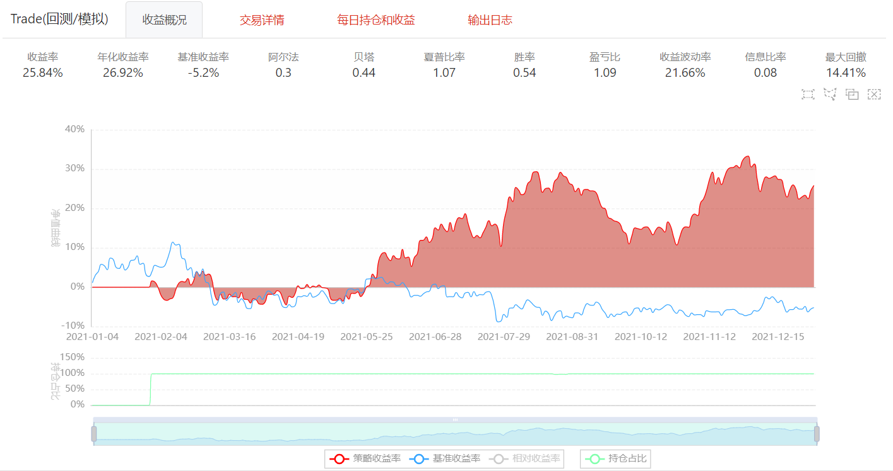

## 8.5 机器学习量化策略基础实战

### 机器学习量化策略实现的基本步骤
1.加载数据
2.标注数据
3.特征工程，分割训练集和测试集
4.选择机器学习模型并配置适当的参数
5.训练模型
6.利用模型数据样本之外的数据进行回测
7.对回测结果进行可视化


### 常用机器学习模型
#### 分类模型
1.线性分类
2.支持向量机
3.XGBoost分类
4.K近邻分类

#### 回归模型
1.线性回归
2.多层感知器回归
3.自适应提升树回归
4.随机森林回归

### 策略实现
本部分将介绍如何在BigQuant实现一个基于支持向量机模型的选股策略


```python
from biglearning.api import M
from biglearning.api import tools as T
from bigdatasource.api import DataSource
from biglearning.module2.common.data import Outputs
from zipline.finance.commission import PerOrder

def m6_run_bigquant_run(input_1, input_2, input_3):
    train_df = input_1.read()
    features = input_2.read()
    feature_min = train_df[features].quantile(0.005)
    feature_max = train_df[features].quantile(0.995)
    train_df[features] = train_df[features].clip(feature_min,feature_max,axis=1) 
    data_1 = DataSource.write_df(train_df)
    test_df = input_3.read()
    test_df[features] = test_df[features].clip(feature_min,feature_max,axis=1)
    data_2 = DataSource.write_df(test_df)
    return Outputs(data_1=data_1, data_2=data_2, data_3=None)

def m6_post_run_bigquant_run(outputs):
    return outputs

def m4_handle_data_bigquant_run(context, data):
    context.extension['index'] += 1
    if  context.extension['index'] % context.rebalance_days != 0:
        return 
    
    date = data.current_dt.strftime('%Y-%m-%d')
    
    cur_data = context.indicator_data[context.indicator_data['date'] == date]

    cur_data = cur_data[cur_data['pred_label'] == 1.0]
    
    stock_to_buy =  list(cur_data.sort_values('instrument',ascending=False).instrument)[:context.stock_num]
    if date == '2017-02-06':
        print(date, len(stock_to_buy), stock_to_buy)

    stock_hold_now = [equity.symbol for equity in context.portfolio.positions]

    no_need_to_sell = [i for i in stock_hold_now if i in stock_to_buy]

    stock_to_sell = [i for i in stock_hold_now if i not in no_need_to_sell]
  

    for stock in stock_to_sell:
        if data.can_trade(context.symbol(stock)):
            context.order_target_percent(context.symbol(stock), 0)
    
    if len(stock_to_buy) == 0:
        return

    weight =  1 / len(stock_to_buy)
    
    for stock in stock_to_buy:
        if data.can_trade(context.symbol(stock)):
            context.order_target_percent(context.symbol(stock), weight)
 
def m4_prepare_bigquant_run(context):
    pass

def m4_initialize_bigquant_run(context):
    context.indicator_data = context.options['data'].read_df()
    context.set_commission(PerOrder(buy_cost=0.0003, sell_cost=0.0013, min_cost=5))
    context.rebalance_days = 5
    context.stock_num = 50
    if 'index' not in context.extension:
        context.extension['index'] = 0
     
def m4_before_trading_start_bigquant_run(context, data):
    pass


m1 = M.instruments.v2(
    start_date='2020-01-01',
    end_date='2021-01-01',
    market='CN_STOCK_A',
    instrument_list='',
    max_count=0
)

m2 = M.advanced_auto_labeler.v2(
    instruments=m1.data,
    label_expr="""shift(close, -5) / shift(open, -1)-1
rank(label)
where(label>=0.95,1,0)""",
    start_date='',
    end_date='',
    benchmark='000300.SHA',
    drop_na_label=False,
    cast_label_int=False
)

m3 = M.input_features.v1(
    features="""(close_0-mean(close_0,12))/mean(close_0,12)*100
rank(std(amount_0,15))
rank_avg_amount_0/rank_avg_amount_8
ts_argmin(low_0,20)
rank_return_30
(low_1-close_0)/close_0
ta_bbands_lowerband_14_0
mean(mf_net_pct_s_0,4)
amount_0/avg_amount_3
return_0/return_5
return_1/return_5
rank_avg_amount_7/rank_avg_amount_10
ta_sma_10_0/close_0
sqrt(high_0*low_0)-amount_0/volume_0*adjust_factor_0
avg_turn_15/(turn_0+1e-5)
return_10
mf_net_pct_s_0
(close_0-open_0)/close_1
 """
)

m15 = M.general_feature_extractor.v7(
    instruments=m1.data,
    features=m3.data,
    start_date='',
    end_date='',
    before_start_days=0
)

m16 = M.derived_feature_extractor.v3(
    input_data=m15.data,
    features=m3.data,
    date_col='date',
    instrument_col='instrument',
    drop_na=False,
    remove_extra_columns=False
)

m7 = M.join.v3(
    data1=m2.data,
    data2=m16.data,
    on='date,instrument',
    how='inner',
    sort=False
)

m13 = M.dropnan.v1(
    input_data=m7.data
)

m9 = M.instruments.v2(
    start_date=T.live_run_param('trading_date', '2021-01-01'),
    end_date=T.live_run_param('trading_date', '2022-01-01'),
    market='CN_STOCK_A',
    instrument_list='',
    max_count=0
)

m17 = M.general_feature_extractor.v7(
    instruments=m9.data,
    features=m3.data,
    start_date='',
    end_date='',
    before_start_days=0
)

m18 = M.derived_feature_extractor.v3(
    input_data=m17.data,
    features=m3.data,
    date_col='date',
    instrument_col='instrument',
    drop_na=False,
    remove_extra_columns=False
)

m14 = M.dropnan.v1(
    input_data=m18.data
)

m6 = M.cached.v3(
    input_1=m13.data,
    input_2=m3.data,
    input_3=m14.data,
    run=m6_run_bigquant_run,
    post_run=m6_post_run_bigquant_run,
    input_ports='',
    params='{}',
    output_ports=''
)

m8 = M.RobustScaler.v13(
    train_ds=m6.data_1,
    features=m3.data,
    test_ds=m6.data_2,
    scale_type='standard',
    quantile_range_min=0.01,
    quantile_range_max=0.99,
    global_scale=True
)

m10 = M.svc.v1(
    training_ds=m8.train_data,
    features=m3.data,
    predict_ds=m8.test_data,
    C=1,
    kernel='rbf',
    degree=3,
    gamma=-1,
    coef0=0,
    tol=0.1,
    max_iter=100,
    key_cols='date,instrument',
    other_train_parameters={}
)

m4 = M.trade.v4(
    instruments=m9.data,
    options_data=m10.predictions,
    start_date='',
    end_date='',
    handle_data=m4_handle_data_bigquant_run,
    prepare=m4_prepare_bigquant_run,
    initialize=m4_initialize_bigquant_run,
    before_trading_start=m4_before_trading_start_bigquant_run,
    volume_limit=0,
    order_price_field_buy='open',
    order_price_field_sell='open',
    capital_base=10000000,
    auto_cancel_non_tradable_orders=True,
    data_frequency='daily',
    price_type='后复权',
    product_type='股票',
    plot_charts=True,
    backtest_only=False,
    benchmark=''
)
```

