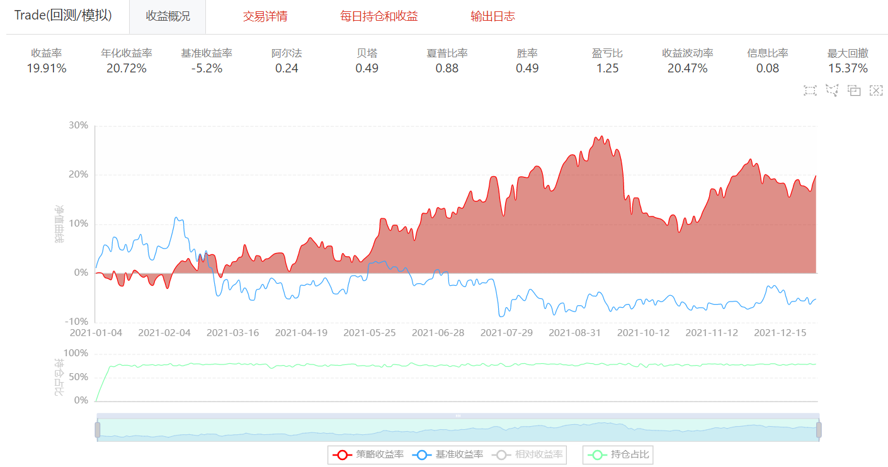

# 8.6 深度学习量化策略基础实战

## 1. 深度学习简介
深度学习是模拟人脑进行分析学习的神经网络。


## 2. 常用深度学习模型架构
- 深度神经网络(DNN)
- 卷积神经网络(CNN)
- 马尔可夫链(MC)
- 玻尔兹曼机(BM)
- 生成对抗网络(GAN)
- 长短期记忆网络(LSTM)

### 2.1 LSTM 介绍
长短期记忆网络（LSTM）是一种常用于处理序列数据的循环神经网络（RNN）的变体，被广泛应用于自然语言处理、语音识别、时间序列预测等任务中。

LSTM通过门控机制解决了传统RNN中的梯度问题，能够有效地处理序列数据，并在多个领域取得了显著的成果。

### 2.2 LSTM在股票预测中的应用
LSTM在量化预测股票方面被广泛应用。它可以利用历史股票价格和交易量等数据来学习股票价格的趋势和波动，从而进行未来的预测。

在股票预测中，LSTM可以接受时间序列数据作为输入，并通过递归地更新隐藏状态来捕获长期依赖关系。它可以通过学习历史价格和交易量等特征的模式，对未来的股票价格进行预测。

通过将股票历史数据作为训练样本，LSTM可以学习不同时间尺度上的模式，例如每日、每周或每月的波动情况。它还可以利用技术指标、市场情绪数据等辅助信息，以提高预测准确性。

在实际应用中，研究人员和投资者通过训练LSTM模型来预测股票的价格趋势、波动情况和交易信号。这些预测结果可以用于制定投资策略、风险管理和决策制定等方面。

需要注意的是，股票市场受到多种因素的影响，包括经济因素、政治事件和市场心理等。LSTM在股票预测中的应用并不是完全准确的，因此在实际应用中需要结合其他因素进行综合分析和决策。此外，过度依赖LSTM模型所做的预测结果也可能存在风险，投资者仍需谨慎分析和评估。
## 3. 模块分类

### 3.1 卷积层
卷积层是深度学习中的基本层之一，通过卷积操作对输入数据进行特征提取和特征映射，并利用参数共享和局部连接等机制提高模型的参数效率。
- 一维卷积层
- 二维卷积层
- 三维卷积层

### 3.2 池化层
平均池化和最大池化是卷积神经网络中常用的池化操作，用于减少特征图的维度，并提取出重要的特征信息。
- 平均池化
- 最大池化

### 3.3 全连接层
全连接层是神经网络中的一种常见层类型。在全连接层中，每个输入神经元与输出层中的每个神经元都有连接。每个连接都有一个权重，用于调整输入神经元对于输出神经元的影响。全连接层的输出可以通过激活函数进行非线性变换。
### 3.4 Dropout层
Dropout层是一种正则化技术，用于在训练过程中随机丢弃一部分输入神经元，以减少过拟合的风险。Dropout层通过随机断开神经元之间的连接来实现丢弃操作。在每个训练迭代中，Dropout层会随机选择一些神经元进行丢弃，并在前向传播和反向传播过程中不使用这些丢弃的神经元。
## 4. 深度学习模型构建
1. 通过模块堆叠将输入层、中间层、输出层连接，然后构建模块进行初始化
2. 训练模型
3. 模型预测


## 5. 策略实现
本部分将介绍如何在BigQuant实现一个基于LSTM的选股策略


```python
from biglearning.api import M
from biglearning.api import tools as T
from bigdatasource.api import DataSource
from biglearning.module2.common.data import Outputs
from zipline.finance.commission import PerOrder
import pandas as pd
import math


# LSTM模型训练和预测
def m4_run_bigquant_run(input_1, input_2, input_3):
    df =  input_1.read_pickle()
    feature_len = len(input_2.read_pickle())
    
    df['x'] = df['x'].reshape(df['x'].shape[0], int(feature_len), int(df['x'].shape[1]/feature_len))
    
    data_1 = DataSource.write_pickle(df)
    return Outputs(data_1=data_1)


# LSTM模型训练和预测的后处理
def m4_post_run_bigquant_run(outputs):
    return outputs


# LSTM模型训练和预测
def m8_run_bigquant_run(input_1, input_2, input_3):
    df =  input_1.read_pickle()
    feature_len = len(input_2.read_pickle())
    
    df['x'] = df['x'].reshape(df['x'].shape[0], int(feature_len), int(df['x'].shape[1]/feature_len))
    
    data_1 = DataSource.write_pickle(df)
    return Outputs(data_1=data_1)


# LSTM模型训练和预测的后处理
def m8_post_run_bigquant_run(outputs):
    return outputs


# 模型评估和排序
def m24_run_bigquant_run(input_1, input_2, input_3):
    pred_label = input_1.read_pickle()
    df = input_2.read_df()
    df = pd.DataFrame({'pred_label':pred_label[:,0], 'instrument':df.instrument, 'date':df.date})
    df.sort_values(['date','pred_label'],inplace=True, ascending=[True,False])
    return Outputs(data_1=DataSource.write_df(df), data_2=None, data_3=None)


# 模型评估和排序的后处理
def m24_post_run_bigquant_run(outputs):
    return outputs


# 初始化策略
def m19_initialize_bigquant_run(context):
    # 从options中读取数据
    context.ranker_prediction = context.options['data'].read_df()
    # 设置佣金费率
    context.set_commission(PerOrder(buy_cost=0.0003, sell_cost=0.0013, min_cost=5))
    stock_count = 30
    # 根据股票数量设置权重
    context.stock_weights = T.norm([1 / math.log(i + 2) for i in range(0, stock_count)])
    context.max_cash_per_instrument = 0.9
    context.options['hold_days'] = 5


# 处理每个交易日的数据
def m19_handle_data_bigquant_run(context, data):
    # 获取当日的预测结果
    ranker_prediction = context.ranker_prediction[
        context.ranker_prediction.date == data.current_dt.strftime('%Y-%m-%d')]

    is_staging = context.trading_day_index < context.options['hold_days']
    cash_avg = context.portfolio.portfolio_value / context.options['hold_days']
    cash_for_buy = min(context.portfolio.cash, (1 if is_staging else 1.5) * cash_avg)
    cash_for_sell = cash_avg - (context.portfolio.cash - cash_for_buy)
    positions = {e.symbol: p.amount * p.last_sale_price
                 for e, p in context.perf_tracker.position_tracker.positions.items()}

    if not is_staging and cash_for_sell > 0:
        equities = {e.symbol: e for e, p in context.perf_tracker.position_tracker.positions.items()}
        instruments = list(reversed(list(ranker_prediction.instrument[ranker_prediction.instrument.apply(
                lambda x: x in equities and not context.has_unfinished_sell_order(equities[x]))])))

        for instrument in instruments:
            context.order_target(context.symbol(instrument), 0)
            cash_for_sell -= positions[instrument]
            if cash_for_sell <= 0:
                break

    buy_cash_weights = context.stock_weights
    buy_instruments = list(ranker_prediction.instrument[:len(buy_cash_weights)])
    max_cash_per_instrument = context.portfolio.portfolio_value * context.max_cash_per_instrument
    for i, instrument in enumerate(buy_instruments):
        cash = cash_for_buy * buy_cash_weights[i]
        if cash > max_cash_per_instrument - positions.get(instrument, 0):
            cash = max_cash_per_instrument - positions.get(instrument, 0)
        if cash > 0:
            context.order_value(context.symbol(instrument), cash)

# 准备工作
def m19_prepare_bigquant_run(context):
    pass

# 获取2020年至2021年股票数据
m1 = M.instruments.v2(
    start_date='2020-01-01',
    end_date='2021-01-01',
    market='CN_STOCK_A',
    instrument_list=' ',
    max_count=0
)

# 使用高级自动标注器获取标签
m2 = M.advanced_auto_labeler.v2(
    instruments=m1.data,
    label_expr="""
shift(close, -5) / shift(open, -1)-1

clip(label, all_quantile(label, 0.01), all_quantile(label, 0.99))

where(shift(high, -1) == shift(low, -1), NaN, label)
""",
    start_date='',
    end_date='',
    benchmark='000300.SHA',
    drop_na_label=True,
    cast_label_int=False
)

# 标准化标签数据
m13 = M.standardlize.v8(
    input_1=m2.data,
    columns_input='label'
)

# 输入特征
m3 = M.input_features.v1(
    features="""close_0/mean(close_0,5)
close_0/mean(close_0,10)
close_0/mean(close_0,20)
close_0/open_0
open_0/mean(close_0,5)
open_0/mean(close_0,10)
open_0/mean(close_0,20)"""
)

# 抽取基础特征
m15 = M.general_feature_extractor.v7(
    instruments=m1.data,
    features=m3.data,
    start_date='',
    end_date='',
    before_start_days=30
)

# 提取派生特征
m16 = M.derived_feature_extractor.v3(
    input_data=m15.data,
    features=m3.data,
    date_col='date',
    instrument_col='instrument',
    drop_na=True,
    remove_extra_columns=False
)

# 标准化基础特征
m14 = M.standardlize.v8(
    input_1=m16.data,
    input_2=m3.data,
    columns_input='[]'
)

# 合并标签和特征
m7 = M.join.v3(
    data1=m13.data,
    data2=m14.data,
    on='date,instrument',
    how='inner',
    sort=False
)

# 将特征转换成二进制数据
m26 = M.dl_convert_to_bin.v2(
    input_data=m7.data,
    features=m3.data,
    window_size=5,
    feature_clip=5,
    flatten=True,
    window_along_col='instrument'
)

# 使用m4_run_bigquant_run函数运行缓存模式
m4 = M.cached.v3(
    input_1=m26.data,
    input_2=m3.data,
    run=m4_run_bigquant_run,
    post_run=m4_post_run_bigquant_run,
    input_ports='',
    params='{}',
    output_ports=''
)

# 获取2021年至2022年股票数据
m9 = M.instruments.v2(
    start_date=T.live_run_param('trading_date', '2021-01-01'),
    end_date=T.live_run_param('trading_date', '2022-01-01'),
    market='CN_STOCK_A',
    instrument_list='',
    max_count=0
)

# 抽取基础特征
m17 = M.general_feature_extractor.v7(
    instruments=m9.data,
    features=m3.data,
    start_date='',
    end_date='',
    before_start_days=30
)

# 提取派生特征
m18 = M.derived_feature_extractor.v3(
    input_data=m17.data,
    features=m3.data,
    date_col='date',
    instrument_col='instrument',
    drop_na=True,
    remove_extra_columns=False
)

# 标准化基础特征
m25 = M.standardlize.v8(
    input_1=m18.data,
    input_2=m3.data,
    columns_input='[]'
)

# 将特征转换成二进制数据
m27 = M.dl_convert_to_bin.v2(
    input_data=m25.data,
    features=m3.data,
    window_size=5,
    feature_clip=5,
    flatten=True,
    window_along_col='instrument'
)

# 使用m8_run_bigquant_run函数运行缓存模式
m8 = M.cached.v3(
    input_1=m27.data,
    input_2=m3.data,
    run=m8_run_bigquant_run,
    post_run=m8_post_run_bigquant_run,
    input_ports='',
    params='{}',
    output_ports=''
)

# 构造LSTM模型的输入层
m6 = M.dl_layer_input.v1(
    shape='7,5',
    batch_shape='',
    dtype='float32',
    sparse=False,
    name=''
)

# 构造LSTM模型的LSTM层
m10 = M.dl_layer_lstm.v1(
    inputs=m6.data,
    units=32,
    activation='tanh',
    recurrent_activation='hard_sigmoid',
    use_bias=True,
    kernel_initializer='glorot_uniform',
    recurrent_initializer='Orthogonal',
    bias_initializer='Zeros',
    unit_forget_bias=True,
    kernel_regularizer='None',
    kernel_regularizer_l1=0,
    kernel_regularizer_l2=0,
    recurrent_regularizer='None',
    recurrent_regularizer_l1=0,
    recurrent_regularizer_l2=0,
    bias_regularizer='None',
    bias_regularizer_l1=0,
    bias_regularizer_l2=0,
    activity_regularizer='None',
    activity_regularizer_l1=0,
    activity_regularizer_l2=0,
    kernel_constraint='None',
    recurrent_constraint='None',
    bias_constraint='None',
    dropout=0,
    recurrent_dropout=0,
    return_sequences=False,
    implementation='0',
    name=''
)

# 构造LSTM模型的Dropout层
m12 = M.dl_layer_dropout.v1(
    inputs=m10.data,
    rate=0.2,
    noise_shape='',
    name=''
)

# 构造LSTM模型的全连接层1
m20 = M.dl_layer_dense.v1(
    inputs=m12.data,
    units=30,
    activation='tanh',
    use_bias=True,
    kernel_initializer='glorot_uniform',
    bias_initializer='Zeros',
    kernel_regularizer='None',
    kernel_regularizer_l1=0,
    kernel_regularizer_l2=0,
    bias_regularizer='None',
    bias_regularizer_l1=0,
    bias_regularizer_l2=0,
    activity_regularizer='None',
    activity_regularizer_l1=0,
    activity_regularizer_l2=0,
    kernel_constraint='None',
    bias_constraint='None',
    name=''
)

# 构造LSTM模型的Dropout层2
m21 = M.dl_layer_dropout.v1(
    inputs=m20.data,
    rate=0.2,
    noise_shape='',
    name=''
)

# 构造LSTM模型的全连接层2
m22 = M.dl_layer_dense.v1(
    inputs=m21.data,
    units=1,
    activation='tanh',
    use_bias=True,
    kernel_initializer='glorot_uniform',
    bias_initializer='Zeros',
    kernel_regularizer='None',
    kernel_regularizer_l1=0,
    kernel_regularizer_l2=0,
    bias_regularizer='None',
    bias_regularizer_l1=0,
    bias_regularizer_l2=0,
    activity_regularizer='None',
    activity_regularizer_l1=0,
    activity_regularizer_l2=0,
    kernel_constraint='None',
    bias_constraint='None',
    name=''
)

# 初始化LSTM模型
m34 = M.dl_model_init.v1(
    inputs=m6.data,
    outputs=m22.data
)

# 训练LSTM模型
m5 = M.dl_model_train.v1(
    input_model=m34.data,
    training_data=m4.data_1,
    optimizer='RMSprop',
    loss='mean_squared_error',
    metrics='mae',
    batch_size=256,
    epochs=5,
    n_gpus=0,
    verbose='2:每个epoch输出一行记录'
)

# 使用LSTM模型进行预测
m11 = M.dl_model_predict.v1(
    trained_model=m5.data,
    input_data=m8.data_1,
    batch_size=1024,
    n_gpus=0,
    verbose='2:每个epoch输出一行记录'
)

# 使用m24_run_bigquant_run函数运行缓存模式
m24 = M.cached.v3(
    input_1=m11.data,
    input_2=m18.data,
    run=m24_run_bigquant_run,
    post_run=m24_post_run_bigquant_run,
    input_ports='',
    params='{}',
    output_ports=''
)

# 执行交易
m19 = M.trade.v4(
    instruments=m9.data,
    options_data=m24.data_1,
    start_date='',
    end_date='',
    initialize=m19_initialize_bigquant_run,
    handle_data=m19_handle_data_bigquant_run,
    prepare=m19_prepare_bigquant_run,
    volume_limit=0.025,
    order_price_field_buy='open',
    order_price_field_sell='close',
    capital_base=1000000,
    auto_cancel_non_tradable_orders=True,
    data_frequency='daily',
    price_type='后复权',
    product_type='股票',
    plot_charts=True,
    backtest_only=False,
    benchmark='000300.SHA'
)
```


